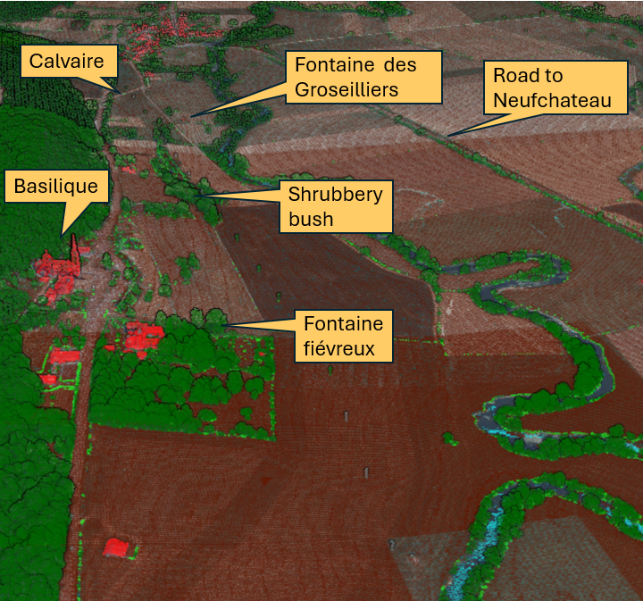

# Introduction

This repository contains a prompt to that aims to deduce where the tree and the spring of Jeanne D'Arc also known as the Pucelle, or Joan of Arc, the Maid COULD have stood.

The author of this repo places his trust in the work of previous generations to pinpoint these locations. 

The main purpose of this repo is to let the author wrestle with artificial intelligence in order to gain experience with it.

# Method

Relevant snippets from Joan of Arc's condemnation and nullification trail were taken if they relate to the tree or the spring. 

A similar approach was taken with documentation that was know to the author of this repo at the time.

Further instructions on product, process and performance are in the prompt.

# Instruction

1. The prompt is posted to an unitialized AI LLM model.
2. The response is documented

# Diligence Statement

In creating this chapter of a fictional police report, I collaborated with Claude, Grok, Copilot and ChatGPT AI to assist a fictional police inspector deduce the whereabouts of the location of the tree and the spring of the Pucelle.

I affirm that all AI-generated and co-created content underwent thorough review and evaluation. The final output accurately reflects my understanding, expertise, and intended meaning. While AI assistance was instrumental in the process, I maintain full responsibility for the content, its accuracy, and its presentation. This disclosure is made in the spirit of transparency and to acknowledge the role of AI in the creation process.

# Personal Thoughts

# The fictional police report

# Appendix

## The naudin map (1728 à 1739)

## The jollois map (1821)

## Copernicus Moisture Index

## Candidate overview

