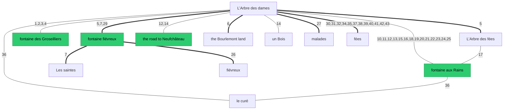

# Introduction

This repository contains a prompt to that aims to deduce where the tree and the spring of Jeanne D'Arc also known as the Pucelle, or Joan of Arc, the Maid COULD have stood.

The author of this repo places his trust in the work of previous generations to pinpoint these locations. 

The main purpose of this repo is to let the author wrestle with artificial intelligence in order to gain experience with it.

# Method

Relevant snippets from Joan of Arc's condemnation and nullification trail were taken if they relate to the tree or the spring. 

A similar approach was taken with documentation that was know to the author of this repo at the time.

Further instructions on product, process and performance are in the prompt.

# Instruction

1. The [prompt](prompt/tree-prompt.yaml) is posted to an unitialized AI LLM model.
2. The response is documented

# Diligence Statement

In creating this chapter of a fictional police report, I collaborated with Claude, Grok, Copilot and ChatGPT AI to assist a fictional police inspector deduce the whereabouts of the location of the tree and the spring of the Pucelle.

I affirm that all AI-generated and co-created content underwent thorough review and evaluation. The final output accurately reflects my understanding, expertise, and intended meaning. While AI assistance was instrumental in the process, I maintain full responsibility for the content, its accuracy, and its presentation. This disclosure is made in the spirit of transparency and to acknowledge the role of AI in the creation process.

# AI generated object relations based on first hand witness accounts

[click here for the diagram](breakout/combined.md)

```mermaid
graph TD
    classDef archaeological fill:#2ecc71,stroke:#1e8449,color:#000;

    N1["L’Arbre des dames"]
    N2["L’Arbre des fées"]
    N3["fontaine des Groseilliers"]
    N4["fontaine fiévreux"]
    N5["fontaine aux Rains"]
    N6["the road to Neufchâteau"]
    N7["the Bourlemont land"]
    N8["un Bois"]
    N9["Les saintes"]
    N10["fiévreux"]
    N11["malades"]
    N12["fées"]
    N13["le curé"]

    N1 == "5" === N2
    N1 -- "1,2,3,4" --- N3
    N1 == "5,7,29" === N4
    N1 == "6" === N7
    N4 == "7" === N9
    N1 == "30,31,32,34,35,37,38,39,40,41,42,43" === N12
    N1 -- "36" --- N13
    N5 -- "36" --- N13
    N4 == "26" === N10
    N1 == "27" === N11
    N1 -- "10,11,12,13,15,16,18,19,20,21,22,23,24,25" --- N5
    N2 -- "17" --- N5
    N1 -- "12,14" --- N6
    N1 -- "14" --- N8

    class N3,N4,N5,N6 archaeological
```

# Personal Thoughts

| Object | Observations |
|---|---|
| [naudin-map](breakout/naudin.md)                  | Where the path leads to the plateau, there is also a spot where the ridge becomes more narrow. The fountain may have washed out the path and made it smaller.|
| [jollois-map](breakout/jollois.md)                | The vineyard grew on both sides of the ridge road. From the ridge road it is possible to see the new road to Neufchateau on the other side of the river |
| [carte-etat-major](breakout/carte-etat-major.md)  | The ridge road could have been more to the west than the current D53. The ridge road ends stops where the basilique begins |
| [napoleonic-cadastre](breakout/napoleonic.md)     | - |
| [copernicus-map](breakout/copernicus.md)          | - |

# Working with Claude Skills

    Typical workflow going forward:
    1. Add new witness testimony to prompt/tree-prompt.yaml (as first-hand-snippets, correctly categorized).
    2. Run /evidence-diagram to fold the new snippets into the diagram — it reads the existing breakout/combined.md first so node/edge numbering for unchanged content stays stable, and reports what actually changed.
    3. Run /verify-citations on the updated file (or the whole breakout/ folder) as a check before you trust or publish the result — it'll flag anything presented as first-hand that's actually secondary, misattributed, or overreaching beyond what the quote states.

