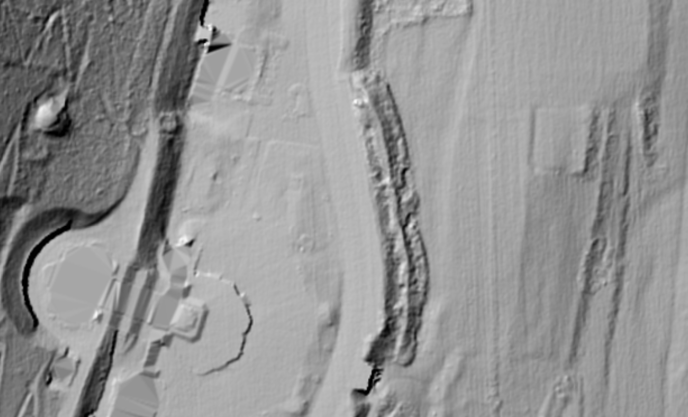

## The Carte de L'etat major 1820-1866

## Observations

- Carte de L'etat major 1820-1866: The ridge road could have been more to the west than the current D53
- Carte de L'etat major 1820-1866: The ridge road ends stops where the basilique begins
- Lidar Scan: there are traces in the landscape from what could have been the fountain washing over the road into the lower road, just north where the plateau begins.

# Personal Thoughts

- That line on the map may not accurately represent the old road

