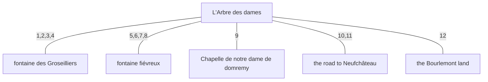

# Object diagram — arbre des Dames and its surroundings (first-hand-snippets only)

`object-model` in `tree-prompt.yaml` has 15 entries. Only the 6 below are ever
directly stated (not merely inferred) to relate to another object in the
`first-hand-snippets` array — testimony from the nullification trial
(`bibliotheque-monastique`, `questionnaire-lorraine`) and Jeanne d'Arc's own
words — so the rest (Hordal chapel, Basilique, the ridge road on the west
bank, vineyard, estate boundary, the Bois Chenu, the slope to the top of the
Bois Chenu, the valley, the river meuse) are excluded from the diagram
entirely.
`general-reputation` sources (Montaigne, Jollois, académie-française, etc.) and
`candidate-locations` are likewise excluded from the grounding.

Two exclusions worth calling out: `estate boundary` is dropped because the
only relevant snippet says the tree *belonged to* Pierre de Bourlémont, which
is ownership, not a boundary — so that edge now lives on the new object `the
Bourlemont land` instead, where "belonged to" is a direct statement. `the Bois
Chenu` is dropped too: the one snippet that places the tree next to a wood
only says "un bois" (a wood) and never names it, so treating that as "the
Bois Chenu" would itself be an inference, which the brief now rules out.

Each edge is labeled with the number(s) of the numbered relations below. Where
more than one first-hand relation supports the same edge, the numbers are
comma-separated.

## Numbered relations

1. **Arbre des dames — fontaine des Groseilliers.** Village children walked from the tree to the fountain as part of the "dimanche des Fontaines" custom.
   *"Les petits du village, filles et garçons, avec du pain et des noix, allaient à l'arbre des Dames et à la Fontaine-des-Groseilliers, le dimanche de Laetare Jerusalem..."* (bibliotheque-monastique).

2. **Arbre des dames — fontaine des Groseilliers.** After eating under the tree, the group walked on to drink at the fountain.
   *"Nous mangions sous l'arbre, puis nous allions boire à la Fontaine-des-Groseilliers."* (bibliotheque-monastique).

3. **Arbre des dames — fontaine des Groseilliers.** Jeannette herself is described going from the dancing under the tree to drink at the fountain.
   *"Jeannette venait danser et jouer avec nous... et puis s'en venait boire à la Fontaine-des-Groseilliers."* (bibliotheque-monastique).

4. **Arbre des dames — fontaine des Groseilliers.** Jeanne, in her youth, is placed at both sites together.
   *"Jeannette, en ses jeunes ans, allait quelquefois, en compagnie des autres fillettes, à l'arbre des Dames et à la Fontaine-des-Groseilliers, pour courir et danser avec ses compagnes."* (bibliotheque-monastique).

5. **Arbre des dames — fontaine fiévreux.** Jeanne d'Arc herself places a spring immediately next to ("auprès") the tree, and identifies it as the one visited by feverish people seeking a cure — the defining trait of the "fontaine fiévreux" object.
   *"Près de Domrémy il y avait un arbre appelé l'arbre des Dames... Auprès est une fontaine. J'ai ouï dire que les fiévreux boivent de cette fontaine et y vont quérir de l'eau pour se remettre en santé."* (bibliotheque-monastique, from Jeanne D'Arc).

6. **Arbre des dames — fontaine fiévreux.** The interrogator and Jeanne both refer to a fountain right next to (rather than a walk away from) the tree — consistent with the same nearby spring as in #5, distinct from the fontaine des Groseilliers reached only "en revenant" (on the way back).
   *"Les saintes vous ont-elles parlé à la fontaine proche de l'arbre? — Oui, je les y ai entendues..."* (bibliotheque-monastique, interrogateur / Jeanne D'Arc).

7. **Arbre des dames — fontaine fiévreux.** The accusation records Jeanne as habitually frequenting "the tree and fountain" as a single, adjacent pair.
   *"ladite Jeanne avait coutume de fréquenter lesdits arbre et fontaine [de Domremy]..."* (bibliotheque-monastique).

8. **Arbre des dames — fontaine fiévreux.** The saints spoke to Jeanne beside a fountain that is itself described as standing next to the great tree.
   *"Lesdites saintes lui ont plusieurs fois parlé près d'une fontaine, située près d'un grand arbre, appelé communément l'arbre des fées."* (bibliotheque-monastique).

9. **Arbre des dames — Chapelle de notre dame de domremy.** Jeanne herself made garlands at the foot of the tree for the image of Notre-Dame de Domrémy.
   *"J'allais parfois avec d'autres filles m'ébattre au pied de l'arbre et j'y faisais des guirlandes pour l'image de la Notre-Dame de Domrémy."* (bibliotheque-monastique, from Jeanne D'Arc).

10. **Arbre des dames — the road to Neufchâteau.** Béatrice, widow of Thévenin d'Estellin, places the tree right beside the road to Neufchâteau.
    *"Cet arbre se trouve à côté du grand chemin par lequel on va à Neufchâteau."* (questionnaire-lorraine, Béatrice).

11. **Arbre des dames — the road to Neufchâteau.** Jean Moen likewise places the tree at the edge of that same road.
    *"L'arbre mentionné est près d'un bois, au bord du grand chemin par lequel on va à Neufchâteau."* (questionnaire-lorraine, Jean Moen).

12. **Arbre des dames — the Bourlemont land.** Jeanne d'Arc states directly that the tree belonged to Pierre de Bourlémont, i.e. it stood on his land.
    *"Il appartenait, d'après le commun dire, à monseigneur Pierre de Bourlemont, chevalier."* (bibliotheque-monastique, from Jeanne D'Arc).
