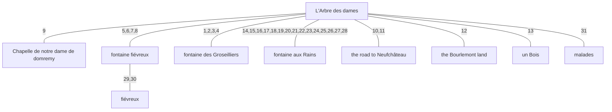

# Object diagram — arbre des Dames and its surroundings (first-hand-snippets only)

`object-model` in `tree-prompt.yaml` has 18 entries and `sick-persons` has 2.
Only the 8 objects and both sick-persons below are ever directly stated (not
merely inferred) to relate to another object/person in the
`first-hand-snippets` array — testimony from the nullification trial
(`bibliotheque-monastique`, `questionnaire-lorraine`) and Jeanne d'Arc's own
words.

Excluded entirely because they are never named in a first-hand-snippet:
Hordal chapel, Basilique, `fontaine de l'Ermite` (it only appears in the
`general-reputation` quote from `jollois`), the ridge road on the west bank,
vineyard, estate boundary, the Bois Chenu, the slope to the top of the Bois
Chenu, the valley, the river meuse.
`general-reputation` sources (Montaigne, Jollois, académie-française, etc.)
and `candidate-locations` are likewise excluded from the grounding.

Three mappings worth calling out because they aren't a literal string match
on the object-model name, but are still direct statements once the referent
is traced within the same snippet:
- `estate boundary` is dropped because the only relevant snippet says the
  tree *belonged to* Pierre de Bourlémont — that's ownership, not a boundary —
  so the edge lives on `the Bourlemont land` instead, where "belonged to" is
  a direct statement.
- `the Bois Chenu` stays dropped: the one snippet that places the tree next
  to a wood only says "un bois" (a wood) and never names it, so treating that
  as "the Bois Chenu" would be an inference. That wording is matched exactly
  by the object `un Bois`, so the relation is kept under that name instead.
- `Chapelle de notre dame de domremy` is kept: Jeanne d'Arc states she made
  garlands "pour l'image de la Notre-Dame de Domrémy" — the image housed at
  that chapel — which is the direct link, even though the snippet names the
  image rather than the building.

Each edge is labeled with the number(s) of the numbered relations below. Where
more than one first-hand relation supports the same edge, the numbers are
comma-separated.

```mermaid
graph TD
    N1["L'Arbre des dames"]
    N2["Chapelle de notre dame de domremy"]
    N3["fontaine fiévreux"]
    N4["fontaine des Groseilliers"]
    N5["fontaine aux Rains"]
    N6["the road to Neufchâteau"]
    N7["the Bourlemont land"]
    N8["un Bois"]
    N9["fiévreux"]
    N10["malades"]

    N1 -- "1,2,3,4" --- N4
    N1 -- "5,6,7,8" --- N3
    N1 -- "9" --- N2
    N1 -- "10,11" --- N6
    N1 -- "12" --- N7
    N1 -- "13" --- N8
    N1 -- "14,15,16,17,18,19,20,21,22,23,24,25,26,27,28" --- N5
    N3 -- "29,30" --- N9
    N1 -- "31" --- N10
```

## Numbered relations

1. **Arbre des dames — fontaine des Groseilliers.** Village children walked from the tree to the fountain as part of the "dimanche des Fontaines" custom.
   *"Les petits du village, filles et garçons, avec du pain et des noix, allaient à l'arbre des Dames et à la Fontaine-des-Groseilliers, le dimanche de Laetare Jerusalem..."* (bibliotheque-monastique).

2. **Arbre des dames — fontaine des Groseilliers.** After eating under the tree, the group walked on to drink at the fountain.
   *"Nous mangions sous l'arbre, puis nous allions boire à la Fontaine-des-Groseilliers."* (bibliotheque-monastique).

3. **Arbre des dames — fontaine des Groseilliers.** Jeannette herself is described going from the dancing under the tree to drink at the fountain.
   *"Jeannette venait danser et jouer avec nous... et puis s'en venait boire à la Fontaine-des-Groseilliers."* (bibliotheque-monastique).

4. **Arbre des dames — fontaine des Groseilliers.** Jeanne, in her youth, is placed at both sites together.
   *"Jeannette, en ses jeunes ans, allait quelquefois, en compagnie des autres fillettes, à l'arbre des Dames et à la Fontaine-des-Groseilliers, pour courir et danser avec ses compagnes."* (bibliotheque-monastique).

5. **Arbre des dames — fontaine fiévreux.** Jeanne d'Arc herself places a spring immediately next to ("auprès") the tree, and identifies it as the one visited by feverish people seeking a cure — the defining trait of the "fontaine fiévreux" object.
   *"Près de Domrémy il y avait un arbre appelé l'arbre des Dames... Auprès est une fontaine. J'ai ouï dire que les fiévreux boivent de cette fontaine et y vont quérir de l'eau pour se remettre en santé."* (bibliotheque-monastique, from Jeanne D'Arc).

6. **Arbre des dames — fontaine fiévreux.** The interrogator and Jeanne both refer to a fountain right next to (rather than a walk away from) the tree — consistent with the same nearby spring as in #5, distinct from the fontaine des Groseilliers reached only "en revenant" (on the way back).
   *"Les saintes vous ont-elles parlé à la fontaine proche de l'arbre? — Oui, je les y ai entendues..."* (bibliotheque-monastique, interrogateur / Jeanne D'Arc).

7. **Arbre des dames — fontaine fiévreux.** The accusation records Jeanne as habitually frequenting "the tree and fountain" as a single, adjacent pair.
   *"ladite Jeanne avait coutume de fréquenter lesdits arbre et fontaine [de Domremy]..."* (bibliotheque-monastique).

8. **Arbre des dames — fontaine fiévreux.** The saints spoke to Jeanne beside a fountain that is itself described as standing next to the great tree.
   *"Lesdites saintes lui ont plusieurs fois parlé près d'une fontaine, située près d'un grand arbre, appelé communément l'arbre des fées."* (bibliotheque-monastique).

9. **Arbre des dames — Chapelle de notre dame de domremy.** Jeanne herself made garlands at the foot of the tree for the image of Notre-Dame de Domrémy.
   *"J'allais parfois avec d'autres filles m'ébattre au pied de l'arbre et j'y faisais des guirlandes pour l'image de la Notre-Dame de Domrémy."* (bibliotheque-monastique, from Jeanne D'Arc).

10. **Arbre des dames — the road to Neufchâteau.** Béatrice, widow of Thévenin d'Estellin, places the tree right beside the road to Neufchâteau.
    *"Cet arbre se trouve à côté du grand chemin par lequel on va à Neufchâteau."* (questionnaire-lorraine, Béatrice).

11. **Arbre des dames — the road to Neufchâteau.** Jean Moen likewise places the tree at the edge of that same road.
    *"L'arbre mentionné est près d'un bois, au bord du grand chemin par lequel on va à Neufchâteau."* (questionnaire-lorraine, Jean Moen).

12. **Arbre des dames — the Bourlemont land.** Jeanne d'Arc states directly that the tree belonged to Pierre de Bourlémont, i.e. it stood on his land.
    *"Il appartenait, d'après le commun dire, à monseigneur Pierre de Bourlemont, chevalier."* (bibliotheque-monastique, from Jeanne D'Arc).

13. **Arbre des dames — un Bois.** Jean Moen places the tree right next to a wood, using exactly this wording ("un bois"), at the edge of the road to Neufchâteau.
    *"L'arbre mentionné est près d'un bois, au bord du grand chemin par lequel on va à Neufchâteau."* (questionnaire-lorraine, Jean Moen).

14. **Arbre des dames — fontaine aux Rains.** Jean Morel, godfather of Jeanne, has the group return from the tree to this fountain, which he places closer to the village than the tree.
    *"...en revenant ils vont à la fontaine aux Rains, qui est plus près du village que l'arbre, en se promenant et chantant, y boivent son eau..."* (questionnaire-lorraine, Jean Morel).

15. **Arbre des dames — fontaine aux Rains.** Dominique Jacob has the children return from the tree to eat and drink at the fountain.
    *"...en revenant ils vont à la fontaine des Rains, mangent leur pain et boivent de cette eau..."* (questionnaire-lorraine, Dominique Jacob).

16. **Arbre des dames — fontaine aux Rains.** Béatrice has the young people return from the tree to drink at the fountain.
    *"...en revenant, vont à la Fontaine aux Rains et boivent son eau."* (questionnaire-lorraine, Béatrice).

17. **Arbre des dames — fontaine aux Rains.** Jeanette, wife of Thévenin Le Royer, gives the same tree-to-fountain return.
    *"...vont ensuite à la Fontaine aux Rains et boivent de son eau."* (questionnaire-lorraine, Jeanette femme de Thévenin Le Royer).

18. **Arbre des dames — fontaine aux Rains.** Jeannette, widow of Thiesselin de Vittel, confirms the young people go on to drink at this fountain.
    *"...et vont boire à la Fontaine aux Rains."* (questionnaire-lorraine, Jeannette veuve de Thiesselin de Vittel).

19. **Arbre des dames — fontaine aux Rains.** Perrin Drappier places Jeanne herself making rounds toward the tree and this fountain together.
    *"...se promener et faire des rondes vers l'arbre et à la fontaine des Rains."* (questionnaire-lorraine, Perrin Drappier).

20. **Arbre des dames — fontaine aux Rains.** Gérard Guillemette has the group return from the tree to drink at the fountain.
    *"...ensuite ils reviennent à la fontaine des Rains et boivent de son eau."* (questionnaire-lorraine, Gérard Guillemette).

21. **Arbre des dames — fontaine aux Rains.** Hauviette, a childhood friend of Jeanne, names the tree and the fountain as the pair the young people habitually visited.
    *"Les jeunes filles et jeunes gens du village avaient l'habitude d'aller à cet arbre et à la fontaine des Rains le dimanche de Lætare, dit des Fontaines..."* (questionnaire-lorraine, Hauviette).

22. **Arbre des dames — fontaine aux Rains.** Jean Waterin has the young people return from the tree to drink at the fountain.
    *"...puis au retour vont à la fontaine des Rains ou parfois à d'autres fontaines, et boivent."* (questionnaire-lorraine, Jean Waterin).

23. **Arbre des dames — fontaine aux Rains.** Gérardin d'Épinal, "le bourguignon," has the group return from the tree to eat and drink at the fountain.
    *"...et ensuite reviennent à la fontaine des Rains, mangent le pain et y boivent de l'eau, comme il le vit."* (questionnaire-lorraine, Gérardin d'Épinal).

24. **Arbre des dames — fontaine aux Rains.** Simonin Musnier has the group pass by the fountain and drink on the way back from the tree.
    *"...en revenant passent à la fontaine des Rains et boivent de son eau."* (questionnaire-lorraine, Simonin Musnier).

25. **Arbre des dames — fontaine aux Rains.** Isabelle, wife of Gérardin d'Épinal, has the group come to drink at the fountain on the way back from the tree.
    *"...au retour ils venaient boire à la fontaine des Rains ; selon la coutume qui existe encore."* (questionnaire-lorraine, Isabelle).

26. **Arbre des dames — fontaine aux Rains.** Colin, son of Jean Colin, has the group sometimes go to drink at the fountain on the way back from the tree.
    *"...et au retour vont parfois pour boire à la fontaine des Rains et y boivent..."* (questionnaire-lorraine, Colin fils de Jean Colin).

27. **Arbre des dames — fontaine aux Rains.** Michel Le Buin has the young people go on to drink at the fountain.
    *"...ensuite vont boire à la fontaine des Rains."* (questionnaire-lorraine, Michel Le Buin).

28. **Arbre des dames — fontaine aux Rains.** Jean Jaquard has the group return from the tree to drink at the fountain.
    *"...puis, jouant et se promenant, reviennent à la fontaine des Rains, boivent de son eau."* (questionnaire-lorraine, Jean Jaquard).

29. **fontaine fiévreux — fiévreux.** Jeanne d'Arc directly states that feverish people (fiévreux) drink from this fountain, and go there to fetch water to recover their health.
    *"J'ai ouï dire que les fiévreux boivent de cette fontaine et y vont quérir de l'eau pour se remettre en santé."* (bibliotheque-monastique, from Jeanne D'Arc).

30. **fontaine fiévreux — fiévreux.** The trial record likewise states that fiévreux go there, profane as that is held to be, to recover their health.
    *"...que des fiévreux y vont, quoique ce soit profane, pour recouvrer la santé."* (bibliotheque-monastique).

31. **Arbre des dames — malades.** Jeanne d'Arc states that the sick (malades), once recovered, go to the tree to amuse themselves.
    *"J'ai oui dire que les malades une fois relevés, vont à cet arbre pour se divertir."* (bibliotheque-monastique, from Jeanne D'Arc).
