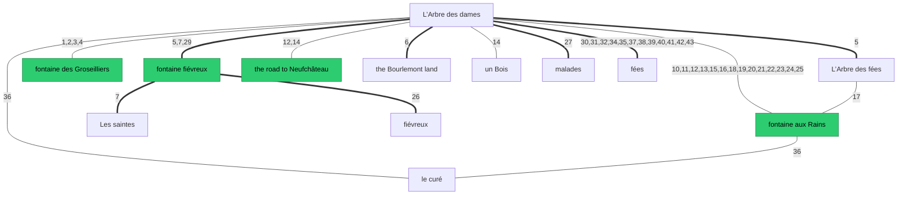

# Object diagram — the tree and its surroundings (first-hand-snippets only)

Scope: only `object-model` entries that a snippet in the `first-hand-snippets`
array (not `general-reputation`, not `observation-list`, not
`candidate-locations`) directly names are drawn. Only relationships a
snippet directly states are drawn as edges; nothing here is inferred from
context, distance math, or the `personal-musings` notes. An entry that is
named first-hand but never appears in a directly-stated relationship to any
other included entity is dropped rather than drawn as an unconnected node.
Snippets that are the condemnation-trial judges'/promoter's own accusatory
assertions about Jeanne — rather than a witness's or Jeanne's own statement —
are excluded as well, since the judges were never eyewitnesses to anything in
Domremy (see "Excluded first-hand-snippets" below).

Legend: a **thick** edge (`==`) means at least one of its supporting
relations is Jeanne d'Arc's own testimony; a normal edge (`--`) means none
of its supporting relations are. A **green** node denotes an entity that may
have left archaeological evidence — see "Archaeological-potential coloring"
below for the rationale on each.

## Included entities and why

- **L’Arbre des dames** / **L’Arbre des fées** — kept as two separate nodes
  (they are two separate object-model entries) because a first-hand snippet
  states they are the *same* tree under two names — that equivalence is
  itself a directly-stated relation, so collapsing them into one node would
  throw the evidence for it away.
- **fontaine des Groseilliers**, **fontaine fiévreux**, **fontaine aux Rains**
  — each is named outright in a snippet, each tied to the tree.
- **the road to Neufchâteau**, **the Bourlemont land**, **un Bois** — named
  outright, each tied to the tree.
- **Les saintes** — named outright, tied to `fontaine fiévreux` via Jeanne
  d'Arc's confirmed interrogation answer (relation 7 — see below).
- **fiévreux** — named outright in Jeanne d'Arc's own testimony, which
  states they go to the fountain beside the tree to recover their health.
  (A second snippet making the same claim — the trial record's "renommée"
  passage — is excluded under rule 2; see "Excluded first-hand-snippets"
  below.)
- **malades** — named outright in Jeanne d'Arc's testimony, which states
  they go to the tree itself to amuse themselves once recovered.
- **fées** — named outright across many depositions — both Jeanne d'Arc's
  own testimony and several questionnaire-lorraine witnesses — each directly
  stating, as claim, rumor, or explicit denial, that "les fées" / "les dames
  fées" haunted or went to the tree. (The same "renommée" passage also once
  tied `fées` to `fontaine fiévreux` and `L’Arbre des fées`, but that
  snippet is excluded under rule 2, so those two edges are dropped — see
  "Excluded first-hand-snippets" below.)
- **le curé** — named outright in Béatrice's deposition, which states he
  goes under the tree and to the fountain aux Rains each Ascension Eve to
  chant the gospel.

## Excluded entirely

### Never named in a first-hand-snippet

`L’Arbre de la Pucelle`, `des ruines`, `Chapelle de notre dame de domremy`,
`Hordal chapel`, `Basilique`, `fontaine de l’Ermite`, `the ridge road on the
west bank`, `vineyard`, `estate boundary`, `the Bois Chenu`, `the slope to the
top of the bois Chenu`, `the valley`, `the river meuse`. (`fontaine de
l'Ermite` and `Chapelle de notre dame de domremy` are close calls — Jeanne
d'Arc mentions garlands for "l'image de la Notre-Dame de Domrémy," and the
Jollois text names a "fontaine de l'Ermite," but the first is an image, not
the chapel, and the second only appears in `general-reputation`, not a
first-hand snippet — so neither is drawn, to avoid inferring a link the text
doesn't state.) `L’Arbre` (the bare, un-named object-model entry) is likewise
not drawn as a third node: every first-hand use of unqualified "l'arbre" /
"cet arbre" occurs in a deposition that has already named the tree earlier in
the same testimony (mostly as "l'arbre des dames" or a synonym of it), so it
is folded into whichever named tree that testimony uses rather than treated
as a distinct, unlinked entity.

### Named first-hand, but dropped as isolated (no stated relationship)

- **l’ermitage de Notre-Dame de Bermont** — named (as "l'église Notre-Dame de
  Bermont") in one deposition, but that sentence describes a *different*
  village's (Greux) custom and states no relation to the tree or any other
  included object. Since no first-hand snippet ties it to anything else, it
  is dropped rather than drawn as an unconnected node.
- **esprit malin** — named once, by Simonin Musnier, but only as a general
  disclaimer — *"bien qu'il n'eût lui-même jamais vu quelque signe de
  quelque esprit malin"* — with no location or relation stated, unlike the
  fées clause earlier in the very same sentence, which explicitly places
  "les fées...sous cet arbre." No first-hand snippet ties `esprit malin` to
  the tree or to any other included entity, so it is dropped.
- **prêtre** — named three times, but only inside a witness's own
  occupational label in the source's parenthetical biography: Dominique
  Jacob (35 ans, prêtre), Jean Colin (66 ans, prêtre), and Henri Arnolin (64
  ans, prêtre). None of their substantive testimony states that they, in
  that capacity, did anything at the tree or fountain — Jean Colin's answer
  is just "Ne sait rien sinon par ouï-dire," and Henri Arnolin's only states
  he never heard Jeanne went there. The priestly role that *does* get a
  stated relation to the tree and fountain belongs to "le curé" in
  Béatrice's deposition, which is why `le curé` is included while `prêtre`
  is dropped as isolated.

### Named only in a snippet excluded under rule 2 (judges' assertion)

None. Both `Les saintes` and `fiévreux` are also stated in a surviving
snippet (Jeanne d'Arc's own testimony, or her confirmed interrogation
answer), so excluding the two judges'-authored snippets below removes edges
and relation numbers but drops no entity from the diagram.

### Excluded first-hand-snippets: condemnation-trial judges' assertions (rule 2)

Two `first-hand-snippets` under `document-reference: bibliotheque-monastique`
are excluded as the judges'/promoter's own accusatory record rather than a
witness's or Jeanne's own statement — neither has a `from` field or a named
witness, and both address Jeanne in the third person in the legalistic
register of the Articles of Accusation, unlike every surrounding snippet
from that same source (which is either first-person witness/Jeanne testimony
or a named-witness deposition):

1. *"Item ladite Jeanne avait coutume de fréquenter lesdits arbre et
   fontaine [de Domremy] et souvent de nuit; quelquefois de jour,
   principalement aux heures des offices, afin d'y être seule; elle a pris
   part à des rondes qui s'opéraient en dansant à l'entour; ensuite elle
   appendait aux branches de l'arbre des guirlandes formées de diverses
   herbes et fleurs, en disant et chantant auparavant, ainsi qu'après,
   certains poèmes et chansons, accompagnés d'invocations, sortilèges et de
   maléfices; desquelles guirlandes le lendemain matin il ne se retrouvait
   plus rien"* — the opening "Item ladite Jeanne..." and the closing charge
   of "invocations, sortilèges et de maléfices" mark this as an Article of
   Accusation, not testimony. Previously cited as relation 8 (this number is
   now retired, not reassigned).
2. *"Lesdites saintes lui ont plusieurs fois parlé près d'une fontaine,
   située près d'un grand arbre, appelé communément l'arbre des fées. La
   renommée court au sujet de ces arbres et fontaine que les dames fées les
   hantent et que des fiévreux y vont, quoique ce soit profane, pour
   recouvrer la santé. Là et ailleurs elle a révéré lesdites saintes et leur
   a fait révérence."* — same third-person, no-witness pattern, describing
   Jeanne's acts and "la renommée" (reputation/rumor) as grounds for a
   charge, immediately following snippet 1 in the source. Previously cited
   as relations 9, 28, and 33 (these numbers are now retired, not
   reassigned).

Dropping these two snippets removes the edges `L’Arbre des fées — fontaine
fiévreux` (previously relation 9), `fées — L’Arbre des fées` and `fées —
fontaine fiévreux` (previously relation 33) entirely, and shrinks the
relation-number labels on `L’Arbre des dames — fontaine fiévreux` (previously
5,7,8,29 → now 5,7,29), `fontaine fiévreux — Les saintes` (previously 7,9 →
now 7), and `fiévreux — fontaine fiévreux` (previously 26,28 → now 26). No
node becomes isolated as a result (see previous section).

Judgment calls worth flagging:
- Whether snippets 1 and 2 above are truly the judges'/promoter's own words,
  as opposed to a further, simply unnamed, witness deposition, is itself a
  judgment call: the yaml gives no explicit "speaker" tag distinguishing
  judge from witness for any snippet. The call here rests on register and
  content (third-person "ladite Jeanne"/"elle", no witness name, and — for
  snippet 1 — explicit accusatory language about "sortilèges et de
  maléfices" that no witness deposition in this dataset uses about Jeanne),
  contrasted with the surrounding anonymous-witness snippets at the top of
  the same source, which are first-person ("je", "nous") folk-custom
  recollections rather than legal charges.
- `un Bois` is matched only because a witness's exact wording is "un bois" —
  the object-model entry `the Bois Chenu` is a different, more specific name
  that no first-hand snippet uses, so that entry stays excluded.
- The edge from `fontaine fiévreux` to the tree, and from `Les saintes` to
  `fontaine fiévreux`, both rely on treating every snippet that places "une
  fontaine" immediately beside/next to the tree (using "auprès," "proche," or
  "située près") as the same single spring — as opposed to `fontaine des
  Groseilliers` or `fontaine aux Rains`, which the snippets always place at
  the end of a walk back ("en revenant"). That distinction (adjacent vs.
  reached after walking back) is stated directly in the snippets themselves.
- Bertrand Lacloppe's "la fontaine proche" (relation 29) is drawn as the same
  adjacent-fountain edge, since it uses the same "proche" wording next to the
  tree, with no "en revenant" framing. By contrast, Jean Moen's "vont aux
  fontaines près de cet arbre pour boire" is plural and unqualified — it is
  *not* drawn as an edge to any single fountain node, since nothing in the
  text picks out which fountain(s) are meant, unlike the singular "une
  fontaine" / "la fontaine proche" wording used elsewhere for this edge.
- Several `fées`-to-tree edges (relations 30–32, 34–35, 37–43) are drawn from
  clauses phrased as hearsay, rumor, or an explicit personal denial by the
  witness (e.g. Jeanne d'Arc's "je n'ai...jamais vu les fées près de cet
  arbre," or Bertrand Lacloppe's "il n'a jamais vu...que lesdites fées
  fussent allées sous cet arbre"). The edge is drawn because the text
  directly states the *claim* that the fées haunted/visited the tree — the
  witness denying personal verification of that claim is not the same as
  the claim itself being absent from the text. This mirrors how relation 30's
  "on disait" / "hanté" wording is already treated as evidence of a stated
  claim, not of a verified fact.
- Relation 37 (Jeannette, veuve de Thiesselin de Vittel) names "une certaine
  dame dénommée Fée" — singular, and used here almost as a proper name for
  one individual in a courtly legend, rather than the plural "les fées" used
  everywhere else. Since `fées` is the only object-model entry this word
  could belong to, and the underlying word is identical, it is folded into
  the `fées` node, but the singular/proper-name framing is flagged here as a
  judgment call rather than resolved silently.
- `esprit malin` (Simonin Musnier, same sentence as relation 41) is
  deliberately *not* drawn as an edge to the tree — see "Excluded entirely"
  above. The clause gives no location, unlike the fées clause immediately
  preceding it in the same sentence.

Each edge is labeled with the number(s) of the matching relation(s) listed
below. Where more than one first-hand snippet supports the same edge, the
numbers are comma-separated.

```mermaid
graph TD
    classDef archaeological fill:#2ecc71,stroke:#1e8449,color:#000;

    N1["L’Arbre des dames"]
    N2["L’Arbre des fées"]
    N3["fontaine des Groseilliers"]
    N4["fontaine fiévreux"]
    N5["fontaine aux Rains"]
    N6["the road to Neufchâteau"]
    N7["the Bourlemont land"]
    N8["un Bois"]
    N9["Les saintes"]
    N10["fiévreux"]
    N11["malades"]
    N12["fées"]
    N13["le curé"]

    N1 == "5" === N2
    N1 -- "1,2,3,4" --- N3
    N1 == "5,7,29" === N4
    N1 == "6" === N7
    N4 == "7" === N9
    N1 == "30,31,32,34,35,37,38,39,40,41,42,43" === N12
    N1 -- "36" --- N13
    N5 -- "36" --- N13
    N4 == "26" === N10
    N1 == "27" === N11
    N1 -- "10,11,12,13,15,16,18,19,20,21,22,23,24,25" --- N5
    N2 -- "17" --- N5
    N1 -- "12,14" --- N6
    N1 -- "14" --- N8

    class N3,N4,N5,N6 archaeological
```

## Numbered relations

1. **Arbre des dames — fontaine des Groseilliers.** Village children walked from the tree to the fountain on Fountain Sunday.
   *"Les petits du village, filles et garçons, avec du pain et des noix, allaient à l'arbre des Dames et à la Fontaine-des-Groseilliers, le dimanche de Laetare Jerusalem..."* (bibliotheque-monastique).

2. **Arbre des dames — fontaine des Groseilliers.** After eating under the tree, the group went on to drink at the fountain.
   *"Nous mangions sous l'arbre, puis nous allions boire à la Fontaine-des-Groseilliers."* (bibliotheque-monastique).

3. **Arbre des dames — fontaine des Groseilliers.** Jeannette is described dancing under the tree, then going to drink at the fountain.
   *"Jeannette venait danser et jouer avec nous... et puis s'en venait boire à la Fontaine-des-Groseilliers."* (bibliotheque-monastique).

4. **Arbre des dames — fontaine des Groseilliers.** Jeanne, in her youth, is placed at both sites together.
   *"Jeannette, en ses jeunes ans, allait quelquefois, en compagnie des autres fillettes, à l'arbre des Dames et à la Fontaine-des-Groseilliers, pour courir et danser avec ses compagnes."* (bibliotheque-monastique).

5. **Arbre des dames = Arbre des fées; Arbre des dames — fontaine fiévreux.** *(Jeanne D'Arc — thick edges)* Jeanne d'Arc states the tree has two names, and places a fountain immediately beside it where feverish people (fiévreux) go to recover.
   *"Près de Domrémy il y avait un arbre appelé l'arbre des Dames ; d'autres l'appelaient l'arbre des Fées. Auprès est une fontaine. J'ai ouï dire que les fiévreux boivent de cette fontaine et y vont quérir de l'eau pour se remettre en santé."* (bibliotheque-monastique, from Jeanne D'Arc).

6. **Arbre des dames — the Bourlemont land.** *(Jeanne D'Arc — thick edge)* Jeanne d'Arc states the tree (here called "le Fou," the same tree as in #5) belonged to Pierre de Bourlémont.
   *"Il y a un grand arbre appelé le Fou, d'où vient le beau mai. Il appartenait, d'après le commun dire, à monseigneur Pierre de Bourlemont, chevalier."* (bibliotheque-monastique, from Jeanne D'Arc).

7. **Arbre des dames — fontaine fiévreux; fontaine fiévreux — Les saintes.** *(Jeanne D'Arc — thick edges)* Jeanne is asked about, and confirms hearing, the saints at "the fountain near the tree" — the confirmed answer is hers, so this counts as her own statement even though the judge poses the question.
   *"interrogateur - Les saintes vous ont-elles parlé à la fontaine proche de l'arbre? Jeanne D'Arc - Oui, je les y ai entendues; mais je ne me rappelle pas ce qu'elles m'y ont dit."* (bibliotheque-monastique).

*(Relations 8, 9, and 33 — previously drawn from two snippets that are judges'/promoter's accusatory assertions, not testimony — are retired under rule 2. See "Excluded first-hand-snippets" above for the dropped quotes and the edges/labels this removed.)*

10. **Arbre des dames — fontaine aux Rains.** Jean Morel, Jeanne's godfather, has the group return from the tree to this fountain, which he places closer to the village than the tree.
    *"...en revenant ils vont à la fontaine aux Rains, qui est plus près du village que l'arbre, en se promenant et chantant, y boivent son eau..."* (questionnaire-lorraine, Jean Morel).

11. **Arbre des dames — fontaine aux Rains.** Dominique Jacob has the children return from the tree to eat and drink at the fountain.
    *"...en revenant ils vont à la fontaine des Rains, mangent leur pain et boivent de cette eau..."* (questionnaire-lorraine, Dominique Jacob).

12. **Arbre des dames — fontaine aux Rains; Arbre des dames — the road to Neufchâteau.** Béatrice places the tree beside the road to Neufchâteau, and has people return from the tree to the fountain.
    *"Cet arbre se trouve à côté du grand chemin par lequel on va à Neufchâteau... en revenant, vont à la Fontaine aux Rains et boivent son eau."* (questionnaire-lorraine, Béatrice).

13. **Arbre des dames — fontaine aux Rains.** Jeanette, wife of Thévenin Le Royer, gives the same tree-to-fountain return.
    *"...vont ensuite à la Fontaine aux Rains et boivent de son eau."* (questionnaire-lorraine, Jeanette femme de Thévenin Le Royer).

14. **Arbre des dames — un Bois; Arbre des dames — the road to Neufchâteau.** Jean Moen places the tree next to a wood, at the edge of the road to Neufchâteau.
    *"L'arbre mentionné est près d'un bois, au bord du grand chemin par lequel on va à Neufchâteau."* (questionnaire-lorraine, Jean Moen).

15. **Arbre des dames — fontaine aux Rains.** Jeannette, widow of Thiesselin de Vittel, has the young people go on to drink at this fountain.
    *"...et vont boire à la Fontaine aux Rains."* (questionnaire-lorraine, Jeannette veuve de Thiesselin de Vittel).

16. **Arbre des dames — fontaine aux Rains.** Perrin Drappier places Jeanne making rounds toward the tree and this fountain together.
    *"...se promener et faire des rondes vers l'arbre et à la fontaine des Rains."* (questionnaire-lorraine, Perrin Drappier).

17. **Arbre des fées — fontaine aux Rains.** Gérard Guillemette, who calls the tree "l'arbre des fées," has the group return from it to drink at the fountain.
    *"L'a souvent entendu appeler l'arbre des fées... ensuite ils reviennent à la fontaine des Rains et boivent de son eau."* (questionnaire-lorraine, Gérard Guillemette).

18. **Arbre des dames — fontaine aux Rains.** Hauviette, a childhood friend of Jeanne, names the tree and fountain as the pair habitually visited.
    *"Les jeunes filles et jeunes gens du village avaient l'habitude d'aller à cet arbre et à la fontaine des Rains le dimanche de Lætare, dit des Fontaines..."* (questionnaire-lorraine, Hauviette).

19. **Arbre des dames — fontaine aux Rains.** Jean Waterin has the young people return from the tree to drink at the fountain.
    *"...puis au retour vont à la fontaine des Rains ou parfois à d'autres fontaines, et boivent."* (questionnaire-lorraine, Jean Waterin).

20. **Arbre des dames — fontaine aux Rains.** Gérardin d'Épinal, "le bourguignon," has the group return from the tree to eat and drink at the fountain.
    *"...et ensuite reviennent à la fontaine des Rains, mangent le pain et y boivent de l'eau, comme il le vit."* (questionnaire-lorraine, Gérardin d'Épinal).

21. **Arbre des dames — fontaine aux Rains.** Simonin Musnier has the group pass the fountain and drink on the way back from the tree.
    *"...en revenant passent à la fontaine des Rains et boivent de son eau."* (questionnaire-lorraine, Simonin Musnier).

22. **Arbre des dames — fontaine aux Rains.** Isabelle, wife of Gérardin d'Épinal, has the group come drink at the fountain on the way back from the tree.
    *"...au retour ils venaient boire à la fontaine des Rains ; selon la coutume qui existe encore."* (questionnaire-lorraine, Isabelle).

23. **Arbre des dames — fontaine aux Rains.** Colin, son of Jean Colin, has the group sometimes go to drink at the fountain on the way back from the tree.
    *"...et au retour vont parfois pour boire à la fontaine des Rains et y boivent..."* (questionnaire-lorraine, Colin fils de Jean Colin).

24. **Arbre des dames — fontaine aux Rains.** Michel Le Buin has the young people go on to drink at the fountain.
    *"...ensuite vont boire à la fontaine des Rains."* (questionnaire-lorraine, Michel Le Buin).

25. **Arbre des dames — fontaine aux Rains.** Jean Jaquard has the group return from the tree to drink at the fountain.
    *"...puis, jouant et se promenant, reviennent à la fontaine des Rains, boivent de son eau."* (questionnaire-lorraine, Jean Jaquard).

26. **fiévreux — fontaine fiévreux.** *(Jeanne D'Arc — thick edge)* Jeanne d'Arc states that feverish people drink from the fountain beside the tree to recover their health.
    *"J'ai ouï dire que les fiévreux boivent de cette fontaine et y vont quérir de l'eau pour se remettre en santé."* (bibliotheque-monastique, from Jeanne D'Arc).

27. **Arbre des dames — malades.** *(Jeanne D'Arc — thick edge)* Jeanne d'Arc states that the sick, once recovered, go to the tree to amuse themselves. "Cet arbre" is folded into "l'arbre des Dames," following the same continuity already used for relation 6 (the immediately preceding sentence in the same testimony names the tree "l'arbre des Dames"/"l'arbre des Fées").
    *"J'ai oui dire que les malades une fois relevés, vont à cet arbre pour se divertir."* (bibliotheque-monastique, from Jeanne D'Arc).

*(Relation 28 — the trial record's repetition of this claim — is retired along with relations 8, 9, and 33; see "Excluded first-hand-snippets" above.)*

29. **Arbre des dames — fontaine fiévreux.** Bertrand Lacloppe places the young people at the tree and "the nearby fountain" together, without the "en revenant" (return-trip) framing used for the Fontaine aux Rains elsewhere — matching the adjacent-fountain pattern already established for this edge (see relations 5 and 7).
    *"...allaient parfois à cet arbre, avec Jeanne parmi eux, et à la fontaine proche, pour se promener et faire des rondes..."* (questionnaire-lorraine, Bertrand Lacloppe).

30. **fées — Arbre des dames.** An anonymous deposition states the tree was haunted by the "dames appelées fées," while noting no one had actually been heard to have seen them.
    *"Il y avait chez nous un arbre que, depuis l'ancien temps, on nommait l'arbre des Dames. Les vieilles gens disaient qu'il était hanté des dames appelées fées. Cependant, je n'ai jamais ouï citer personne qui ait vu les fées."* (bibliotheque-monastique).

31. **fées — Arbre des dames.** *(Jeanne D'Arc — thick edge)* Jeanne d'Arc recounts hearsay that elders said the "dames fées" haunted the tree, that one of her godmothers claimed to have seen fées there, and personally denies ever having seen fées near the tree.
    *"Souventes fois j'ai ouï dire par des anciens...que les dames fées le hantaient. J'ai même ouï dire à une de mes marraines, nommée Jeanne, femme du maire Rubery, qu'elle-même avait vu là des fées...Je n'ai, moi, jamais vu les fées près de cet arbre, que je sache."* (bibliotheque-monastique, from Jeanne D'Arc).

32. **fées — Arbre des dames.** *(Jeanne D'Arc — thick edge)* Jeanne d'Arc denies knowing or having heard that the tree was haunted by fées.
    *"Je ne sais et n'ai pas oui dire qu'il fût hanté par les fées."* (bibliotheque-monastique, from Jeanne D'Arc).

*(Relation 33 — the trial record's "renommée" passage tying fées to Arbre des fées and to fontaine fiévreux — is retired along with relations 8, 9, and 28; see "Excluded first-hand-snippets" above.)*

34. **fées — Arbre des dames.** Jean Morel, Jeanne's godfather, recounts that supernatural women called fées formerly danced under the tree called "des dames."
    *"Entendit dire autrefois que des femmes ou personnes surnaturelles, on les appelait fées, allaient anciennement danser sous l'arbre appelé des dames."* (questionnaire-lorraine, Jean Morel).

35. **fées — Arbre des dames.** Béatrice recounts that the "dames fatales," in French "les fées," formerly went under this tree (already named "l'arbre des dames" earlier in her deposition).
    *"...autrefois entendit dire qu'anciennement les dames fatales, en français les fées, allaient sous cet arbre; mais n'y vont plus à cause des péchés."* (questionnaire-lorraine, Béatrice).

36. **le curé — Arbre des dames; le curé — fontaine aux Rains.** Béatrice states that on Ascension Eve the curé, carrying the processional crosses through the fields, also goes under the tree and chants the gospel there, as well as at the fountain aux Rains.
    *"La veille de l'Ascension, quand le curé porte les croix par les champs, il va lui aussi sous cet arbre et y chante l'évangile, ainsi qu'à la fontaine aux Rains et aux autres fontaines."* (questionnaire-lorraine, Béatrice).

37. **fées — Arbre des dames** *(judgment call — see below)*. Jeannette, widow of Thiesselin de Vittel, recounts a tale that a lord, Pierre Gravier de Bourlemont, used to meet a lady called "Fée" under this tree.
    *"...on raconte qu'anciennement un seigneur appelé seigneur Pierre Gravier, chevalier, seigneur de Bourlemont, allait rencontrer sous cet arbre une certaine dame dénommée Fée, et qu'ils parlaient ensemble; l'a entendu lire dans un roman."* (questionnaire-lorraine, Jeannette veuve de Thiesselin de Vittel).

38. **fées — Arbre des dames.** Bertrand Lacloppe recounts that "les fées" were formerly said to go under the tree, though he never saw or heard of it happening in his own time.
    *"On disait jadis que les fées (en français) y allaient; cependant il n'a jamais vu, ni entendu dire à l'époque que lesdites fées fussent allées sous cet arbre."* (questionnaire-lorraine, Bertrand Lacloppe).

39. **fées — Arbre des dames.** Hauviette recounts that the "dames appelées fées" used to go to the tree, though she never heard that anyone had seen them.
    *"On disait qu'avant, les dames appelées fées allaient à cet arbre, mais elle-même n'a jamais entendu dire que quelqu'un les ait vues."* (questionnaire-lorraine, Hauviette).

40. **fées — Arbre des dames.** Jean Waterin recounts that women called fées formerly went there, though he never heard that anyone had seen them.
    *"Entendit dire que jadis des femmes appelées fées s'y rendaient; mais n'entendit jamais dire que quelqu'un les y ait vues."* (questionnaire-lorraine, Jean Waterin).

41. **fées — Arbre des dames.** Simonin Musnier recounts that those called "les fées" formerly went under the tree — in the same breath disclaiming ever having seen a sign of an "esprit malin" himself (see judgment calls below).
    *"...on dit que jadis celles qu'on appelle les fées allaient sous cet arbre, bien qu'il n'eût lui-même jamais vu quelque signe de quelque esprit malin."* (questionnaire-lorraine, Simonin Musnier).

42. **fées — Arbre des dames.** Michel Le Buin recounts that women called fées formerly went under the tree, though they no longer do, so far as he knows.
    *"A entendu dire que des femmes appelée fées se rendaient autrefois sous cet arbre, mais ignore si c'est vrai puisqu'elles n'y ont plus."* (questionnaire-lorraine, Michel Le Buin).

43. **fées — Arbre des dames.** Albert d'Ourches recounts that fées formerly came under the tree, though no one had ever seen them.
    *"A entendu dire autrefois que jadis les fées venaient sous cet arbre, sans que personne ne les eût vues."* (questionnaire-lorraine, Albert d'Ourches).

## Archaeological-potential coloring

Green nodes denote an included entity that denotes a constructed/physical
feature which could plausibly leave a trace diggable today (worked stone,
masonry, a built basin, a road bed), as opposed to a living tree, a
folkloric being, a person's office, or an unformed group of people. This is
an interpretive layer, not a first-hand claim, so it needs no citation — but
the rationale for each is given here, and any debatable call is flagged.

- **fontaine des Groseilliers**, **fontaine fiévreux**, **fontaine aux
  Rains** *(green — judgment call)*. None of the surviving testimony
  describes these springs' construction directly, so coloring them green
  rests on the general likelihood that a named, regularly-visited village
  fountain of this kind was fitted with at least a stone-lined basin or
  well-head, which could leave worked-stone remains even after the spring
  itself silts up or shifts. This is inference from the *kind* of object
  named, not from any first-hand-stated fact about these particular
  fountains — flagged here rather than resolved silently, per rule 7.
- **the road to Neufchâteau** *(green)*. An old right-of-way of this kind
  typically leaves a road bed, ditch, or verge trace even where its exact
  route has since shifted — one of rule 9's own listed examples of a
  qualifying constructed feature.
- **L’Arbre des dames** / **L’Arbre des fées** *(not green)*. A living beech,
  however venerable — no masonry or worked stone to leave behind.
- **the Bourlemont land** *(not green)*. Denotes ownership of a stretch of
  land, not a built structure on it; nothing first-hand describes markers,
  walls, or boundary stones for it.
- **un Bois** *(not green)*. A wood — a natural feature, not constructed.
- **Les saintes**, **fées** *(not green)*. Non-physical/folkloric entities —
  rule 9's own example of what does not qualify.
- **fiévreux**, **malades** *(not green)*. Groups of people, not places or
  structures.
- **le curé** *(not green)*. A person's office, not a physical feature —
  rule 9's own example of what does not qualify.
