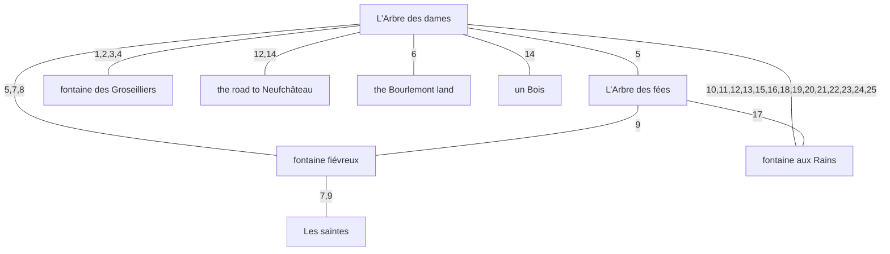

# Object diagram — the tree and its surroundings (first-hand-snippets only)

Scope: only `object-model` entries that a snippet in the `first-hand-snippets`
array (not `general-reputation`, not `observation-list`, not
`candidate-locations`) directly names are drawn. Only relationships a
snippet directly states are drawn as edges; nothing here is inferred from
context, distance math, or the `personal-musings` notes. An entry that is
named first-hand but never appears in a directly-stated relationship to any
other included entity is dropped rather than drawn as an unconnected node.

## Included entities and why

- **L’Arbre des dames** / **L’Arbre des fées** — kept as two separate nodes
  (they are two separate object-model entries) because a first-hand snippet
  states they are the *same* tree under two names — that equivalence is
  itself a directly-stated relation, so collapsing them into one node would
  throw the evidence for it away.
- **fontaine des Groseilliers**, **fontaine fiévreux**, **fontaine aux Rains**
  — each is named outright in a snippet, each tied to the tree.
- **the road to Neufchâteau**, **the Bourlemont land**, **un Bois** — named
  outright, each tied to the tree.
- **Les saintes** — named outright, tied to `fontaine fiévreux` (see below).

## Excluded entirely

### Never named in a first-hand-snippet

`L’Arbre de la Pucelle`, `des ruines`, `Chapelle de notre dame de domremy`,
`Hordal chapel`, `Basilique`, `fontaine de l’Ermite`, `the ridge road on the
west bank`, `vineyard`, `estate boundary`, `the Bois Chenu`, `the slope to the
top of the bois Chenu`, `the valley`, `the river meuse`. (`fontaine de
l'Ermite` and `Chapelle de notre dame de domremy` are close calls — Jeanne
d'Arc mentions garlands for "l'image de la Notre-Dame de Domrémy," and the
Jollois text names a "fontaine de l'Ermite," but the first is an image, not
the chapel, and the second only appears in `general-reputation`, not a
first-hand snippet — so neither is drawn, to avoid inferring a link the text
doesn't state.) `L’Arbre` (the bare, un-named object-model entry) is likewise
not drawn as a third node: every first-hand use of unqualified "l'arbre" /
"cet arbre" occurs in a deposition that has already named the tree earlier in
the same testimony (mostly as "l'arbre des dames" or a synonym of it), so it
is folded into whichever named tree that testimony uses rather than treated
as a distinct, unlinked entity.

### Named first-hand, but dropped as isolated (no stated relationship)

- **l’ermitage de Notre-Dame de Bermont** — named (as "l'église Notre-Dame de
  Bermont") in one deposition, but that sentence describes a *different*
  village's (Greux) custom and states no relation to the tree or any other
  included object. Since no first-hand snippet ties it to anything else, it
  is dropped rather than drawn as an unconnected node.

Two judgment calls worth flagging:
- `un Bois` is matched only because a witness's exact wording is "un bois" —
  the object-model entry `the Bois Chenu` is a different, more specific name
  that no first-hand snippet uses, so that entry stays excluded.
- The edge from `fontaine fiévreux` to the tree, and from `Les saintes` to
  `fontaine fiévreux`, both rely on treating every snippet that places "une
  fontaine" immediately beside/next to the tree (using "auprès," "proche," or
  "située près") as the same single spring — as opposed to `fontaine des
  Groseilliers` or `fontaine aux Rains`, which the snippets always place at
  the end of a walk back ("en revenant"). That distinction (adjacent vs.
  reached after walking back) is stated directly in the snippets themselves.

Each edge is labeled with the number(s) of the matching relation(s) listed
below. Where more than one first-hand snippet supports the same edge, the
numbers are comma-separated.

```mermaid
graph TD
    N1["L’Arbre des dames"]
    N2["L’Arbre des fées"]
    N3["fontaine des Groseilliers"]
    N4["fontaine fiévreux"]
    N5["fontaine aux Rains"]
    N6["the road to Neufchâteau"]
    N7["the Bourlemont land"]
    N8["un Bois"]
    N9["Les saintes"]

    N1 -- "5" --- N2
    N1 -- "1,2,3,4" --- N3
    N1 -- "5,7,8" --- N4
    N2 -- "9" --- N4
    N1 -- "6" --- N7
    N4 -- "7,9" --- N9
    N1 -- "10,11,12,13,15,16,18,19,20,21,22,23,24,25" --- N5
    N2 -- "17" --- N5
    N1 -- "12,14" --- N6
    N1 -- "14" --- N8
```

## Numbered relations

1. **Arbre des dames — fontaine des Groseilliers.** Village children walked from the tree to the fountain on Fountain Sunday.
   *"Les petits du village, filles et garçons, avec du pain et des noix, allaient à l'arbre des Dames et à la Fontaine-des-Groseilliers, le dimanche de Laetare Jerusalem..."* (bibliotheque-monastique).

2. **Arbre des dames — fontaine des Groseilliers.** After eating under the tree, the group went on to drink at the fountain.
   *"Nous mangions sous l'arbre, puis nous allions boire à la Fontaine-des-Groseilliers."* (bibliotheque-monastique).

3. **Arbre des dames — fontaine des Groseilliers.** Jeannette is described dancing under the tree, then going to drink at the fountain.
   *"Jeannette venait danser et jouer avec nous... et puis s'en venait boire à la Fontaine-des-Groseilliers."* (bibliotheque-monastique).

4. **Arbre des dames — fontaine des Groseilliers.** Jeanne, in her youth, is placed at both sites together.
   *"Jeannette, en ses jeunes ans, allait quelquefois, en compagnie des autres fillettes, à l'arbre des Dames et à la Fontaine-des-Groseilliers, pour courir et danser avec ses compagnes."* (bibliotheque-monastique).

5. **Arbre des dames = Arbre des fées; Arbre des dames — fontaine fiévreux.** Jeanne d'Arc states the tree has two names, and places a fountain immediately beside it where feverish people (fiévreux) go to recover.
   *"Près de Domrémy il y avait un arbre appelé l'arbre des Dames ; d'autres l'appelaient l'arbre des Fées. Auprès est une fontaine. J'ai ouï dire que les fiévreux boivent de cette fontaine et y vont quérir de l'eau pour se remettre en santé."* (bibliotheque-monastique, from Jeanne D'Arc).

6. **Arbre des dames — the Bourlemont land.** Jeanne d'Arc states the tree (here called "le Fou," the same tree as in #5) belonged to Pierre de Bourlémont.
   *"Il y a un grand arbre appelé le Fou, d'où vient le beau mai. Il appartenait, d'après le commun dire, à monseigneur Pierre de Bourlemont, chevalier."* (bibliotheque-monastique, from Jeanne D'Arc).

7. **Arbre des dames — fontaine fiévreux; fontaine fiévreux — Les saintes.** Jeanne is asked about, and confirms hearing, the saints at "the fountain near the tree."
   *"interrogateur - Les saintes vous ont-elles parlé à la fontaine proche de l'arbre? Jeanne D'Arc - Oui, je les y ai entendues; mais je ne me rappelle pas ce qu'elles m'y ont dit."* (bibliotheque-monastique).

8. **Arbre des dames — fontaine fiévreux.** The accusation records Jeanne as habitually frequenting "the tree and fountain" as one adjacent pair.
   *"ladite Jeanne avait coutume de fréquenter lesdits arbre et fontaine [de Domremy]..."* (bibliotheque-monastique).

9. **Arbre des fées — fontaine fiévreux; fontaine fiévreux — Les saintes.** The trial record places the saints' voices beside a fountain that is itself placed next to the great tree — this snippet explicitly names it "l'arbre des fées," not "des dames," so the edge attaches to that node (per skill rule 3: honor the literal name used).
   *"Lesdites saintes lui ont plusieurs fois parlé près d'une fontaine, située près d'un grand arbre, appelé communément l'arbre des fées."* (bibliotheque-monastique).

10. **Arbre des dames — fontaine aux Rains.** Jean Morel, Jeanne's godfather, has the group return from the tree to this fountain, which he places closer to the village than the tree.
    *"...en revenant ils vont à la fontaine aux Rains, qui est plus près du village que l'arbre, en se promenant et chantant, y boivent son eau..."* (questionnaire-lorraine, Jean Morel).

11. **Arbre des dames — fontaine aux Rains.** Dominique Jacob has the children return from the tree to eat and drink at the fountain.
    *"...en revenant ils vont à la fontaine des Rains, mangent leur pain et boivent de cette eau..."* (questionnaire-lorraine, Dominique Jacob).

12. **Arbre des dames — fontaine aux Rains; Arbre des dames — the road to Neufchâteau.** Béatrice places the tree beside the road to Neufchâteau, and has people return from the tree to the fountain.
    *"Cet arbre se trouve à côté du grand chemin par lequel on va à Neufchâteau... en revenant, vont à la Fontaine aux Rains et boivent son eau."* (questionnaire-lorraine, Béatrice).

13. **Arbre des dames — fontaine aux Rains.** Jeanette, wife of Thévenin Le Royer, gives the same tree-to-fountain return.
    *"...vont ensuite à la Fontaine aux Rains et boivent de son eau."* (questionnaire-lorraine, Jeanette femme de Thévenin Le Royer).

14. **Arbre des dames — un Bois; Arbre des dames — the road to Neufchâteau.** Jean Moen places the tree next to a wood, at the edge of the road to Neufchâteau.
    *"L'arbre mentionné est près d'un bois, au bord du grand chemin par lequel on va à Neufchâteau."* (questionnaire-lorraine, Jean Moen).

15. **Arbre des dames — fontaine aux Rains.** Jeannette, widow of Thiesselin de Vittel, has the young people go on to drink at this fountain.
    *"...et vont boire à la Fontaine aux Rains."* (questionnaire-lorraine, Jeannette veuve de Thiesselin de Vittel).

16. **Arbre des dames — fontaine aux Rains.** Perrin Drappier places Jeanne making rounds toward the tree and this fountain together.
    *"...se promener et faire des rondes vers l'arbre et à la fontaine des Rains."* (questionnaire-lorraine, Perrin Drappier).

17. **Arbre des fées — fontaine aux Rains.** Gérard Guillemette, who calls the tree "l'arbre des fées," has the group return from it to drink at the fountain.
    *"L'a souvent entendu appeler l'arbre des fées... ensuite ils reviennent à la fontaine des Rains et boivent de son eau."* (questionnaire-lorraine, Gérard Guillemette).

18. **Arbre des dames — fontaine aux Rains.** Hauviette, a childhood friend of Jeanne, names the tree and fountain as the pair habitually visited.
    *"Les jeunes filles et jeunes gens du village avaient l'habitude d'aller à cet arbre et à la fontaine des Rains le dimanche de Lætare, dit des Fontaines..."* (questionnaire-lorraine, Hauviette).

19. **Arbre des dames — fontaine aux Rains.** Jean Waterin has the young people return from the tree to drink at the fountain.
    *"...puis au retour vont à la fontaine des Rains ou parfois à d'autres fontaines, et boivent."* (questionnaire-lorraine, Jean Waterin).

20. **Arbre des dames — fontaine aux Rains.** Gérardin d'Épinal, "le bourguignon," has the group return from the tree to eat and drink at the fountain.
    *"...et ensuite reviennent à la fontaine des Rains, mangent le pain et y boivent de l'eau, comme il le vit."* (questionnaire-lorraine, Gérardin d'Épinal).

21. **Arbre des dames — fontaine aux Rains.** Simonin Musnier has the group pass the fountain and drink on the way back from the tree.
    *"...en revenant passent à la fontaine des Rains et boivent de son eau."* (questionnaire-lorraine, Simonin Musnier).

22. **Arbre des dames — fontaine aux Rains.** Isabelle, wife of Gérardin d'Épinal, has the group come drink at the fountain on the way back from the tree.
    *"...au retour ils venaient boire à la fontaine des Rains ; selon la coutume qui existe encore."* (questionnaire-lorraine, Isabelle).

23. **Arbre des dames — fontaine aux Rains.** Colin, son of Jean Colin, has the group sometimes go to drink at the fountain on the way back from the tree.
    *"...et au retour vont parfois pour boire à la fontaine des Rains et y boivent..."* (questionnaire-lorraine, Colin fils de Jean Colin).

24. **Arbre des dames — fontaine aux Rains.** Michel Le Buin has the young people go on to drink at the fountain.
    *"...ensuite vont boire à la fontaine des Rains."* (questionnaire-lorraine, Michel Le Buin).

25. **Arbre des dames — fontaine aux Rains.** Jean Jaquard has the group return from the tree to drink at the fountain.
    *"...puis, jouant et se promenant, reviennent à la fontaine des Rains, boivent de son eau."* (questionnaire-lorraine, Jean Jaquard).
