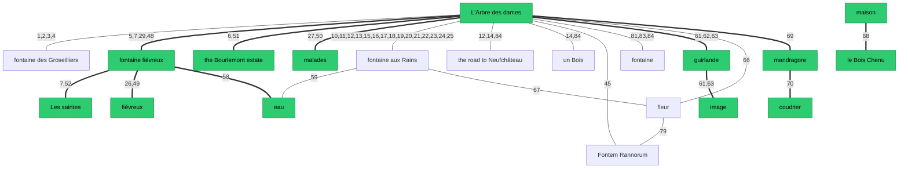

# Object diagram — the tree and its surroundings (first-hand-snippets only)

Scope: only `object-model` entries that a snippet in the `first-hand-snippets`
array (not `general-reputation`, not `observation-list`, not
`candidate-locations`) directly names are drawn. Only relationships a
snippet directly states are drawn as edges; nothing here is inferred from
context, distance math, or the `personal-musings` notes. An entry that is
named first-hand but never appears in a directly-stated relationship to any
other included entity is dropped rather than drawn as an unconnected node.
Snippets that are the condemnation-trial judges'/promoter's own accusatory
assertions about Jeanne — rather than a witness's or Jeanne's own statement —
are excluded as well, since the judges were never eyewitnesses to anything in
Domremy (see "Excluded first-hand-snippets" below).

Legend: a **thick** edge (`==`) means at least one of its supporting
relations is Jeanne d'Arc's own testimony; a normal edge (`--`) means none
of its supporting relations are. A **green** node denotes an entity that is
an endpoint of at least one thick edge — i.e. Jeanne d'Arc herself said
something that touches it — see "Jeanne-sourced coloring" below. Every
other node keeps the diagram's default styling. When a snippet directly
states that two different names name the same entity, that pair is drawn
as a single node under one canonical label rather than two (rule 4) — see
"Included entities and why" for which alternate names fold into which node
and the citation establishing each equivalence.

## Change in this update

`prompt/tree-prompt.yaml` changed two ways this pass: five more
`object-model` entries were commented out, and one brand-new first-hand
snippet was added (a new `document-reference`, `tome2livre7pieceK-5`, with
one new snippet from witness Johannes Moen).

- **Removed from `object-model`: `Fagus`, `prêtre`, `le curé`, `évangile`,
  `nappe`.** Per rule 5, a node only exists for a *current* `object-model`
  entry.
  - `Fagus` (`N37`, added only last pass) is retired, not reassigned,
    taking its only relation (77, `the Bourlemont estate — Fagus`) with
    it. `the Bourlemont estate` (`N7`) keeps its other edge (6/51 to `N1`)
    and stays included and green on that strength alone.
  - `le curé` (`N13`) is retired, not reassigned, taking relations 36
    (`le curé — Arbre des dames; le curé — fontaine aux Rains`), 71
    (`croix — le curé`), and 82 (`le curé — fontaine`) with it.
  - `évangile` (`N34`) is retired, not reassigned, taking relation 72
    (`évangile — Arbre des dames; évangile — le curé`) with it — doubly
    dead this pass, since `le curé` left too.
  - `nappe` (`N25`) is retired, not reassigned, taking relation 60
    (`nappe — Arbre des dames`) with it.
  - `prêtre` was already excluded as isolated before this removal (see
    "No longer in the fixed vocabulary"), the same treatment `esprit
    malin` already got.
- **`croix` (`N33`) is newly dropped as isolated, not for a vocabulary
  reason.** `croix` itself is still current `object-model`, but its one
  stated relationship (71, `croix — le curé`) was to `le curé`, which just
  left `object-model`. With no other first-hand-stated relationship to any
  remaining included entity, rule 5(b) drops it — the mirror image of
  `maison`/`le Bois Chenu`'s earlier un-isolation, flagged under judgment
  calls.
- **New snippet: Johannes Moen's Latin deposition** (`tome2livre7pieceK-5`)
  is the Latin parallel of Jean Moen's existing French testimony
  (relations 14, 81) — same witness, same three facts (tree near a wood,
  tree beside the road to Neufchâteau, young people drink at "the
  fountains" near the tree), from a different document. Numbered as a new
  relation, 84, co-citing the existing `Arbre des dames — un Bois`,
  `Arbre des dames — the road to Neufchâteau`, and `Arbre des dames —
  fontaine` edges rather than creating any new node. Not Jeanne-sourced,
  so it doesn't thicken any edge that wasn't already thick.

Everything else — nodes, edges, exclusions, and last pass's vocabulary
removals — is unchanged.

## Included entities and why

- **L’Arbre des dames** (merged with **L’Arbre des fées**, per rule 4) —
  two first-hand snippets each directly state the tree carries both names:
  relation 5 (bibliotheque-monastique) and relation 48 (interro_public3,
  French), *"il y avait un arbre appelé l'arbre des Dames ; d'autres
  l'appelaient l'arbre des Fées."* That equivalence is itself the evidence,
  so it is recorded as one merged node (keeping the dominant label
  `L'Arbre des dames`/`N1`) rather than drawn as two nodes joined by an
  identity edge. Bare/unqualified references ("l'arbre," "cet arbre") and
  the unslotted "le Fou"/"fau" continue to fold here via the pre-existing
  most-recently-named rule, unchanged.
- **fontaine des Groseilliers**, **fontaine fiévreux**, **fontaine aux Rains**
  — each is named outright in a snippet, each tied to the tree.
- **Fontem Rannorum** — the Latin name three witness depositions
  (Gérardin d'Épinal, Mengette, Jean Morel) use for the fountain the young
  people walk back to from the tree; kept as its own node rather than folded
  into `fontaine aux Rains` (see judgment calls below).
- **the road to Neufchâteau**, **the Bourlemont estate**, **un Bois** — named
  outright, each tied to the tree.
- **Les saintes** — named outright, tied to `fontaine fiévreux` via Jeanne
  d'Arc's confirmed interrogation answers.
- **fiévreux** — named outright in Jeanne d'Arc's own testimony, which
  states they go to the fountain beside the tree to recover their health.
- **malades** — named outright in Jeanne d'Arc's testimony, which states
  they go to the tree itself to amuse themselves once recovered.
- **eau** — directly stated as carried to, drunk, or placed at the tree or
  a fountain by one or more witnesses.
- **guirlande** (garland/wreath, including "couronnes"/"chappeaux"/Latin
  "serta") and **image** (the devotional "image de la Notre-Dame de
  Domrémy") — Jeanne states she made guirlandes at the tree *for* the
  image; both the tree-guirlande and guirlande-image relations are directly
  stated in the same sentence.
- **fleur** — Nicolas Bailly and Jean Morel both state flowers are picked
  at the tree or around the fountain(s).
- **maison** / **le Bois Chenu** (also "le Bosc Chesnu") — Jeanne states
  this wood is visible from her father's house door; this is the only
  first-hand-stated relationship either entity has, and it ties them
  together, so both are included.
- **mandragore** / **coudrier** — Jeanne states a mandrake lies in the
  ground near the tree, with a hazel growing above it.

## Excluded entirely

### Never named in a first-hand-snippet

`L’Arbre de la Pucelle`, `des ruines`, `Chapelle de notre dame de domremy`,
`Hordal chapel`, `Basilique`, `fontaine de l’Ermite`, `the spring of the
frogs`, `fontaine des grenouilles`, `fontaine aux Groselles`, `the ridge
road on the west bank`, `vineyard`, `estate boundary`,
`the slope to the top of the bois Chenu`, `the valley`, `the river meuse`.
(`the spring of the frogs` and `fontaine des grenouilles` are both named
only in a `general-reputation` editorial note speculating that "fontaine
des Rains" might really mean "fontaine des grenouilles" — not a first-hand
snippet, so neither is drawn. `fontaine aux Groselles` is named only in the
Napoleonic-cadastre `observation-list` entry and that same editorial note's
"Grouselier"/"groseilles" aside — again, neither is first-hand. `fontaine
de l'Ermite` and `Chapelle de notre dame de domremy` are close calls —
Jeanne d'Arc mentions garlands for "l'image de la Notre-Dame de Domrémy,"
and the Jollois text names a "fontaine de l'Ermite," but the first is an
image, not the chapel, and the second only appears in `general-reputation`,
not a first-hand snippet — so neither is drawn, to avoid inferring a link
the text doesn't state.)

### Redundant: every mention folds into a more specific existing node

`arbre`, `bois`, `chemin` (and the pre-existing bare `L'Arbre` entry) are
each named first-hand many times, but every single use is either (a) an
unqualified "l'arbre"/"un bois"/"ce chemin" that a deposition has already
tied to a more specific name earlier in the same testimony, or (b) a
qualified phrase ("le grand chemin par lequel on va à Neufchâteau," "un
bois... au bord du grand chemin") that only ever picks out the *same*
specific entity already in the diagram (`the road to Neufchâteau`, `un
Bois`/`le Bois Chenu`, or one of the named trees). None of them ever
surfaces its own distinct, otherwise-unrepresented relationship, so the
bare entry itself never becomes its own node — it is folded away every
time, the same treatment the bare `L'Arbre` entry has always had.

### Named first-hand, but dropped as isolated (no stated relationship)

- **l’ermitage de Notre-Dame de Bermont** — named first-hand twice: (1) as
  "l'église Notre-Dame de Bermont" in Gérard Guillemette's deposition, which
  describes a *different* village's (Greux) custom, and (2) in Jean
  Waterin's deposition, which states that Jeanne herself "allait au
  pèlerinage de Notre-Dame de Bermont." Neither snippet states any relation
  between this place and the tree, a fountain, or any other included
  entity. Dropped rather than drawn as an unconnected node.
- **croix** — named first-hand in Béatrice's deposition ("quand le curé
  porte les croix par les champs..."), and its one stated relationship
  (relation 71, `croix — le curé`) used to qualify it for inclusion. `le
  curé` left `object-model` this pass (see "No longer in the fixed
  vocabulary"), so that relationship is now to an excluded entity, and
  `croix` has no other stated relationship to any remaining included
  entity. Dropped as isolated — see judgment calls.
- **cierge** — named once, in Jean Waterin's deposition: "Elle portait
  souvent des cierges et allait au pèlerinage de Notre-Dame de Bermont."
  This ties cierges to Jeanne herself (not an `object-model` entity) and
  only loosely, via "et," to the already-isolated Bermont shrine — no
  direct relationship to another included entity.
- **charrue** — named once, in Jean Waterin's deposition: "il alla avec
  elle à la charrue du père de Jeanne." Ties the plow to Jeanne and her
  father (people, not objects) — no relationship to another included
  entity.
- **église** — named first-hand (Gérard Guillemette's "l'église Notre-Dame
  de Bermont," describing Greux's custom, and Jean Waterin's generic
  "fréquentait les églises et les lieux saints"). Neither states a direct
  relationship to any Domremy tree/fountain entity in this diagram.
- **château** — named twice (bibliotheque-monastique: "Quand le château
  était en prospérité, les seigneurs... allaient... aux Loges-les-Dames";
  Isabelle: "Quand le château du village était en bon état, les
  seigneurs... allaient se délasser sous cet arbre"). Both uses are a
  *temporal* frame ("in the days when the castle was prosperous...") for an
  action whose subject is "les seigneurs," not the château itself — not a
  direct stated relationship between the château and the tree. See
  judgment calls.

### No longer in the fixed vocabulary

- **`fées`** — removed from `object-model`. Still named first-hand,
  extensively, but rule 5 only draws a node for a *current* `object-model`
  entry. Node `N12` and its thirteen supporting relations (30, 31, 32, 34,
  35, 37–43, 46) stay retired, not reassigned.
- **`esprit malin`** — also removed from `object-model`; was already
  excluded as isolated before removal.
- **`Arbor Dominarum`** and **`Arborem Fatalium des Faées`** — removed
  from `object-model` in a prior pass. Node `N15` (which had merged both
  these names, plus `Fagus`, per that pass's rule-4 collapse) is retired,
  not reassigned.
- **`fons`** — removed from `object-model` in a prior pass. Node `N18` is
  retired, not reassigned, taking relations 73 (`Arbor Dominarum — fons`),
  74 (`fiévreux — fons`), and 80 (`Les saintes — fons`) with it.
- **`mai`** — removed from `object-model` in a prior pass (both duplicate
  list entries). Node `N28` is retired, not reassigned, taking relations
  64 and 65 (`mai — Arbre des dames`) and 76 (`mai — Arbor Dominarum`) with
  it; relation 51's mai-naming clause ("d'où vient le beau mai") no longer
  draws an edge, though the same relation's Bourlemont-ownership clause
  still does — see judgment calls.
- **`noix`** — removed from `object-model` in a prior pass. Node `N23` is
  retired, not reassigned, taking relations 56 and 57 with it.
- **`oeuf`** — removed from `object-model` in a prior pass. Node `N22` is
  retired, not reassigned; its only relations, 53 and 54, retire alongside
  it (shared with `pain`/`vin`, below).
- **`pain`** — removed from `object-model` in a prior pass. Node `N20` is
  retired, not reassigned, taking relations 53, 54, 55, and 78 with it.
- **`vin`** — removed from `object-model` in a prior pass. Node `N21` is
  retired, not reassigned, taking relations 53, 54, 55, and 78 with it
  (shared with `pain`, above).
- **`Fagus`** — survived last pass's `Arbor Dominarum`/`Arborem Fatalium
  des Faées` removal as a standalone node (`N37`), but is itself removed
  from `object-model` this pass. `N37` is retired, not reassigned, taking
  its only relation, 77 (`the Bourlemont estate — Fagus`), with it. `the
  Bourlemont estate` (`N7`) keeps its other edge, 6/51.
- **`prêtre`** — removed from `object-model` this pass; was already
  excluded as isolated before removal, the same treatment `esprit malin`
  already got.
- **`le curé`** — removed from `object-model` this pass. Node `N13` is
  retired, not reassigned, taking relations 36 (`le curé — Arbre des
  dames; le curé — fontaine aux Rains`), 71 (`croix — le curé`), and 82
  (`le curé — fontaine`) with it. This also cascades `croix` into isolation
  — see "Named first-hand, but dropped as isolated" and judgment calls.
- **`évangile`** — removed from `object-model` this pass. Node `N34` is
  retired, not reassigned, taking relation 72 (`évangile — Arbre des
  dames; évangile — le curé`) with it — doubly dead, since `le curé` left
  too.
- **`nappe`** — removed from `object-model` this pass. Node `N25` is
  retired, not reassigned, taking relation 60 (`nappe — Arbre des dames`)
  with it.

### Named only in a snippet excluded under rule 2 (judges' assertion)

- **`herbe`** — named once, inside the judges'-assertion snippet dropped
  under rule 2: *"elle appendait aux branches de l'arbre des guirlandes
  formées de diverses herbes et fleurs."* With that snippet excluded,
  `herbe` has no surviving first-hand mention at all. (`fleur` survives
  independently via Nicolas Bailly and Jean Morel — see "Included
  entities" above.)

### Excluded first-hand-snippets: condemnation-trial judges' assertions (rule 2)

Two `first-hand-snippets` under `document-reference: bibliotheque-monastique`
are excluded as the judges'/promoter's own accusatory record rather than a
witness's or Jeanne's own statement — neither has a `from` field or a named
witness, and both address Jeanne in the third person in the legalistic
register of the Articles of Accusation, unlike every surrounding snippet
from that same source:

1. *"Item ladite Jeanne avait coutume de fréquenter lesdits arbre et
   fontaine [de Domremy] et souvent de nuit; quelquefois de jour,
   principalement aux heures des offices, afin d'y être seule; elle a pris
   part à des rondes qui s'opéraient en dansant à l'entour; ensuite elle
   appendait aux branches de l'arbre des guirlandes formées de diverses
   herbes et fleurs, en disant et chantant auparavant, ainsi qu'après,
   certains poèmes et chansons, accompagnés d'invocations, sortilèges et de
   maléfices; desquelles guirlandes le lendemain matin il ne se retrouvait
   plus rien"* — the opening "Item ladite Jeanne..." and the closing charge
   of "invocations, sortilèges et de maléfices" mark this as an Article of
   Accusation, not testimony. Previously cited as relation 8 (retired, not
   reassigned). This is also `herbe`'s only first-hand mention (see above).
2. *"Lesdites saintes lui ont plusieurs fois parlé près d'une fontaine,
   située près d'un grand arbre, appelé communément l'arbre des fées. La
   renommée court au sujet de ces arbres et fontaine que les dames fées les
   hantent et que des fiévreux y vont, quoique ce soit profane, pour
   recouvrer la santé. Là et ailleurs elle a révéré lesdites saintes et leur
   a fait révérence."* — same third-person, no-witness pattern. Previously
   cited as relations 9, 28, and 33 (retired, not reassigned).

Dropping these two snippets removes the edges `L'Arbre des fées — fontaine
fiévreux` (previously relation 9), `fées — L'Arbre des fées` and `fées —
fontaine fiévreux` (previously relation 33) entirely, and shrinks the
relation-number labels on `L'Arbre des dames — fontaine fiévreux` (5,7,29,48
— previously also 8), `fontaine fiévreux — Les saintes` (7,52 — previously
also 9), and `fiévreux — fontaine fiévreux` (26,49 — previously also 28).

## Judgment calls

- Whether the two snippets above are truly the judges'/promoter's own
  words, as opposed to a further unnamed witness deposition, is itself a
  judgment call: the yaml gives no explicit "speaker" tag. The call rests
  on register and content (third-person "ladite Jeanne"/"elle," no witness
  name, explicit accusatory language) contrasted with the surrounding
  first-person folk-custom recollections.
- **`fées`/`esprit malin` removal treated as intentional**, on the strength
  of the vocabulary list alone — if unintentional, restoring them to
  `object-model` and re-running this skill would bring node `N12` and
  relations 30–32, 34–35, 37–43, 46 straight back.
- `un Bois` is matched only because Jean Moen's exact wording is "un bois"
  — a different, more specific name from `le Bois Chenu`/`le Bosc Chesnu`.
  No snippet states a relationship between the two woods.
- **`interro_public3`/`interro_public5` snippets' attribution to Jeanne
  d'Arc is now explicit, not inferred.** These third-person
  condemnation-trial minutes ("elle fut interrogée... répondit que...")
  used to carry no `from` field at all, so attributing them to Jeanne
  rested on a judgment call about phrasing (the "elle fut interrogée...
  répondit que" pattern being the trial clerk's standard way of recording
  *her own answer*, functionally the same as an "R." answer, and distinct
  from an Article-of-Accusation's "ladite Jeanne avait coutume de..."
  register). They now carry `who: Jeanne D'Arc according to the
  interrogatoire of 1431` directly, settling that call with data rather
  than inference. Still kept and attributed to Jeanne throughout
  (relations 48–52, 58, 61, 63, 68–70, 77 — 64, 73–76, and 80 are retired
  this pass for the unrelated reason that their vocabulary left
  `object-model`, see "No longer in the fixed vocabulary").
- **The same blanket `who` tag also landed on the two rule-2-excluded
  judges'/promoter's-assertion snippets** ("Item ladite Jeanne avait
  coutume de fréquenter..." and "Lesdites saintes lui ont plusieurs fois
  parlé...") — every snippet in that `bibliotheque-monastique` block
  received the identical tag, apparently mechanically, rather than per
  individual speaker. Rule 2's test is a snippet's own register and
  content (third-person "ladite Jeanne," no witness name, Articles-of-
  Accusation phrasing), not the presence or absence of an attribution
  field, so this doesn't reopen their exclusion — flagged here rather
  than silently decided, per rule 7.
- The edge from `fontaine fiévreux` to the tree (and `Les saintes`/
  `fiévreux` to `fontaine fiévreux`) relies on treating every snippet that
  places "une fontaine" immediately beside/next to the tree ("auprès,"
  "proche," "située près") as the same single spring — as opposed to
  `fontaine des Groseilliers` or `fontaine aux Rains`, always reached "en
  revenant." Jean Moen's "vont aux fontaines près de cet arbre pour boire"
  is plural/unqualified and does *not* get this treatment — it is now
  drawn to the new bare `fontaine` node (`N19`) instead, rather than left
  undrawn as before.
- **`Fontem Rannorum` kept separate from `fontaine aux Rains`** — almost
  certainly the same real fountain (even Gérardin d'Épinal's own
  French-summarized testimony describes the identical scene as "la
  fontaine des Rains"), but no single snippet states that equivalence, and
  `object-model` lists them as distinct entries, so they stay two nodes.
- **Confirmed-synonym collapsing (rule 4).** `L'Arbre des dames`/`L'Arbre
  des fées` collapse into one node (relations 5, 48) because a snippet
  directly states the equivalence. The prior two passes' second merge —
  `Arbor Dominarum`/`Arborem Fatalium des Faées`/`Fagus` into `N15`, then
  `Fagus` surviving alone as `N37` once the other two names left
  `object-model` — no longer applies at all: `Fagus` itself left
  `object-model` this pass, so none of that Latin tree-naming cluster has
  a node anymore. The judgment call this used to require (whether `Fagus`
  stays separate from `L'Arbre des dames`, `N1`, since no snippet states
  the French/Latin cross-language equivalence outright) is moot while
  `Fagus` has no node to be separate *from* — recorded here in case any of
  `Arbor Dominarum`/`Arborem Fatalium des Faées`/`Fagus` returns to
  `object-model` in a future pass.
- **Dep_mengette's "ad lobias dominarum"** is judgment-called as matching
  the French "aux Loges-les-Dames" phrasing (which has no vocabulary slot
  and folds to `N1`), so relation 45 (`L'Arbre des dames — Fontem
  Rannorum`) is unaffected by this pass's vocabulary removal. The spelling
  variants that used to be judgment-called the other way — Gérardin
  d'Épinal's "l'obre dominarum" and Jean Morel's "arbore que dicitur
  dominarum," as naming `Arbor Dominarum` rather than the French cluster —
  no longer matter: the relations built on that call (44, 47) are retired
  along with `Arbor Dominarum` itself.
- **`château`'s temporal framing does not count as a direct relationship.**
  Contrast with `le curé`, where "quand le curé porte les croix... il va...
  sous cet arbre" has *le curé himself* as the subject of both clauses
  (direct subject-verb statements); `château`'s "quand le château était en
  prospérité, les seigneurs allaient..." has "les seigneurs," not the
  château, as the subject — the château is only a temporal backdrop, not
  an object stated to relate to the tree. Excluded as isolated rather than
  drawn on a weaker standard than every other edge in this diagram.
- **Jean Morel's "après une lecture de l'évangile de saint Jean, elles n'y
  vont plus" was never drawn as an `évangile — arbre` edge**, for the same
  reason as `château`: it states a causal/temporal sequence (the gospel
  being read *causes* the fées to stop visiting), not that the gospel
  reading happens at the tree. Moot now that `évangile` has left
  `object-model` entirely, but recorded for the historical record.
- **`maison`/`le Bois Chenu` un-isolation.** This was the first time this
  diagram's rule 5(b) test flipped an entity from isolated to included
  purely because a *later* vocabulary addition supplied the missing
  relationship — worth flagging since it demonstrates rule 5 is sensitive
  to the current state of `object-model`, not a fixed historical judgment.
- **`croix` re-isolation — the mirror image of the above.** `le curé` left
  `object-model` this pass, taking relation 71 (`croix — le curé`) with
  it; `croix` has no other first-hand-stated relationship to any included
  entity, so rule 5(b) now drops it the opposite direction: an entity can
  flip from included back to isolated when a vocabulary change removes its
  only relationship partner, not just when one is added. See "Named
  first-hand, but dropped as isolated."

Each edge is labeled with the number(s) of the matching relation(s) listed
below. Where more than one first-hand snippet supports the same edge, the
numbers are comma-separated.

```mermaid
graph TD
    classDef jeanneSourced fill:#2ecc71,stroke:#1e8449,color:#000;

    N1["L'Arbre des dames"]
    N3["fontaine des Groseilliers"]
    N4["fontaine fiévreux"]
    N5["fontaine aux Rains"]
    N6["the road to Neufchâteau"]
    N7["the Bourlemont estate"]
    N8["un Bois"]
    N9["Les saintes"]
    N10["fiévreux"]
    N11["malades"]
    N14["Fontem Rannorum"]
    N19["fontaine"]
    N24["eau"]
    N26["guirlande"]
    N27["image"]
    N29["fleur"]
    N30["maison"]
    N31["mandragore"]
    N32["coudrier"]
    N36["le Bois Chenu"]

    N1 -- "1,2,3,4" --- N3
    N1 == "5,7,29,48" === N4
    N1 == "6,51" === N7
    N4 == "7,52" === N9
    N4 == "26,49" === N10
    N1 == "27,50" === N11
    N1 -- "10,11,12,13,15,16,17,18,19,20,21,22,23,24,25" --- N5
    N1 -- "12,14,84" --- N6
    N1 -- "14,84" --- N8
    N1 -- "45" --- N14
    N29 -- "79" --- N14
    N1 -- "81,83,84" --- N19
    N4 == "58" === N24
    N5 -- "59" --- N24
    N1 == "61,62,63" === N26
    N26 == "61,63" === N27
    N1 -- "66" --- N29
    N5 -- "67" --- N29
    N30 == "68" === N36
    N1 == "69" === N31
    N31 == "70" === N32

    class N1,N4,N7,N9,N10,N11,N24,N26,N27,N30,N31,N32,N36 jeanneSourced
```

## Numbered relations

1. **Arbre des dames — fontaine des Groseilliers.** Village children walked from the tree to the fountain on Fountain Sunday.
   *"Les petits du village, filles et garçons, avec du pain et des noix, allaient à l'arbre des Dames et à la Fontaine-des-Groseilliers, le dimanche de Laetare Jerusalem..."* (bibliotheque-monastique).

2. **Arbre des dames — fontaine des Groseilliers.** After eating under the tree, the group went on to drink at the fountain.
   *"Nous mangions sous l'arbre, puis nous allions boire à la Fontaine-des-Groseilliers."* (bibliotheque-monastique).

3. **Arbre des dames — fontaine des Groseilliers.** Jeannette is described dancing under the tree, then going to drink at the fountain.
   *"Jeannette venait danser et jouer avec nous... et puis s'en venait boire à la Fontaine-des-Groseilliers."* (bibliotheque-monastique).

4. **Arbre des dames — fontaine des Groseilliers.** Jeanne, in her youth, is placed at both sites together.
   *"Jeannette, en ses jeunes ans, allait quelquefois, en compagnie des autres fillettes, à l'arbre des Dames et à la Fontaine-des-Groseilliers, pour courir et danser avec ses compagnes."* (bibliotheque-monastique).

5. **Arbre des dames — fontaine fiévreux** (and states the tree's two names, "Arbre des Dames"/"Arbre des Fées," are the same tree — see "Included entities," node merge). *(Jeanne D'Arc — thick edge)* Jeanne d'Arc states the tree has two names, and places a fountain immediately beside it where feverish people (fiévreux) go to recover.
   *"Près de Domrémy il y avait un arbre appelé l'arbre des Dames ; d'autres l'appelaient l'arbre des Fées. Auprès est une fontaine. J'ai ouï dire que les fiévreux boivent de cette fontaine et y vont quérir de l'eau pour se remettre en santé."* (bibliotheque-monastique, from Jeanne D'Arc).

6. **Arbre des dames — the Bourlemont estate.** *(Jeanne D'Arc — thick edge)* Jeanne d'Arc states the tree (here called "le Fou," the same tree as in #5) belonged to Pierre de Bourlémont.
   *"Il y a un grand arbre appelé le Fou, d'où vient le beau mai. Il appartenait, d'après le commun dire, à monseigneur Pierre de Bourlemont, chevalier."* (bibliotheque-monastique, from Jeanne D'Arc).

7. **Arbre des dames — fontaine fiévreux; fontaine fiévreux — Les saintes.** *(Jeanne D'Arc — thick edges)* Jeanne confirms hearing the saints at "the fountain near the tree."
   *"interrogateur - Les saintes vous ont-elles parlé à la fontaine proche de l'arbre? Jeanne D'Arc - Oui, je les y ai entendues; mais je ne me rappelle pas ce qu'elles m'y ont dit."* (bibliotheque-monastique).

*(Relations 8, 9, and 33 — judges'/promoter's accusatory assertions, not testimony — are retired under rule 2.)*

10. **Arbre des dames — fontaine aux Rains.** Jean Morel, Jeanne's godfather, has the group return from the tree to this fountain.
    *"...en revenant ils vont à la fontaine aux Rains, qui est plus près du village que l'arbre, en se promenant et chantant, y boivent son eau..."* (questionnaire-lorraine, Jean Morel).

11. **Arbre des dames — fontaine aux Rains.** Dominique Jacob has the children return from the tree to eat and drink at the fountain.
    *"...en revenant ils vont à la fontaine des Rains, mangent leur pain et boivent de cette eau..."* (questionnaire-lorraine, Dominique Jacob).

12. **Arbre des dames — fontaine aux Rains; Arbre des dames — the road to Neufchâteau.** Béatrice places the tree beside the road to Neufchâteau, and has people return from the tree to the fountain.
    *"Cet arbre se trouve à côté du grand chemin par lequel on va à Neufchâteau... en revenant, vont à la Fontaine aux Rains et boivent son eau."* (questionnaire-lorraine, Béatrice).

13. **Arbre des dames — fontaine aux Rains.** Jeanette, wife of Thévenin Le Royer, gives the same tree-to-fountain return.
    *"...vont ensuite à la Fontaine aux Rains et boivent de son eau."* (questionnaire-lorraine, Jeanette femme de Thévenin Le Royer).

14. **Arbre des dames — un Bois; Arbre des dames — the road to Neufchâteau.** Jean Moen places the tree next to a wood, at the edge of the road to Neufchâteau.
    *"L'arbre mentionné est près d'un bois, au bord du grand chemin par lequel on va à Neufchâteau."* (questionnaire-lorraine, Jean Moen).

15. **Arbre des dames — fontaine aux Rains.** Jeannette, widow of Thiesselin de Vittel, has the young people go on to drink at this fountain.
    *"...et vont boire à la Fontaine aux Rains."* (questionnaire-lorraine, Jeannette veuve de Thiesselin de Vittel).

16. **Arbre des dames — fontaine aux Rains.** Perrin Drappier places Jeanne making rounds toward the tree and this fountain together.
    *"...se promener et faire des rondes vers l'arbre et à la fontaine des Rains."* (questionnaire-lorraine, Perrin Drappier).

17. **Arbre des dames — fontaine aux Rains.** Gérard Guillemette, who calls the tree "l'arbre des fées" (merged into the `Arbre des dames` node — see "Included entities"), has the group return from it to drink at the fountain.
    *"L'a souvent entendu appeler l'arbre des fées... ensuite ils reviennent à la fontaine des Rains et boivent de son eau."* (questionnaire-lorraine, Gérard Guillemette).

18. **Arbre des dames — fontaine aux Rains.** Hauviette, a childhood friend of Jeanne, names the tree and fountain as the pair habitually visited.
    *"Les jeunes filles et jeunes gens du village avaient l'habitude d'aller à cet arbre et à la fontaine des Rains le dimanche de Lætare, dit des Fontaines..."* (questionnaire-lorraine, Hauviette).

19. **Arbre des dames — fontaine aux Rains.** Jean Waterin has the young people return from the tree to drink at the fountain.
    *"...puis au retour vont à la fontaine des Rains ou parfois à d'autres fontaines, et boivent."* (questionnaire-lorraine, Jean Waterin).

20. **Arbre des dames — fontaine aux Rains.** Gérardin d'Épinal, "le bourguignon," has the group return from the tree to eat and drink at the fountain.
    *"...et ensuite reviennent à la fontaine des Rains, mangent le pain et y boivent de l'eau, comme il le vit."* (questionnaire-lorraine, Gérardin d'Épinal).

21. **Arbre des dames — fontaine aux Rains.** Simonin Musnier has the group pass the fountain and drink on the way back from the tree.
    *"...en revenant passent à la fontaine des Rains et boivent de son eau."* (questionnaire-lorraine, Simonin Musnier).

22. **Arbre des dames — fontaine aux Rains.** Isabelle, wife of Gérardin d'Épinal, has the group come drink at the fountain on the way back from the tree.
    *"...au retour ils venaient boire à la fontaine des Rains ; selon la coutume qui existe encore."* (questionnaire-lorraine, Isabelle).

23. **Arbre des dames — fontaine aux Rains.** Colin, son of Jean Colin, has the group sometimes go to drink at the fountain on the way back from the tree.
    *"...et au retour vont parfois pour boire à la fontaine des Rains et y boivent..."* (questionnaire-lorraine, Colin fils de Jean Colin).

24. **Arbre des dames — fontaine aux Rains.** Michel Le Buin has the young people go on to drink at the fountain.
    *"...ensuite vont boire à la fontaine des Rains."* (questionnaire-lorraine, Michel Le Buin).

25. **Arbre des dames — fontaine aux Rains.** Jean Jaquard has the group return from the tree to drink at the fountain.
    *"...puis, jouant et se promenant, reviennent à la fontaine des Rains, boivent de son eau."* (questionnaire-lorraine, Jean Jaquard).

26. **fiévreux — fontaine fiévreux.** *(Jeanne D'Arc — thick edge)* Jeanne d'Arc states that feverish people drink from the fountain beside the tree to recover their health.
    *"J'ai ouï dire que les fiévreux boivent de cette fontaine et y vont quérir de l'eau pour se remettre en santé."* (bibliotheque-monastique, from Jeanne D'Arc).

27. **Arbre des dames — malades.** *(Jeanne D'Arc — thick edge)* Jeanne d'Arc states that the sick, once recovered, go to the tree to amuse themselves.
    *"J'ai oui dire que les malades une fois relevés, vont à cet arbre pour se divertir."* (bibliotheque-monastique, from Jeanne D'Arc).

*(Relation 28 — the trial record's repetition of this claim — is retired along with relations 8, 9, and 33.)*

29. **Arbre des dames — fontaine fiévreux.** Bertrand Lacloppe places the young people at the tree and "the nearby fountain" together.
    *"...allaient parfois à cet arbre, avec Jeanne parmi eux, et à la fontaine proche, pour se promener et faire des rondes..."* (questionnaire-lorraine, Bertrand Lacloppe).

*(Relations 30, 31, 32, 34, 35, and 37–43 — all `fées — Arbre des dames` edges — and relation 46 are retired: `fées` was removed from `object-model`.)*

*(Relation 36 — le curé — Arbre des dames; le curé — fontaine aux Rains, from Béatrice's deposition — is retired: `le curé` left `object-model` this pass, see "No longer in the fixed vocabulary.")*

*(Relations 44 and 47 — Arbor Dominarum — Fontem Rannorum, from Gérardin d'Épinal's and Jean Morel's Latin depositions — are retired: `Arbor Dominarum` left `object-model` this pass, see "No longer in the fixed vocabulary." `Fontem Rannorum` keeps its remaining edges, 45 and 79.)*

45. **Arbre des dames — Fontem Rannorum.** Mengette's Latin deposition names the tree "ad lobias dominarum" (matching the French "aux Loges-les-Dames," which has no vocabulary slot and folds to `L'Arbre des dames`), and has the group drink at Fontem Rannorum after eating under it.
    *"Et postea veniebant bibitum ad fontem rannorum."* (dep_mengette, Mengette).

48. **Arbre des dames — fontaine fiévreux** (and restates the tree's two names are the same, co-citing relation 5's node merge). *(Jeanne D'Arc — thick edge)* The condemnation-trial minute records Jeanne's answer that the tree has two names, with a fountain immediately beside it — the same facts as relation 5, from a different document. The parallel Latin ("Arbor Dominarum"/"Arborem Fatalium des Faées"/"fons") used to be drawn as relation 73 on a separate `Arbor Dominarum`/`fons` cluster; both names left `object-model` this pass, so relation 73 is retired and no Latin parallel is drawn for this fact — see "No longer in the fixed vocabulary" and judgment calls.
    *"...assez près de Domrémy, il y a certain arbre appelé l'Arbre des Dames, et les autres l'appellent l'Arbre des Fées ; auprès est une fontaine."* (interro_public3, from Jeanne D'Arc). Parallel archaic French: *"...se appelle l'arbre des Dames ; et les aultres l'appellent l'arbre des Fees ; et auprez a une fontaine..."* (interro_public3).

49. **fiévreux — fontaine fiévreux.** *(Jeanne D'Arc — thick edge)* The same minute records Jeanne's answer that feverish people drink from that fountain to recover health — the same fact as relation 26, from a different document.
    *"...a ouï dire que les gens malades de fièvre boivent à cette fontaine et vont quérir de son eau pour recouvrer santé."* (interro_public3, from Jeanne D'Arc).

50. **Arbre des dames — malades.** *(Jeanne D'Arc — thick edge)* The same minute records Jeanne's answer that the sick, once able to rise, go to the tree to amuse themselves — the same fact as relation 27, from a different document.
    *"...les malades, quand ils peuvent se lever vont à l'arbre pour s'ébattre."* (interro_public3, from Jeanne D'Arc).

51. **Arbre des dames — the Bourlemont estate.** *(Jeanne D'Arc — thick edge)* The same minute records Jeanne's answer that the tree belonged to Pierre de Bourlemont — the same fact as relation 6, from a different document. The same sentence also states the May-bough comes from the tree ("d'où vient le beau mai"), the same fact as the now-retired relation 64, but that no longer draws an edge now that `mai` has left `object-model` — see "No longer in the fixed vocabulary."
    *"Et c'est un grand arbre, appelé fau d'où vient le beau mai ; et appartenait, à ce qu'on dit, à Messire Pierre de Bourlemont, chevalier."* (interro_public3, from Jeanne D'Arc).

52. **fontaine fiévreux — Les saintes.** *(Jeanne D'Arc — thick edge)* A second condemnation-trial minute records Jeanne confirming the saints spoke to her at the fountain near the tree (but not, so far as she knows, under the tree itself) — the same fact as relation 7, from a different document.
    *"Interrogée si saintes Catherine et Marguerite lui parlèrent sous l'arbre mentionné plus haut, répondit : 'Je ne sais'. Interrogée si, à la fontaine qui est près de l'arbre, les saintes parlèrent avec elle, répondit que oui, et que là elle les ouït bien mais ce qu'elles lui dirent alors, elle ne le sait plus."* (interro_public5, from Jeanne D'Arc).

*(Relations 53, 54, 55, 56, and 57 — pain/vin/oeuf at the tree, and noix at the tree and at "the fountains" — are retired: `pain`, `vin`, `oeuf`, and `noix` all left `object-model` this pass, see "No longer in the fixed vocabulary.")*

58. **eau — fontaine fiévreux.** *(Jeanne D'Arc — thick edge)* Jeanne states the fiévreux fetch water from the fountain beside the tree.
    *"...y vont quérir de l'eau pour se remettre en santé."* (bibliotheque-monastique, from Jeanne D'Arc).

59. **eau — fontaine aux Rains.** Jean Morel has the group drink the fountain's water.
    *"...y boivent son eau..."* (questionnaire-lorraine, Jean Morel).

*(Relation 60 — nappe — Arbre des dames, including Mengette's Latin parallel — is retired: `nappe` left `object-model` this pass.)*

61. **guirlande — Arbre des dames; guirlande — image.** *(Jeanne D'Arc — thick edges)* Jeanne states she made garlands at the tree for the devotional image of Notre-Dame de Domrémy.
    *"J'allais parfois avec d'autres filles m'ébattre au pied de l'arbre et j'y faisais des guirlandes pour l'image de la Notre-Dame de Domrémy."* (bibliotheque-monastique, from Jeanne D'Arc).

62. **guirlande — Arbre des dames.** An anonymous witness states girls hung garlands on the tree's branches.
    *"J'ai vu des filles mettre des guirlandes aux branches de cet arbre..."* (bibliotheque-monastique).

63. **guirlande — Arbre des dames; guirlande — image.** *(Jeanne D'Arc — thick edges)* The condemnation-trial minute restates relation 61's facts under "couronnes"/Latin "serta"/archaic French "chappeaux" — all treated as the same `guirlande` node, since no separate vocabulary entry exists for any of those words.
    *"faisoit à cet arbre couronnes pour l'image de Notre-Dame de Domrémy."* (interro_public3, from Jeanne D'Arc).

*(Relations 64 and 65 — mai — Arbre des dames, including Colin fils de Jean Colin's May-Day effigy — are retired: `mai` left `object-model` this pass. Relation 51, which also names the May-bough, keeps its number for the Bourlemont-ownership fact it still supports — see judgment calls.)*

66. **fleur — Arbre des dames.** Nicolas Bailly has village girls pick flowers at the tree.
    *"elles y font des rondes et cueillent des fleurs."* (questionnaire-lorraine, Nicolas Bailly).

67. **fleur — fontaine aux Rains.** Jean Morel (French) has the group pick flowers around the fountain on the way back from the tree.
    *"...autour s'amusent à cueillir des fleurs."* (questionnaire-lorraine, Jean Morel).

68. **maison — le Bois Chenu.** *(Jeanne D'Arc — thick edge)* Jeanne states the wood is visible from her father's house door — the relationship that pulls both entities into the diagram.
    *"il y a un bois chenu qu'on voit de l'huis de sa maison de son père ; et n'y a pas la distance qu'une demi-lieue."* (interro_public3, from Jeanne D'Arc). Parallel Latin: *"...quod videtur ab ostio patris sui..."*; archaic French: *"...que on voit de l'huys de son pere..."* (interro_public3).

69. **mandragore — Arbre des dames.** *(Jeanne D'Arc — thick edge)* Jeanne states a mandrake lies in the ground near the tree.
    *"elle ouït dire qu'elle est en terre, proche de l'arbre ci-dessus mentionné."* (interro_public5, from Jeanne D'Arc). Parallel Latin: *"...in terra, prope illam arborem de qua superius dictum est..."* (interro_public5).

70. **coudrier — mandragore.** *(Jeanne D'Arc — thick edge)* Jeanne states a hazel grows above the mandrake.
    *"Et dit qu'elle a ouï dire que sur cette mandragore s'élève un coudrier."* (interro_public5, from Jeanne D'Arc). Parallel Latin: *"...supra illam mandragoram est una corylus."* (interro_public5).

*(Relations 71 and 72 — croix — le curé, and évangile — Arbre des dames; évangile — le curé, both from Béatrice's deposition — are retired: `le curé` and `évangile` both left `object-model` this pass. `croix` has no other stated relationship and is dropped as isolated — see judgment calls.)*

*(Relations 73, 74, 75, and 76 — Arbor Dominarum — fons, fiévreux — fons, malades — Arbor Dominarum, and mai — Arbor Dominarum — are retired: `Arbor Dominarum`, `fons`, and `mai` all left `object-model` this pass. `fiévreux` and `malades` keep their other edges, 26/49 and 27/50 respectively.)*

*(Relation 77 — the Bourlemont estate — Fagus — is retired: `Fagus` left `object-model` this pass. `the Bourlemont estate` keeps its other edge, 6/51.)*

*(Relation 78 — pain/vin — Arbor Dominarum, from Gérardin d'Épinal's Latin deposition — is retired: all three named entities left `object-model` this pass.)*

79. **fleur — Fontem Rannorum.** Jean Morel's Latin deposition has the group pick flowers around Fontem Rannorum on the way back.
    *"...et circumcirca ludendo flores colligunt."* (dep_jean_morel, Jean Morel).

*(Relation 80 — Les saintes — fons — is retired: `fons` left `object-model` this pass. `Les saintes` keeps its other edge, 7/52.)*

81. **Arbre des dames — fontaine.** Jean Moen has the village youths go to "the fountains near this tree" to drink — plural/unqualified, so drawn to the new bare `fontaine` node rather than any single named spring. Co-cited by relation 83.
    *"vont aux fontaines près de cet arbre pour boire."* (questionnaire-lorraine, Jean Moen).

*(Relation 82 — le curé — fontaine, from Béatrice's deposition — is retired: `le curé` left `object-model` this pass.)*

83. **Arbre des dames — fontaine.** Jean Waterin has the group go, on the way back from the tree, to the fountain aux Rains "or sometimes other fountains" (plural/unqualified).
    *"...puis au retour vont à la fontaine des Rains ou parfois à d'autres fontaines, et boivent."* (questionnaire-lorraine, Jean Waterin).

84. **Arbre des dames — un Bois; Arbre des dames — the road to Neufchâteau; Arbre des dames — fontaine.** Johannes Moen's Latin deposition — the Latin parallel of Jean Moen's French testimony, relations 14 and 81, from a different document — places the tree near a wood, beside the great road to Neufchâteau, and has the village children go to drink at "the fountains" near the tree (plural/unqualified).
    *"...arbor articulata est subtus nemus, juxta magnum iter per quod itur ad NovumCastrum ; et pueri et puellæ dictæ villæ, annis singulis communiter in dicto dominico des Fontaines, solent ire ad spatiandum subtus illam arborem, et ibidem comedunt jocose, et vadunt ad fontes juxta illam arborem ad bibendum."* (tome2livre7pieceK-5, Johannes Moen).

## Jeanne-sourced coloring

Green nodes denote an included entity that is an endpoint of at least one
thick (Jeanne-D'Arc-sourced) edge, per rule 9. This is purely derived from
which edges are already thick.

- **L'Arbre des dames** (`N1`, merged with `L'Arbre des fées`) *(green)*.
  Endpoint of many thick edges, including 5/7/29/48 to `fontaine fiévreux`,
  6/51 to `the Bourlemont estate`, 27/50 to `malades`, 61/63 to
  `guirlande`, 69 to `mandragore`.
- **fontaine fiévreux** (`N4`) *(green)*. Endpoint of thick edges 5/7/29/48
  (to `N1`), 7/52 (to `Les saintes`), 26/49 (to `fiévreux`), and 58 (to
  `eau`).
- **the Bourlemont estate** (`N7`) *(green)*. Its edge is relation 6/51
  (to `N1`).
- **Les saintes** (`N9`) *(green)*. Its edge is relation 7/52 (to `N4`).
- **fiévreux** (`N10`) *(green)*. Its edge is relation 26/49 (to `N4`).
- **malades** (`N11`) *(green)*. Its edge is relation 27/50 (to `N1`).
- **eau** (`N24`) *(green)*. Endpoint of thick edge 58 (to `N4`); its
  other edge, 59 (to `fontaine aux Rains`), is normal.
- **guirlande** (`N26`) *(green)*. Endpoint of thick edges 61/63 (to `N1`
  and to `image`); its other citation, 62, is normal.
- **image** (`N27`) *(green)*. Its edges, to `N26`, are relations 61/63.
- **maison** (`N30`) *(green)*. Its only edge, to `N36`, is relation 68.
- **mandragore** (`N31`) *(green)*. Endpoint of thick edge 69 (to `N1`)
  and thick edge 70 (to `coudrier`).
- **coudrier** (`N32`) *(green)*. Its only edge, to `N31`, is relation 70.
- **le Bois Chenu** (`N36`) *(green)*. Its only edge, to `N30`, is
  relation 68.
- **fontaine des Groseilliers** (`N3`), **fontaine aux Rains** (`N5`), **the
  road to Neufchâteau** (`N6`), **Fontem Rannorum** (`N14`), **un Bois**
  (`N8`), **fontaine** (`N19`), **fleur** (`N29`)
  *(default styling)*. None of their edges are thick — every relation
  touching them comes from a named witness other than Jeanne, so they stay
  uncolored.
