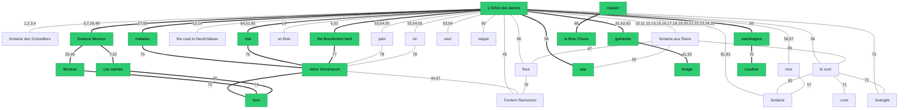

# Object diagram — the tree and its surroundings (first-hand-snippets only)

Scope: only `object-model` entries that a snippet in the `first-hand-snippets`
array (not `general-reputation`, not `observation-list`, not
`candidate-locations`) directly names are drawn. Only relationships a
snippet directly states are drawn as edges; nothing here is inferred from
context, distance math, or the `personal-musings` notes. An entry that is
named first-hand but never appears in a directly-stated relationship to any
other included entity is dropped rather than drawn as an unconnected node.
Snippets that are the condemnation-trial judges'/promoter's own accusatory
assertions about Jeanne — rather than a witness's or Jeanne's own statement —
are excluded as well, since the judges were never eyewitnesses to anything in
Domremy (see "Excluded first-hand-snippets" below).

Legend: a **thick** edge (`==`) means at least one of its supporting
relations is Jeanne d'Arc's own testimony; a normal edge (`--`) means none
of its supporting relations are. A **green** node denotes an entity that is
an endpoint of at least one thick edge — i.e. Jeanne d'Arc herself said
something that touches it — see "Jeanne-sourced coloring" below. Every
other node keeps the diagram's default styling. When a snippet directly
states that two different names name the same entity, that pair is drawn
as a single node under one canonical label rather than two (rule 4) — see
"Included entities and why" for which alternate names fold into which node
and the citation establishing each equivalence.

## Change in this update

Rule 4 was reworked: it used to require honoring every literal name as its
own node even when a snippet stated two names were the same tree; it now
requires *collapsing* confirmed synonyms into one node, so that
equivalence evidence doesn't just get thrown away. Re-walking the surviving
first-hand snippets against this new rule (no new vocabulary or testimony
this pass) found exactly two confirmed-synonym statements, both about the
tree:

- **`L'Arbre des dames` and `L'Arbre des fées` merge into one node**,
  keeping the former's label and node number (`N1`). Two French snippets —
  relation 5 (bibliotheque-monastique) and relation 48 (interro_public3) —
  each independently state the tree carries both names ("il y avait un
  arbre appelé l'arbre des Dames ; d'autres l'appelaient l'arbre des
  Fées"). The old `N1 === N2` identity edge is gone (there's nothing left
  to draw once they're one node); relation 17 (Gérard Guillemette, who
  calls the tree "l'arbre des fées") now adds its citation number directly
  onto the `N1`–`fontaine aux Rains` edge instead of hanging off a
  separate node. `N2` is retired, not reassigned, the same treatment the
  retired `fées`/`N12` already got.
- **`Arbor Dominarum`, `Arborem Fatalium des Faées`, and `Fagus` merge into
  one node**, keeping the first label and node number (`N15`). The Latin
  minute (relation 73, interro_public3) states "vocata Arbor Dominarum, et
  alii vocant eam Arborem Fatalium des Faées" — the Latin parallel of the
  Dames/Fées equivalence above — and the same single snippet continues,
  without introducing any new tree, "Et est una magna arbor, vocata Fagus,
  unde venit mayum" ("And it is a great tree, called Fagus..."): the same
  continuing-description pattern that has always folded French "le
  Fou"/"fau" into `N1`, now applied to `Fagus` within its own snippet.
  Relations 76 and 77 (previously drawn to a separate `Fagus` node) now
  point straight at `N15`. `N16` and `N17` are retired, not reassigned.
  This also resolves last pass's flagged asymmetry (French "fau" folding
  away while Latin "Fagus" didn't) — see judgment calls.
- **Not merged: the French tree-cluster (`N1`) and the Latin tree-cluster
  (`N15`), or `fons` and `fontaine fiévreux`.** These are almost certainly
  the same real tree/fountain, but no single snippet states the
  cross-language equivalence directly — only the `Fontem
  Rannorum`/`fontaine aux Rains`-style plausibility that rule 3 bars from
  being treated as a stated relation. See judgment calls.

Everything else — nodes, edges, exclusions — is unchanged from the prior
pass; only the two merges above and their direct edge consequences moved.

## Included entities and why

- **L’Arbre des dames** (merged with **L’Arbre des fées**, per rule 4) —
  two first-hand snippets each directly state the tree carries both names:
  relation 5 (bibliotheque-monastique) and relation 48 (interro_public3,
  French), *"il y avait un arbre appelé l'arbre des Dames ; d'autres
  l'appelaient l'arbre des Fées."* That equivalence is itself the evidence,
  so it is recorded as one merged node (keeping the dominant label
  `L'Arbre des dames`/`N1`) rather than drawn as two nodes joined by an
  identity edge. Bare/unqualified references ("l'arbre," "cet arbre") and
  the unslotted "le Fou"/"fau" continue to fold here via the pre-existing
  most-recently-named rule, unchanged.
- **fontaine des Groseilliers**, **fontaine fiévreux**, **fontaine aux Rains**
  — each is named outright in a snippet, each tied to the tree.
- **Fontem Rannorum** — the Latin name three witness depositions
  (Gérardin d'Épinal, Mengette, Jean Morel) use for the fountain the young
  people walk back to from the tree; kept as its own node rather than folded
  into `fontaine aux Rains` (see judgment calls below).
- **the road to Neufchâteau**, **the Bourlemont land**, **un Bois** — named
  outright, each tied to the tree.
- **Les saintes** — named outright, tied to `fontaine fiévreux` (and now
  `fons`) via Jeanne d'Arc's confirmed interrogation answers.
- **fiévreux** — named outright in Jeanne d'Arc's own testimony, which
  states they go to the fountain beside the tree (and, in Latin, `fons`)
  to recover their health.
- **malades** — named outright in Jeanne d'Arc's testimony, which states
  they go to the tree itself (and, in Latin, `Arbor Dominarum`) to amuse
  themselves once recovered.
- **le curé** — named outright in Béatrice's deposition, which states he
  goes under the tree and to the fountain aux Rains each Ascension Eve to
  chant the gospel, and separately that he carries the processional crosses.
- **Arbor Dominarum** (merged with **Arborem Fatalium des Faées** and
  **Fagus**, per rule 4) — the Latin minute (relation 73, interro_public3)
  states the tree carries two Latin names, *"vocata Arbor Dominarum, et
  alii vocant eam Arborem Fatalium des Faées"* — the Latin parallel of the
  `L'Arbre des dames`/`L'Arbre des fées` equivalence above, so these two
  collapse into one node the same way. The same single snippet continues,
  with no new tree introduced, *"Et est una magna arbor, vocata Fagus,
  unde venit mayum"* ("And it is a great tree, called Fagus...") — the same
  continuing-description pattern that already folds French "le Fou"/"fau"
  into `L'Arbre des dames`, so `Fagus` folds into this node too (relations
  76, 77). Canonical label `Arbor Dominarum` is kept: it's named first in
  the snippet, and is already the established home for two more Latin
  depositions' spelling variants (Gérardin d'Épinal's "l'obre dominarum",
  Jean Morel's "arbore que dicitur dominarum") — see judgment calls. This
  merged node is kept **separate** from the French `L'Arbre des dames`
  merged node — see judgment calls for why.
- **fons** — the Latin name, in the same minute, for the fountain
  immediately beside the tree. Kept as its own node rather than merged
  with its French counterpart `fontaine fiévreux` — no snippet states that
  cross-language equivalence directly — see judgment calls.
- **pain**, **vin**, **oeuf**, **noix**, **eau**, **nappe** — each is
  directly stated as carried to, eaten/drunk, or placed at the tree or a
  fountain by one or more witnesses.
- **guirlande** (garland/wreath, including "couronnes"/"chappeaux"/Latin
  "serta") and **image** (the devotional "image de la Notre-Dame de
  Domrémy") — Jeanne states she made guirlandes at the tree *for* the
  image; both the tree-guirlande and guirlande-image relations are directly
  stated in the same sentence.
- **mai** (the May-bough "le beau mai"/"mayum", and separately a May-Day
  effigy "un homme de mai") — the bough is directly stated to come *from*
  the tree ("le Fou... d'où vient le beau mai"), and its Latin counterpart
  comes from `Fagus`; the effigy is made during the same under-the-tree
  gathering Colin, fils de Jean Colin, describes.
- **fleur** — Nicolas Bailly and Jean Morel both state flowers are picked
  at the tree or around the fountain(s).
- **maison** / **le Bois Chenu** (also "le Bosc Chesnu") — Jeanne states
  this wood is visible from her father's house door; this is the only
  first-hand-stated relationship either entity has, and it ties them
  together, so both are included.
- **mandragore** / **coudrier** — Jeanne states a mandrake lies in the
  ground near the tree, with a hazel growing above it.
- **croix** / **évangile** — Béatrice states le curé carries the
  processional crosses, and separately that he chants the gospel under the
  tree and at the fountain aux Rains.

## Excluded entirely

### Never named in a first-hand-snippet

`L’Arbre de la Pucelle`, `des ruines`, `Chapelle de notre dame de domremy`,
`Hordal chapel`, `Basilique`, `fontaine de l’Ermite`, `the spring of the
frogs`, `fontaine des grenouilles`, `fontaine aux Groselles`, `the ridge
road on the west bank`, `vineyard`, `estate boundary`,
`the slope to the top of the bois Chenu`, `the valley`, `the river meuse`.
(`the spring of the frogs` and `fontaine des grenouilles` are both named
only in a `general-reputation` editorial note speculating that "fontaine
des Rains" might really mean "fontaine des grenouilles" — not a first-hand
snippet, so neither is drawn. `fontaine aux Groselles` is named only in the
Napoleonic-cadastre `observation-list` entry and that same editorial note's
"Grouselier"/"groseilles" aside — again, neither is first-hand. `fontaine
de l'Ermite` and `Chapelle de notre dame de domremy` are close calls —
Jeanne d'Arc mentions garlands for "l'image de la Notre-Dame de Domrémy,"
and the Jollois text names a "fontaine de l'Ermite," but the first is an
image, not the chapel, and the second only appears in `general-reputation`,
not a first-hand snippet — so neither is drawn, to avoid inferring a link
the text doesn't state.)

### Redundant: every mention folds into a more specific existing node

`arbre`, `bois`, `chemin` (and the pre-existing bare `L'Arbre` entry) are
each named first-hand many times, but every single use is either (a) an
unqualified "l'arbre"/"un bois"/"ce chemin" that a deposition has already
tied to a more specific name earlier in the same testimony, or (b) a
qualified phrase ("le grand chemin par lequel on va à Neufchâteau," "un
bois... au bord du grand chemin") that only ever picks out the *same*
specific entity already in the diagram (`the road to Neufchâteau`, `un
Bois`/`le Bois Chenu`, or one of the named trees). None of them ever
surfaces its own distinct, otherwise-unrepresented relationship, so the
bare entry itself never becomes its own node — it is folded away every
time, the same treatment the bare `L'Arbre` entry has always had.

### Named first-hand, but dropped as isolated (no stated relationship)

- **l’ermitage de Notre-Dame de Bermont** — named first-hand twice: (1) as
  "l'église Notre-Dame de Bermont" in Gérard Guillemette's deposition, which
  describes a *different* village's (Greux) custom, and (2) in Jean
  Waterin's deposition, which states that Jeanne herself "allait au
  pèlerinage de Notre-Dame de Bermont." Neither snippet states any relation
  between this place and the tree, a fountain, or any other included
  entity. Dropped rather than drawn as an unconnected node.
- **prêtre** — named three times, but only inside a witness's own
  occupational label in the source's parenthetical biography: Dominique
  Jacob (35 ans, prêtre), Jean Colin (66 ans, prêtre), and Henri Arnolin (64
  ans, prêtre). None of their substantive testimony states that they, in
  that capacity, did anything at the tree or fountain. The priestly role
  that *does* get a stated relation belongs to "le curé" in Béatrice's
  deposition, which is why `le curé` is included while `prêtre` is dropped.
- **cierge** — named once, in Jean Waterin's deposition: "Elle portait
  souvent des cierges et allait au pèlerinage de Notre-Dame de Bermont."
  This ties cierges to Jeanne herself (not an `object-model` entity) and
  only loosely, via "et," to the already-isolated Bermont shrine — no
  direct relationship to another included entity.
- **charrue** — named once, in Jean Waterin's deposition: "il alla avec
  elle à la charrue du père de Jeanne." Ties the plow to Jeanne and her
  father (people, not objects) — no relationship to another included
  entity.
- **église** — named first-hand (Gérard Guillemette's "l'église Notre-Dame
  de Bermont," describing Greux's custom, and Jean Waterin's generic
  "fréquentait les églises et les lieux saints"). Neither states a direct
  relationship to any Domremy tree/fountain entity in this diagram.
- **château** — named twice (bibliotheque-monastique: "Quand le château
  était en prospérité, les seigneurs... allaient... aux Loges-les-Dames";
  Isabelle: "Quand le château du village était en bon état, les
  seigneurs... allaient se délasser sous cet arbre"). Both uses are a
  *temporal* frame ("in the days when the castle was prosperous...") for an
  action whose subject is "les seigneurs," not the château itself — not a
  direct stated relationship between the château and the tree. See
  judgment calls.

### No longer in the fixed vocabulary

- **`fées`** — removed from `object-model`. Still named first-hand,
  extensively, but rule 5 only draws a node for a *current* `object-model`
  entry. Node `N12` and its thirteen supporting relations (30, 31, 32, 34,
  35, 37–43, 46) stay retired, not reassigned.
- **`esprit malin`** — also removed from `object-model`; was already
  excluded as isolated before removal.

### Named only in a snippet excluded under rule 2 (judges' assertion)

- **`herbe`** — named once, inside the judges'-assertion snippet dropped
  under rule 2: *"elle appendait aux branches de l'arbre des guirlandes
  formées de diverses herbes et fleurs."* With that snippet excluded,
  `herbe` has no surviving first-hand mention at all. (`fleur` survives
  independently via Nicolas Bailly and Jean Morel — see "Included
  entities" above.)

### Excluded first-hand-snippets: condemnation-trial judges' assertions (rule 2)

Two `first-hand-snippets` under `document-reference: bibliotheque-monastique`
are excluded as the judges'/promoter's own accusatory record rather than a
witness's or Jeanne's own statement — neither has a `from` field or a named
witness, and both address Jeanne in the third person in the legalistic
register of the Articles of Accusation, unlike every surrounding snippet
from that same source:

1. *"Item ladite Jeanne avait coutume de fréquenter lesdits arbre et
   fontaine [de Domremy] et souvent de nuit; quelquefois de jour,
   principalement aux heures des offices, afin d'y être seule; elle a pris
   part à des rondes qui s'opéraient en dansant à l'entour; ensuite elle
   appendait aux branches de l'arbre des guirlandes formées de diverses
   herbes et fleurs, en disant et chantant auparavant, ainsi qu'après,
   certains poèmes et chansons, accompagnés d'invocations, sortilèges et de
   maléfices; desquelles guirlandes le lendemain matin il ne se retrouvait
   plus rien"* — the opening "Item ladite Jeanne..." and the closing charge
   of "invocations, sortilèges et de maléfices" mark this as an Article of
   Accusation, not testimony. Previously cited as relation 8 (retired, not
   reassigned). This is also `herbe`'s only first-hand mention (see above).
2. *"Lesdites saintes lui ont plusieurs fois parlé près d'une fontaine,
   située près d'un grand arbre, appelé communément l'arbre des fées. La
   renommée court au sujet de ces arbres et fontaine que les dames fées les
   hantent et que des fiévreux y vont, quoique ce soit profane, pour
   recouvrer la santé. Là et ailleurs elle a révéré lesdites saintes et leur
   a fait révérence."* — same third-person, no-witness pattern. Previously
   cited as relations 9, 28, and 33 (retired, not reassigned).

Dropping these two snippets removes the edges `L'Arbre des fées — fontaine
fiévreux` (previously relation 9), `fées — L'Arbre des fées` and `fées —
fontaine fiévreux` (previously relation 33) entirely, and shrinks the
relation-number labels on `L'Arbre des dames — fontaine fiévreux` (5,7,29,48
— previously also 8), `fontaine fiévreux — Les saintes` (7,52 — previously
also 9), and `fiévreux — fontaine fiévreux` (26,49 — previously also 28).

## Judgment calls

- Whether the two snippets above are truly the judges'/promoter's own
  words, as opposed to a further unnamed witness deposition, is itself a
  judgment call: the yaml gives no explicit "speaker" tag. The call rests
  on register and content (third-person "ladite Jeanne"/"elle," no witness
  name, explicit accusatory language) contrasted with the surrounding
  first-person folk-custom recollections.
- **`fées`/`esprit malin` removal treated as intentional**, on the strength
  of the vocabulary list alone — if unintentional, restoring them to
  `object-model` and re-running this skill would bring node `N12` and
  relations 30–32, 34–35, 37–43, 46 straight back.
- `un Bois` is matched only because Jean Moen's exact wording is "un bois"
  — a different, more specific name from `le Bois Chenu`/`le Bosc Chesnu`.
  No snippet states a relationship between the two woods.
- **New `interro_public3`/`interro_public5` snippets attributed to Jeanne
  d'Arc despite carrying no `from` field.** All of them are third-person
  condemnation-trial minutes ("elle fut interrogée... répondit que...")
  rather than first-person testimony. The call is that these are not
  Articles of Accusation (no "ladite Jeanne avait coutume de...", no
  "sortilèges et de maléfices"): the "elle fut interrogée... répondit que"
  phrasing is the trial clerk's standard way of recording *her own answer*,
  functionally the same as an "R." answer. Kept and attributed to Jeanne
  throughout (relations 48–52, 58, 61, 63, 64, 68–70, 73–77, 80).
- The edge from `fontaine fiévreux` to the tree (and `Les saintes`/
  `fiévreux` to `fontaine fiévreux`) relies on treating every snippet that
  places "une fontaine" immediately beside/next to the tree ("auprès,"
  "proche," "située près") as the same single spring — as opposed to
  `fontaine des Groseilliers` or `fontaine aux Rains`, always reached "en
  revenant." Jean Moen's "vont aux fontaines près de cet arbre pour boire"
  is plural/unqualified and does *not* get this treatment — it is now
  drawn to the new bare `fontaine` node (`N19`) instead, rather than left
  undrawn as before.
- **`Fontem Rannorum` kept separate from `fontaine aux Rains`** — almost
  certainly the same real fountain (even Gérardin d'Épinal's own
  French-summarized testimony describes the identical scene as "la
  fontaine des Rains"), but no single snippet states that equivalence, and
  `object-model` lists them as distinct entries, so they stay two nodes.
- **Confirmed-synonym collapsing (reworked rule 4).** Two pairs/triples of
  names collapse into single nodes this pass because a snippet directly
  states the equivalence: `L'Arbre des dames`/`L'Arbre des fées`
  (relations 5, 48) and `Arbor Dominarum`/`Arborem Fatalium des
  Faées`/`Fagus` (relations 73, 76, 77 — `Fagus` via the same
  continuing-description reasoning as French "le Fou"/"fau", since it's
  introduced within the *same* snippet as the `Arbor Dominarum`/`Arborem
  Fatalium des Faées` equivalence statement, with no new tree-subject
  introduced in between). This also retires the previous pass's flagged
  split: with `Arbor Dominarum` and `Fagus` now the same node, the
  malades-visit clause and the mai/Bourlemont clauses within
  interro_public3's Latin minute no longer attach to two different nodes —
  they're both edges on `N15`.
- **`L'Arbre des dames` (`N1`) and `Arbor Dominarum` (`N15`) are kept as
  two separate merged nodes, not combined with each other.** They are
  almost certainly the same real tree — interro_public3 appears to record
  the identical interrogation answer in French and in Latin — but no
  single snippet states that cross-language equivalence outright; each
  snippet only states the two-name equivalence *within its own language*.
  Per rule 3 (no inference from plausibility), this gets the same
  treatment as `Fontem Rannorum` vs. `fontaine aux Rains` below: likely the
  same thing, kept separate because the text doesn't say so.
- **`fons` is not merged with `fontaine fiévreux`, for the same reason** —
  only cross-document plausibility connects them (both are "a fountain
  immediately beside the tree" in Jeanne's testimony, one in French, one
  in the Latin minute), not a snippet stating the two names are the same
  fountain.
- **"l'obre dominarum" (Gérardin d'Épinal) and "arbore que dicitur
  dominarum" (Jean Morel) are judgment-called as spelling/case variants of
  "Arbor Dominarum,"** not of the French "aux Loges-les-Dames" cluster —
  moving relations 44 and 47 from the `L'Arbre des dames — Fontem Rannorum`
  edge onto a new `Arbor Dominarum — Fontem Rannorum` edge. Dep_mengette's
  "ad lobias dominarum" is judgment-called as matching the French "aux
  Loges-les-Dames" phrasing instead (which has no vocabulary slot and
  folds to `N1`), so relation 45 is unaffected.
- **`château`'s temporal framing does not count as a direct relationship.**
  Contrast with `le curé`, where "quand le curé porte les croix... il va...
  sous cet arbre" has *le curé himself* as the subject of both clauses
  (direct subject-verb statements); `château`'s "quand le château était en
  prospérité, les seigneurs allaient..." has "les seigneurs," not the
  château, as the subject — the château is only a temporal backdrop, not
  an object stated to relate to the tree. Excluded as isolated rather than
  drawn on a weaker standard than every other edge in this diagram.
- **Jean Morel's "après une lecture de l'évangile de saint Jean, elles n'y
  vont plus" is not drawn as an `évangile — arbre` edge**, for the same
  reason as `château`: it states a causal/temporal sequence (the gospel
  being read *causes* the fées to stop visiting), not that the gospel
  reading happens at the tree. `évangile` is still included, but solely on
  the strength of Béatrice's direct "il va... sous cet arbre et y chante
  l'évangile."
- **`maison`/`le Bois Chenu` un-isolation.** This is the first time this
  diagram's rule 5(b) test has flipped an entity from isolated to included
  purely because a *later* vocabulary addition supplied the missing
  relationship — worth flagging since it demonstrates rule 5 is sensitive
  to the current state of `object-model`, not a fixed historical judgment.

Each edge is labeled with the number(s) of the matching relation(s) listed
below. Where more than one first-hand snippet supports the same edge, the
numbers are comma-separated.

```mermaid
graph TD
    classDef jeanneSourced fill:#2ecc71,stroke:#1e8449,color:#000;

    N1["L'Arbre des dames"]
    N3["fontaine des Groseilliers"]
    N4["fontaine fiévreux"]
    N5["fontaine aux Rains"]
    N6["the road to Neufchâteau"]
    N7["the Bourlemont land"]
    N8["un Bois"]
    N9["Les saintes"]
    N10["fiévreux"]
    N11["malades"]
    N13["le curé"]
    N14["Fontem Rannorum"]
    N15["Arbor Dominarum"]
    N18["fons"]
    N19["fontaine"]
    N20["pain"]
    N21["vin"]
    N22["oeuf"]
    N23["noix"]
    N24["eau"]
    N25["nappe"]
    N26["guirlande"]
    N27["image"]
    N28["mai"]
    N29["fleur"]
    N30["maison"]
    N31["mandragore"]
    N32["coudrier"]
    N33["croix"]
    N34["évangile"]
    N36["le Bois Chenu"]

    N1 -- "1,2,3,4" --- N3
    N1 == "5,7,29,48" === N4
    N1 == "6,51" === N7
    N4 == "7,52" === N9
    N1 -- "36" --- N13
    N5 -- "36" --- N13
    N4 == "26,49" === N10
    N1 == "27,50" === N11
    N1 -- "10,11,12,13,15,16,17,18,19,20,21,22,23,24,25" --- N5
    N1 -- "12,14" --- N6
    N1 -- "14" --- N8
    N1 -- "45" --- N14
    N15 -- "44,47" --- N14
    N15 == "73" === N18
    N10 == "74" === N18
    N11 == "75" === N15
    N28 == "76" === N15
    N7 == "77" === N15
    N20 -- "78" --- N15
    N21 -- "78" --- N15
    N29 -- "79" --- N14
    N9 == "80" === N18
    N1 -- "81,83" --- N19
    N13 -- "82" --- N19
    N23 -- "57" --- N19
    N1 -- "53,54,55" --- N20
    N1 -- "53,54,55" --- N21
    N1 -- "53,54" --- N22
    N1 -- "56,57" --- N23
    N1 == "58" === N24
    N5 -- "59" --- N24
    N1 -- "60" --- N25
    N1 == "61,62,63" === N26
    N26 == "61,63" === N27
    N1 == "64,51,65" === N28
    N1 -- "66" --- N29
    N5 -- "67" --- N29
    N30 == "68" === N36
    N1 == "69" === N31
    N31 == "70" === N32
    N13 -- "71" --- N33
    N1 -- "72" --- N34
    N13 -- "72" --- N34

    class N1,N4,N7,N9,N10,N11,N15,N18,N24,N26,N27,N28,N30,N31,N32,N36 jeanneSourced
```

## Numbered relations

1. **Arbre des dames — fontaine des Groseilliers.** Village children walked from the tree to the fountain on Fountain Sunday.
   *"Les petits du village, filles et garçons, avec du pain et des noix, allaient à l'arbre des Dames et à la Fontaine-des-Groseilliers, le dimanche de Laetare Jerusalem..."* (bibliotheque-monastique).

2. **Arbre des dames — fontaine des Groseilliers.** After eating under the tree, the group went on to drink at the fountain.
   *"Nous mangions sous l'arbre, puis nous allions boire à la Fontaine-des-Groseilliers."* (bibliotheque-monastique).

3. **Arbre des dames — fontaine des Groseilliers.** Jeannette is described dancing under the tree, then going to drink at the fountain.
   *"Jeannette venait danser et jouer avec nous... et puis s'en venait boire à la Fontaine-des-Groseilliers."* (bibliotheque-monastique).

4. **Arbre des dames — fontaine des Groseilliers.** Jeanne, in her youth, is placed at both sites together.
   *"Jeannette, en ses jeunes ans, allait quelquefois, en compagnie des autres fillettes, à l'arbre des Dames et à la Fontaine-des-Groseilliers, pour courir et danser avec ses compagnes."* (bibliotheque-monastique).

5. **Arbre des dames — fontaine fiévreux** (and states the tree's two names, "Arbre des Dames"/"Arbre des Fées," are the same tree — see "Included entities," node merge). *(Jeanne D'Arc — thick edge)* Jeanne d'Arc states the tree has two names, and places a fountain immediately beside it where feverish people (fiévreux) go to recover.
   *"Près de Domrémy il y avait un arbre appelé l'arbre des Dames ; d'autres l'appelaient l'arbre des Fées. Auprès est une fontaine. J'ai ouï dire que les fiévreux boivent de cette fontaine et y vont quérir de l'eau pour se remettre en santé."* (bibliotheque-monastique, from Jeanne D'Arc).

6. **Arbre des dames — the Bourlemont land.** *(Jeanne D'Arc — thick edge)* Jeanne d'Arc states the tree (here called "le Fou," the same tree as in #5) belonged to Pierre de Bourlémont.
   *"Il y a un grand arbre appelé le Fou, d'où vient le beau mai. Il appartenait, d'après le commun dire, à monseigneur Pierre de Bourlemont, chevalier."* (bibliotheque-monastique, from Jeanne D'Arc).

7. **Arbre des dames — fontaine fiévreux; fontaine fiévreux — Les saintes.** *(Jeanne D'Arc — thick edges)* Jeanne confirms hearing the saints at "the fountain near the tree."
   *"interrogateur - Les saintes vous ont-elles parlé à la fontaine proche de l'arbre? Jeanne D'Arc - Oui, je les y ai entendues; mais je ne me rappelle pas ce qu'elles m'y ont dit."* (bibliotheque-monastique).

*(Relations 8, 9, and 33 — judges'/promoter's accusatory assertions, not testimony — are retired under rule 2.)*

10. **Arbre des dames — fontaine aux Rains.** Jean Morel, Jeanne's godfather, has the group return from the tree to this fountain.
    *"...en revenant ils vont à la fontaine aux Rains, qui est plus près du village que l'arbre, en se promenant et chantant, y boivent son eau..."* (questionnaire-lorraine, Jean Morel).

11. **Arbre des dames — fontaine aux Rains.** Dominique Jacob has the children return from the tree to eat and drink at the fountain.
    *"...en revenant ils vont à la fontaine des Rains, mangent leur pain et boivent de cette eau..."* (questionnaire-lorraine, Dominique Jacob).

12. **Arbre des dames — fontaine aux Rains; Arbre des dames — the road to Neufchâteau.** Béatrice places the tree beside the road to Neufchâteau, and has people return from the tree to the fountain.
    *"Cet arbre se trouve à côté du grand chemin par lequel on va à Neufchâteau... en revenant, vont à la Fontaine aux Rains et boivent son eau."* (questionnaire-lorraine, Béatrice).

13. **Arbre des dames — fontaine aux Rains.** Jeanette, wife of Thévenin Le Royer, gives the same tree-to-fountain return.
    *"...vont ensuite à la Fontaine aux Rains et boivent de son eau."* (questionnaire-lorraine, Jeanette femme de Thévenin Le Royer).

14. **Arbre des dames — un Bois; Arbre des dames — the road to Neufchâteau.** Jean Moen places the tree next to a wood, at the edge of the road to Neufchâteau.
    *"L'arbre mentionné est près d'un bois, au bord du grand chemin par lequel on va à Neufchâteau."* (questionnaire-lorraine, Jean Moen).

15. **Arbre des dames — fontaine aux Rains.** Jeannette, widow of Thiesselin de Vittel, has the young people go on to drink at this fountain.
    *"...et vont boire à la Fontaine aux Rains."* (questionnaire-lorraine, Jeannette veuve de Thiesselin de Vittel).

16. **Arbre des dames — fontaine aux Rains.** Perrin Drappier places Jeanne making rounds toward the tree and this fountain together.
    *"...se promener et faire des rondes vers l'arbre et à la fontaine des Rains."* (questionnaire-lorraine, Perrin Drappier).

17. **Arbre des dames — fontaine aux Rains.** Gérard Guillemette, who calls the tree "l'arbre des fées" (merged into the `Arbre des dames` node — see "Included entities"), has the group return from it to drink at the fountain.
    *"L'a souvent entendu appeler l'arbre des fées... ensuite ils reviennent à la fontaine des Rains et boivent de son eau."* (questionnaire-lorraine, Gérard Guillemette).

18. **Arbre des dames — fontaine aux Rains.** Hauviette, a childhood friend of Jeanne, names the tree and fountain as the pair habitually visited.
    *"Les jeunes filles et jeunes gens du village avaient l'habitude d'aller à cet arbre et à la fontaine des Rains le dimanche de Lætare, dit des Fontaines..."* (questionnaire-lorraine, Hauviette).

19. **Arbre des dames — fontaine aux Rains.** Jean Waterin has the young people return from the tree to drink at the fountain.
    *"...puis au retour vont à la fontaine des Rains ou parfois à d'autres fontaines, et boivent."* (questionnaire-lorraine, Jean Waterin).

20. **Arbre des dames — fontaine aux Rains.** Gérardin d'Épinal, "le bourguignon," has the group return from the tree to eat and drink at the fountain.
    *"...et ensuite reviennent à la fontaine des Rains, mangent le pain et y boivent de l'eau, comme il le vit."* (questionnaire-lorraine, Gérardin d'Épinal).

21. **Arbre des dames — fontaine aux Rains.** Simonin Musnier has the group pass the fountain and drink on the way back from the tree.
    *"...en revenant passent à la fontaine des Rains et boivent de son eau."* (questionnaire-lorraine, Simonin Musnier).

22. **Arbre des dames — fontaine aux Rains.** Isabelle, wife of Gérardin d'Épinal, has the group come drink at the fountain on the way back from the tree.
    *"...au retour ils venaient boire à la fontaine des Rains ; selon la coutume qui existe encore."* (questionnaire-lorraine, Isabelle).

23. **Arbre des dames — fontaine aux Rains.** Colin, son of Jean Colin, has the group sometimes go to drink at the fountain on the way back from the tree.
    *"...et au retour vont parfois pour boire à la fontaine des Rains et y boivent..."* (questionnaire-lorraine, Colin fils de Jean Colin).

24. **Arbre des dames — fontaine aux Rains.** Michel Le Buin has the young people go on to drink at the fountain.
    *"...ensuite vont boire à la fontaine des Rains."* (questionnaire-lorraine, Michel Le Buin).

25. **Arbre des dames — fontaine aux Rains.** Jean Jaquard has the group return from the tree to drink at the fountain.
    *"...puis, jouant et se promenant, reviennent à la fontaine des Rains, boivent de son eau."* (questionnaire-lorraine, Jean Jaquard).

26. **fiévreux — fontaine fiévreux.** *(Jeanne D'Arc — thick edge)* Jeanne d'Arc states that feverish people drink from the fountain beside the tree to recover their health.
    *"J'ai ouï dire que les fiévreux boivent de cette fontaine et y vont quérir de l'eau pour se remettre en santé."* (bibliotheque-monastique, from Jeanne D'Arc).

27. **Arbre des dames — malades.** *(Jeanne D'Arc — thick edge)* Jeanne d'Arc states that the sick, once recovered, go to the tree to amuse themselves.
    *"J'ai oui dire que les malades une fois relevés, vont à cet arbre pour se divertir."* (bibliotheque-monastique, from Jeanne D'Arc).

*(Relation 28 — the trial record's repetition of this claim — is retired along with relations 8, 9, and 33.)*

29. **Arbre des dames — fontaine fiévreux.** Bertrand Lacloppe places the young people at the tree and "the nearby fountain" together.
    *"...allaient parfois à cet arbre, avec Jeanne parmi eux, et à la fontaine proche, pour se promener et faire des rondes..."* (questionnaire-lorraine, Bertrand Lacloppe).

*(Relations 30, 31, 32, 34, 35, and 37–43 — all `fées — Arbre des dames` edges — and relation 46 are retired: `fées` was removed from `object-model`.)*

36. **le curé — Arbre des dames; le curé — fontaine aux Rains.** Béatrice states that on Ascension Eve the curé, carrying the processional crosses through the fields, also goes under the tree and chants the gospel there, as well as at the fountain aux Rains.
    *"La veille de l'Ascension, quand le curé porte les croix par les champs, il va lui aussi sous cet arbre et y chante l'évangile, ainsi qu'à la fontaine aux Rains et aux autres fontaines."* (questionnaire-lorraine, Béatrice).

44. **Arbor Dominarum — Fontem Rannorum.** *(moved from the `L'Arbre des dames` edge this pass — see judgment calls)* Gérardin d'Épinal's Latin deposition has the village children return from the tree ("l'obre dominarum," judgment-called as a spelling variant of "Arbor Dominarum") to eat and drink at Fontem Rannorum.
    *"...et postea redeunt ad fontem rannorum ; et comedunt panem, et bibunt de aqua illius, prout vidit."* (dep_gerardin_epinal, Gérardin d'Épinal).

45. **Arbre des dames — Fontem Rannorum.** Mengette's Latin deposition names the tree "ad lobias dominarum" (matching the French "aux Loges-les-Dames," which has no vocabulary slot and folds to `L'Arbre des dames`), and has the group drink at Fontem Rannorum after eating under it.
    *"Et postea veniebant bibitum ad fontem rannorum."* (dep_mengette, Mengette).

47. **Arbor Dominarum — Fontem Rannorum.** *(moved from the `L'Arbre des dames` edge this pass — see judgment calls)* Jean Morel's Latin deposition names the tree "arbore que dicitur dominarum" (judgment-called as a case variant of "Arbor Dominarum") and has the young people return singing from it to the fountain, which he states is closer to the village than the tree.
    *"...et redeundo veniunt supra fontem ad Rannos, spaciando et cantando, et de aqua illius fontis bibunt...nec ad fontem, qui fens est propinquior villa quam sit arbor."* (dep_jean_morel, Jean Morel).

48. **Arbre des dames — fontaine fiévreux** (and restates the tree's two names are the same, co-citing relation 5's node merge). *(Jeanne D'Arc — thick edge)* The condemnation-trial minute records Jeanne's answer that the tree has two names, with a fountain immediately beside it — the same facts as relation 5, from a different document. The parallel Latin ("Arbor Dominarum"/"Arborem Fatalium des Faées"/"fons") is relation 73, which merges into the separate `Arbor Dominarum` node rather than this one — see judgment calls for why the French and Latin tree-clusters stay apart.
    *"...assez près de Domrémy, il y a certain arbre appelé l'Arbre des Dames, et les autres l'appellent l'Arbre des Fées ; auprès est une fontaine."* (interro_public3, from Jeanne D'Arc). Parallel archaic French: *"...se appelle l'arbre des Dames ; et les aultres l'appellent l'arbre des Fees ; et auprez a une fontaine..."* (interro_public3).

49. **fiévreux — fontaine fiévreux.** *(Jeanne D'Arc — thick edge)* The same minute records Jeanne's answer that feverish people drink from that fountain to recover health — the same fact as relation 26, from a different document.
    *"...a ouï dire que les gens malades de fièvre boivent à cette fontaine et vont quérir de son eau pour recouvrer santé."* (interro_public3, from Jeanne D'Arc).

50. **Arbre des dames — malades.** *(Jeanne D'Arc — thick edge)* The same minute records Jeanne's answer that the sick, once able to rise, go to the tree to amuse themselves — the same fact as relation 27, from a different document.
    *"...les malades, quand ils peuvent se lever vont à l'arbre pour s'ébattre."* (interro_public3, from Jeanne D'Arc).

51. **Arbre des dames — the Bourlemont land; Arbre des dames — mai.** *(Jeanne D'Arc — thick edges)* The same minute records Jeanne's answer that the tree belonged to Pierre de Bourlemont, and that the May-bough comes from it — the same facts as relations 6 and 64, from a different document.
    *"Et c'est un grand arbre, appelé fau d'où vient le beau mai ; et appartenait, à ce qu'on dit, à Messire Pierre de Bourlemont, chevalier."* (interro_public3, from Jeanne D'Arc).

52. **fontaine fiévreux — Les saintes.** *(Jeanne D'Arc — thick edge)* A second condemnation-trial minute records Jeanne confirming the saints spoke to her at the fountain near the tree (but not, so far as she knows, under the tree itself) — the same fact as relation 7, from a different document.
    *"Interrogée si saintes Catherine et Marguerite lui parlèrent sous l'arbre mentionné plus haut, répondit : 'Je ne sais'. Interrogée si, à la fontaine qui est près de l'arbre, les saintes parlèrent avec elle, répondit que oui, et que là elle les ouït bien mais ce qu'elles lui dirent alors, elle ne le sait plus."* (interro_public5, from Jeanne D'Arc).

53. **pain — Arbre des dames; vin — Arbre des dames; oeuf — Arbre des dames.** Bread, wine, and eggs are both carried to the tree by the Bourlemont ladies, and bread by the village children.
    *"On emportait du pain, des oeufs, du vin... Ils emportent des petits pains, et mangent sous l'arbre."* (bibliotheque-monastique).

54. **vin — Arbre des dames; oeuf — Arbre des dames; pain — Arbre des dames.** Perrin Drappier has the Bourlemont ladies carry the same three items toward the tree.
    *"...ils portaient du pain et du vin avec des œufs."* (questionnaire-lorraine, Perrin Drappier).

55. **vin — Arbre des dames; pain — Arbre des dames.** Gérardin d'Épinal (French) has the local lords carry wine and bread and eat under the tree.
    *"qui portaient du vin et du pain et allaient manger sous l'arbre."* (questionnaire-lorraine, Gérardin d'Épinal).

56. **noix — Arbre des dames.** Village children carry walnuts to the tree alongside bread.
    *"Les petits du village, filles et garçons, avec du pain et des noix, allaient à l'arbre des Dames..."* (bibliotheque-monastique).

57. **noix — Arbre des dames; noix — fontaine.** Hauviette has walnuts carried both around the tree and to "the fountains" (plural/unqualified — see `fontaine`, `N19`).
    *"Elle a vu porter des noix autour de cet arbre et aux fontaines."* (questionnaire-lorraine, Hauviette).

58. **eau — fontaine fiévreux.** *(Jeanne D'Arc — thick edge)* Jeanne states the fiévreux fetch water from the fountain beside the tree.
    *"...y vont quérir de l'eau pour se remettre en santé."* (bibliotheque-monastique, from Jeanne D'Arc).

59. **eau — fontaine aux Rains.** Jean Morel has the group drink the fountain's water.
    *"...y boivent son eau..."* (questionnaire-lorraine, Jean Morel).

60. **nappe — Arbre des dames.** A tablecloth is spread under the tree; Mengette's Latin deposition states the same (folded to the same node, since her tree-naming "ad lobias dominarum" has no vocabulary slot).
    *"Que de fois nous avons mis la nappe sous l'arbre et mangé ensemble!"* (bibliotheque-monastique). Latin: *"Aliquando habebant unam mappam subtus illam arborem."* (dep_mengette).

61. **guirlande — Arbre des dames; guirlande — image.** *(Jeanne D'Arc — thick edges)* Jeanne states she made garlands at the tree for the devotional image of Notre-Dame de Domrémy.
    *"J'allais parfois avec d'autres filles m'ébattre au pied de l'arbre et j'y faisais des guirlandes pour l'image de la Notre-Dame de Domrémy."* (bibliotheque-monastique, from Jeanne D'Arc).

62. **guirlande — Arbre des dames.** An anonymous witness states girls hung garlands on the tree's branches.
    *"J'ai vu des filles mettre des guirlandes aux branches de cet arbre..."* (bibliotheque-monastique).

63. **guirlande — Arbre des dames; guirlande — image.** *(Jeanne D'Arc — thick edges)* The condemnation-trial minute restates relation 61's facts under "couronnes"/Latin "serta"/archaic French "chappeaux" — all treated as the same `guirlande` node, since no separate vocabulary entry exists for any of those words.
    *"faisoit à cet arbre couronnes pour l'image de Notre-Dame de Domrémy."* (interro_public3, from Jeanne D'Arc).

64. **mai — Arbre des dames.** *(Jeanne D'Arc — thick edge)* The May-bough comes from the tree (here "le Fou," folded to the same node as relation 6). Co-cited by relation 51's parallel restatement.
    *"Il y a un grand arbre appelé le Fou, d'où vient le beau mai."* (bibliotheque-monastique, from Jeanne D'Arc).

65. **mai — Arbre des dames.** Colin, fils de Jean Colin, has the village youths make a May-Day effigy during their gathering under the tree.
    *"Parfois, le jour des Fontaines, ils font un homme de mai et apportent de petits pains..."* (questionnaire-lorraine, Colin fils de Jean Colin).

66. **fleur — Arbre des dames.** Nicolas Bailly has village girls pick flowers at the tree.
    *"elles y font des rondes et cueillent des fleurs."* (questionnaire-lorraine, Nicolas Bailly).

67. **fleur — fontaine aux Rains.** Jean Morel (French) has the group pick flowers around the fountain on the way back from the tree.
    *"...autour s'amusent à cueillir des fleurs."* (questionnaire-lorraine, Jean Morel).

68. **maison — le Bois Chenu.** *(Jeanne D'Arc — thick edge)* Jeanne states the wood is visible from her father's house door — the relationship that pulls both entities into the diagram.
    *"il y a un bois chenu qu'on voit de l'huis de sa maison de son père ; et n'y a pas la distance qu'une demi-lieue."* (interro_public3, from Jeanne D'Arc). Parallel Latin: *"...quod videtur ab ostio patris sui..."*; archaic French: *"...que on voit de l'huys de son pere..."* (interro_public3).

69. **mandragore — Arbre des dames.** *(Jeanne D'Arc — thick edge)* Jeanne states a mandrake lies in the ground near the tree.
    *"elle ouït dire qu'elle est en terre, proche de l'arbre ci-dessus mentionné."* (interro_public5, from Jeanne D'Arc). Parallel Latin: *"...in terra, prope illam arborem de qua superius dictum est..."* (interro_public5).

70. **coudrier — mandragore.** *(Jeanne D'Arc — thick edge)* Jeanne states a hazel grows above the mandrake.
    *"Et dit qu'elle a ouï dire que sur cette mandragore s'élève un coudrier."* (interro_public5, from Jeanne D'Arc). Parallel Latin: *"...supra illam mandragoram est una corylus."* (interro_public5).

71. **croix — le curé.** Béatrice states le curé carries the processional crosses through the fields.
    *"quand le curé porte les croix par les champs..."* (questionnaire-lorraine, Béatrice).

72. **évangile — Arbre des dames; évangile — le curé.** Béatrice states le curé chants the gospel under the tree and at the fountain aux Rains.
    *"il va lui aussi sous cet arbre et y chante l'évangile, ainsi qu'à la fontaine aux Rains et aux autres fontaines."* (questionnaire-lorraine, Béatrice).

73. **Arbor Dominarum — fons** (and states the tree's two Latin names, "Arbor Dominarum"/"Arborem Fatalium des Faées," are the same tree — see "Included entities," node merge). *(Jeanne D'Arc — thick edge)* The Latin minute states the tree has two Latin names, with a fountain ("fons") immediately beside it — the Latin parallel of relation 48.
    *"...quædam arbor, vocata Arbor Dominarum, et alii vocant eam Arborem Fatalium des Faées, juxta quam est unus fons..."* (interro_public3, from Jeanne D'Arc).

74. **fiévreux — fons.** *(Jeanne D'Arc — thick edge)* The Latin minute states feverish people drink from that fountain — the Latin parallel of relation 49.
    *"...infirmi febricitantes potant de illo fonte et vadunt quæsitum de aqua illius, pro habenda sanitate."* (interro_public3, from Jeanne D'Arc).

75. **malades — Arbor Dominarum.** *(Jeanne D'Arc — thick edge)* The Latin minute states the sick go to the tree (named earlier in this same sentence as "Arbor Dominarum," per the fold-to-most-recent-naming rule) to amuse themselves — the Latin parallel of relation 50.
    *"...audivit infirmi, quando possunt se levare, vadunt ad arborem pro spatiendo."* (interro_public3, from Jeanne D'Arc).

76. **mai — Arbor Dominarum.** *(Jeanne D'Arc — thick edge)* The Latin minute states the May-bough comes from the tree, here renamed "Fagus" within the same snippet as relation 73 and folded into the `Arbor Dominarum` node (see "Included entities") — the Latin parallel of relation 64.
    *"Et est una magna arbor, vocata Fagus, unde venit mayum, le beau may..."* (interro_public3, from Jeanne D'Arc).

77. **the Bourlemont land — Arbor Dominarum.** *(Jeanne D'Arc — thick edge)* The Latin minute states the tree, as "Fagus" (folded into the `Arbor Dominarum` node), belonged to Pierre de Bourlemont — the Latin parallel of relation 6/51.
    *"...et solebat pertinere domino Petro de Bourlemont, militi."* (interro_public3, from Jeanne D'Arc).

78. **pain — Arbor Dominarum; vin — Arbor Dominarum.** Gérardin d'Épinal's Latin deposition has the local lords carry wine and bread to the tree (named "l'obre dominarum," judgment-called to `Arbor Dominarum`), and the mothers make bread for the children's visits.
    *"...portabant vinum et panem ; et ibant comestum subtus arborem... et matres eorum faciunt panes..."* (dep_gerardin_epinal, Gérardin d'Épinal).

79. **fleur — Fontem Rannorum.** Jean Morel's Latin deposition has the group pick flowers around Fontem Rannorum on the way back.
    *"...et circumcirca ludendo flores colligunt."* (dep_jean_morel, Jean Morel).

80. **Les saintes — fons.** *(Jeanne D'Arc — thick edge)* The Latin parallel of relation 52: Jeanne confirms the saints spoke with her at the fountain near the tree.
    *"Interrogata si, apud fontem qui est juxta arborem, prædicta Sanctæ locutæ sunt cum ea, respondit quod sic..."* (interro_public5, from Jeanne D'Arc).

81. **Arbre des dames — fontaine.** Jean Moen has the village youths go to "the fountains near this tree" to drink — plural/unqualified, so drawn to the new bare `fontaine` node rather than any single named spring. Co-cited by relation 83.
    *"vont aux fontaines près de cet arbre pour boire."* (questionnaire-lorraine, Jean Moen).

82. **le curé — fontaine.** Béatrice has le curé also chant the gospel at "the other fountains" (plural/unqualified), beyond the fountain aux Rains already covered by relation 36.
    *"...ainsi qu'à la fontaine aux Rains et aux autres fontaines."* (questionnaire-lorraine, Béatrice).

83. **Arbre des dames — fontaine.** Jean Waterin has the group go, on the way back from the tree, to the fountain aux Rains "or sometimes other fountains" (plural/unqualified).
    *"...puis au retour vont à la fontaine des Rains ou parfois à d'autres fontaines, et boivent."* (questionnaire-lorraine, Jean Waterin).

## Jeanne-sourced coloring

Green nodes denote an included entity that is an endpoint of at least one
thick (Jeanne-D'Arc-sourced) edge, per rule 9. This is purely derived from
which edges are already thick.

- **L'Arbre des dames** (`N1`, merged with `L'Arbre des fées`) *(green)*.
  Endpoint of many thick edges, including 5/7/29/48 to `fontaine fiévreux`,
  6/51 to `the Bourlemont land`, 27/50 to `malades`, 58 to `eau`, 61/63 to
  `guirlande`, 64/51 to `mai`, 69 to `mandragore`.
- **fontaine fiévreux** (`N4`) *(green)*. Endpoint of thick edges 5/7/29/48
  (to `N1`), 7/52 (to `Les saintes`), 26/49 (to `fiévreux`), and 58 (to
  `eau`).
- **the Bourlemont land** (`N7`) *(green)*. Its edges are relations 6/51
  (to `N1`) and 77 (to `Arbor Dominarum`).
- **Les saintes** (`N9`) *(green)*. Its edges are relations 7/52 (to `N4`)
  and 80 (to `fons`).
- **fiévreux** (`N10`) *(green)*. Its edges are relations 26/49 (to `N4`)
  and 74 (to `fons`).
- **malades** (`N11`) *(green)*. Its edges are relations 27/50 (to `N1`)
  and 75 (to `Arbor Dominarum`).
- **Arbor Dominarum** (`N15`, merged with `Arborem Fatalium des Faées` and
  `Fagus`) *(green)*. Endpoint of thick edges 73 (to `fons`), 75 (to
  `malades`), 76 (to `mai`), and 77 (to `the Bourlemont land`); also
  endpoint of normal edges 44/47 (to `Fontem Rannorum`) and 78 (to
  `pain`/`vin`) — green because *at least one* edge is thick.
- **fons** (`N18`) *(green)*. Its edges are relations 73 (to `N15`), 74
  (to `fiévreux`), and 80 (to `Les saintes`).
- **eau** (`N24`) *(green)*. Endpoint of thick edge 58 (to `N4`); its
  other edge, 59 (to `fontaine aux Rains`), is normal.
- **guirlande** (`N26`) *(green)*. Endpoint of thick edges 61/63 (to `N1`
  and to `image`); its other citation, 62, is normal.
- **image** (`N27`) *(green)*. Its edges, to `N26`, are relations 61/63.
- **mai** (`N28`) *(green)*. Endpoint of thick edges 64/51 (to `N1`) and
  76 (to `Arbor Dominarum`); its other citation, 65, is normal.
- **maison** (`N30`) *(green)*. Its only edge, to `N36`, is relation 68.
- **mandragore** (`N31`) *(green)*. Endpoint of thick edge 69 (to `N1`)
  and thick edge 70 (to `coudrier`).
- **coudrier** (`N32`) *(green)*. Its only edge, to `N31`, is relation 70.
- **le Bois Chenu** (`N36`) *(green)*. Its only edge, to `N30`, is
  relation 68.
- **fontaine des Groseilliers** (`N3`), **fontaine aux Rains** (`N5`), **the
  road to Neufchâteau** (`N6`), **un Bois** (`N8`), **le curé** (`N13`),
  **Fontem Rannorum** (`N14`), **fontaine** (`N19`), **pain** (`N20`),
  **vin** (`N21`), **oeuf** (`N22`), **noix** (`N23`), **nappe** (`N25`),
  **fleur** (`N29`), **croix** (`N33`), **évangile** (`N34`)
  *(default styling)*. None of their edges are thick — every relation
  touching them comes from a named witness other than Jeanne, so they stay
  uncolored.
