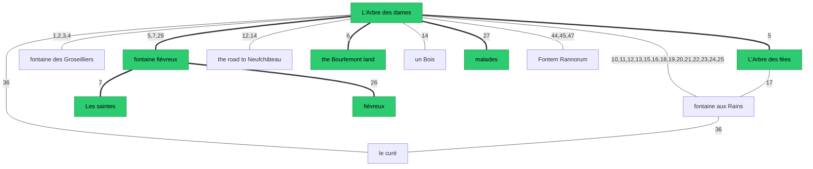

# Object diagram — the tree and its surroundings (first-hand-snippets only)

Scope: only `object-model` entries that a snippet in the `first-hand-snippets`
array (not `general-reputation`, not `observation-list`, not
`candidate-locations`) directly names are drawn. Only relationships a
snippet directly states are drawn as edges; nothing here is inferred from
context, distance math, or the `personal-musings` notes. An entry that is
named first-hand but never appears in a directly-stated relationship to any
other included entity is dropped rather than drawn as an unconnected node.
Snippets that are the condemnation-trial judges'/promoter's own accusatory
assertions about Jeanne — rather than a witness's or Jeanne's own statement —
are excluded as well, since the judges were never eyewitnesses to anything in
Domremy (see "Excluded first-hand-snippets" below).

Legend: a **thick** edge (`==`) means at least one of its supporting
relations is Jeanne d'Arc's own testimony; a normal edge (`--`) means none
of its supporting relations are. A **green** node denotes an entity that is
an endpoint of at least one thick edge — i.e. Jeanne d'Arc herself said
something that touches it — see "Jeanne-sourced coloring" below. Every
other node keeps the diagram's default styling.

## Change in this update

The coloring rules were simplified: the previous archaeological-potential
(green) and fontaine-fiévreux-specific (light-blue) rules are both gone,
replaced by one rule — a node is green if it is an endpoint of a
Jeanne-D'Arc-sourced (thick) edge, default otherwise. This recolors the
diagram: `fontaine des Groseilliers`, `fontaine aux Rains`, `the road to
Neufchâteau`, and `Fontem Rannorum` lose the green they had under the old
archaeological rule (none of their edges are thick), while `L'Arbre des
fées`, `the Bourlemont land`, and `malades` gain green for the first time
(each is the far end of a thick edge from `L'Arbre des dames`).
`L'Arbre des dames`, `Les saintes`, and `fiévreux` stay green, carried over
from the old light-blue rule rather than the old green one. `fontaine
fiévreux` itself stays green too — unlike the retired light-blue rule, this
one has no "reference point" carve-out, and Jeanne herself does talk about
`fontaine fiévreux` directly (relations 5, 7, 26). No `first-hand-snippets`
or `object-model` entries changed this pass.

`fontaine aux Groselles` is never named in a first-hand snippet (it comes
from the Napoleonic-cadastre `observation-list` entry and the "groseilles"
editorial aside in `general-reputation`), so under rule 5 it is excluded
exactly like `the spring of the frogs` and `fontaine des grenouilles` before
it — see "Excluded entirely" below.

`fées`, by contrast, was previously this diagram's single most-connected
node (`N12`), with thirteen supporting relations (30, 31, 32, 34, 35,
37–43, 46) across both of Jeanne d'Arc's own testimony and numerous
`questionnaire-lorraine` depositions. Rule 5 draws a node only for a
*current* `object-model` entry — it no longer matters how many surviving
snippets name `fées`, since the fixed vocabulary this diagram draws from no
longer has a slot for it. The `fées` node and all thirteen of its edges are
therefore dropped entirely, and those thirteen relation numbers are retired
(not reassigned), the same way rule-2 exclusions have retired numbers
before. No other node becomes isolated as a result — every neighbor `fées`
touched (`L’Arbre des dames`) keeps plenty of other edges. `esprit malin`
was already excluded as isolated in the prior version for an unrelated
reason (no stated relationship to any other entity); it is now simply
outside the vocabulary altogether, so that reasoning is moot. See "No
longer in the fixed vocabulary" below for both.

## Included entities and why

- **L’Arbre des dames** / **L’Arbre des fées** — kept as two separate nodes
  (they are two separate object-model entries) because a first-hand snippet
  states they are the *same* tree under two names — that equivalence is
  itself a directly-stated relation, so collapsing them into one node would
  throw the evidence for it away.
- **fontaine des Groseilliers**, **fontaine fiévreux**, **fontaine aux Rains**
  — each is named outright in a snippet, each tied to the tree.
- **Fontem Rannorum** — the Latin name three new witness depositions
  (Gérardin d'Épinal, Mengette, Jean Morel) use for the fountain the young
  people walk back to from the tree; kept as its own node rather than folded
  into `fontaine aux Rains` (see judgment calls below).
- **the road to Neufchâteau**, **the Bourlemont land**, **un Bois** — named
  outright, each tied to the tree.
- **Les saintes** — named outright, tied to `fontaine fiévreux` via Jeanne
  d'Arc's confirmed interrogation answer (relation 7 — see below).
- **fiévreux** — named outright in Jeanne d'Arc's own testimony, which
  states they go to the fountain beside the tree to recover their health.
  (A second snippet making the same claim — the trial record's "renommée"
  passage — is excluded under rule 2; see "Excluded first-hand-snippets"
  below.)
- **malades** — named outright in Jeanne d'Arc's testimony, which states
  they go to the tree itself to amuse themselves once recovered.
- **le curé** — named outright in Béatrice's deposition, which states he
  goes under the tree and to the fountain aux Rains each Ascension Eve to
  chant the gospel.

## Excluded entirely

### Never named in a first-hand-snippet

`L’Arbre de la Pucelle`, `des ruines`, `Chapelle de notre dame de domremy`,
`Hordal chapel`, `Basilique`, `fontaine de l’Ermite`, `the spring of the
frogs`, `fontaine des grenouilles`, `fontaine aux Groselles`, `the ridge
road on the west bank`, `vineyard`, `estate boundary`, `the Bois Chenu`,
`the slope to the top of the bois Chenu`, `the valley`, `the river meuse`.
(`the spring of the frogs` and `fontaine des grenouilles` are both named
only in a new `general-reputation` editorial note speculating that
"fontaine des Rains" might really mean "fontaine des grenouilles" — not a
first-hand snippet, so neither is drawn. `fontaine aux Groselles` is named
only in the Napoleonic-cadastre `observation-list` entry and that same
editorial note's "Grouselier"/"groseilles" aside — again, neither is
first-hand. `fontaine de l'Ermite` and `Chapelle de notre dame de domremy`
are close calls — Jeanne
d'Arc mentions garlands for "l'image de la Notre-Dame de Domrémy," and the
Jollois text names a "fontaine de l'Ermite," but the first is an image, not
the chapel, and the second only appears in `general-reputation`, not a
first-hand snippet — so neither is drawn, to avoid inferring a link the text
doesn't state.) `L’Arbre` (the bare, un-named object-model entry) is likewise
not drawn as a third node: every first-hand use of unqualified "l'arbre" /
"cet arbre" occurs in a deposition that has already named the tree earlier in
the same testimony (mostly as "l'arbre des dames" or a synonym of it), so it
is folded into whichever named tree that testimony uses rather than treated
as a distinct, unlinked entity.

### Named first-hand, but dropped as isolated (no stated relationship)

- **l’ermitage de Notre-Dame de Bermont** — named first-hand twice: (1) as
  "l'église Notre-Dame de Bermont" in Gérard Guillemette's deposition, which
  describes a *different* village's (Greux) custom, and (2) in Jean
  Waterin's deposition, which states that Jeanne herself "allait au
  pèlerinage de Notre-Dame de Bermont." Neither snippet states any relation
  between this place and the tree, a fountain, or any other included
  entity — the second snippet places Jeanne there but ties the visit to
  nothing else in the diagram. Since no first-hand snippet ties it to
  anything else, it is dropped rather than drawn as an unconnected node.
- **prêtre** — named three times, but only inside a witness's own
  occupational label in the source's parenthetical biography: Dominique
  Jacob (35 ans, prêtre), Jean Colin (66 ans, prêtre), and Henri Arnolin (64
  ans, prêtre). None of their substantive testimony states that they, in
  that capacity, did anything at the tree or fountain — Jean Colin's answer
  is just "Ne sait rien sinon par ouï-dire," and Henri Arnolin's only states
  he never heard Jeanne went there. The priestly role that *does* get a
  stated relation to the tree and fountain belongs to "le curé" in
  Béatrice's deposition, which is why `le curé` is included while `prêtre`
  is dropped as isolated.

### No longer in the fixed vocabulary

- **`fées`** — removed from `object-model` in this update. Still named
  first-hand, extensively (both Jeanne d'Arc's own testimony and many
  `questionnaire-lorraine` witnesses, directly stating as claim, rumor, or
  denial that "les fées"/"les dames fées" haunted or went to the tree), but
  rule 5 only draws a node for a *current* `object-model` entry — a snippet
  naming an entity no longer in the vocabulary doesn't qualify it for
  inclusion. This drops node `N12` and all thirteen of its supporting
  relations (30, 31, 32, 34, 35, 37–43, 46), which are retired, not
  reassigned. (One of those, relation 33, was already separately retired
  under rule 2 — the judges'-assertion snippet that also tied `fées` to
  `fontaine fiévreux` and `L'Arbre des fées`; that reasoning still stands
  independently of the vocabulary change.)
- **`esprit malin`** — also removed from `object-model`. It was already
  excluded from the prior diagram as isolated (named once, by Simonin
  Musnier, only as a disclaimer — *"bien qu'il n'eût lui-même jamais vu
  quelque signe de quelque esprit malin"* — with no location or relation
  stated). That reasoning is now moot: the entry isn't part of the fixed
  vocabulary to consider at all.

### Named only in a snippet excluded under rule 2 (judges' assertion)

None. Both `Les saintes` and `fiévreux` are also stated in a surviving
snippet (Jeanne d'Arc's own testimony, or her confirmed interrogation
answer), so excluding the two judges'-authored snippets below removes edges
and relation numbers but drops no entity from the diagram.

### Excluded first-hand-snippets: condemnation-trial judges' assertions (rule 2)

Two `first-hand-snippets` under `document-reference: bibliotheque-monastique`
are excluded as the judges'/promoter's own accusatory record rather than a
witness's or Jeanne's own statement — neither has a `from` field or a named
witness, and both address Jeanne in the third person in the legalistic
register of the Articles of Accusation, unlike every surrounding snippet
from that same source (which is either first-person witness/Jeanne testimony
or a named-witness deposition):

1. *"Item ladite Jeanne avait coutume de fréquenter lesdits arbre et
   fontaine [de Domremy] et souvent de nuit; quelquefois de jour,
   principalement aux heures des offices, afin d'y être seule; elle a pris
   part à des rondes qui s'opéraient en dansant à l'entour; ensuite elle
   appendait aux branches de l'arbre des guirlandes formées de diverses
   herbes et fleurs, en disant et chantant auparavant, ainsi qu'après,
   certains poèmes et chansons, accompagnés d'invocations, sortilèges et de
   maléfices; desquelles guirlandes le lendemain matin il ne se retrouvait
   plus rien"* — the opening "Item ladite Jeanne..." and the closing charge
   of "invocations, sortilèges et de maléfices" mark this as an Article of
   Accusation, not testimony. Previously cited as relation 8 (this number is
   now retired, not reassigned).
2. *"Lesdites saintes lui ont plusieurs fois parlé près d'une fontaine,
   située près d'un grand arbre, appelé communément l'arbre des fées. La
   renommée court au sujet de ces arbres et fontaine que les dames fées les
   hantent et que des fiévreux y vont, quoique ce soit profane, pour
   recouvrer la santé. Là et ailleurs elle a révéré lesdites saintes et leur
   a fait révérence."* — same third-person, no-witness pattern, describing
   Jeanne's acts and "la renommée" (reputation/rumor) as grounds for a
   charge, immediately following snippet 1 in the source. Previously cited
   as relations 9, 28, and 33 (these numbers are now retired, not
   reassigned).

Dropping these two snippets removes the edges `L’Arbre des fées — fontaine
fiévreux` (previously relation 9), `fées — L’Arbre des fées` and `fées —
fontaine fiévreux` (previously relation 33) entirely, and shrinks the
relation-number labels on `L’Arbre des dames — fontaine fiévreux` (previously
5,7,8,29 → now 5,7,29), `fontaine fiévreux — Les saintes` (previously 7,9 →
now 7), and `fiévreux — fontaine fiévreux` (previously 26,28 → now 26). No
node becomes isolated as a result (see previous section).

Judgment calls worth flagging:
- Whether snippets 1 and 2 above are truly the judges'/promoter's own words,
  as opposed to a further, simply unnamed, witness deposition, is itself a
  judgment call: the yaml gives no explicit "speaker" tag distinguishing
  judge from witness for any snippet. The call here rests on register and
  content (third-person "ladite Jeanne"/"elle", no witness name, and — for
  snippet 1 — explicit accusatory language about "sortilèges et de
  maléfices" that no witness deposition in this dataset uses about Jeanne),
  contrasted with the surrounding anonymous-witness snippets at the top of
  the same source, which are first-person ("je", "nous") folk-custom
  recollections rather than legal charges.
- **`fées`/`esprit malin` removal treated as intentional.** `prompt/tree-prompt.yaml`'s
  `object-model` no longer lists either entry, and this diagram's rule 5 has
  no mechanism to second-guess the fixed vocabulary it's handed — so the
  `fées` node and its thirteen edges are dropped on the strength of the
  vocabulary list alone, with no way to tell from the diagram-building
  process itself whether the removal was deliberate or an incidental edit.
  Flagged here per rule 7 since this is the largest structural change this
  diagram has had; if the removal was unintentional, restoring `fées` to
  `object-model` and re-running this skill would bring node `N12` and
  relations 30–32, 34–35, 37–43, 46 straight back.
- `un Bois` is matched only because a witness's exact wording is "un bois" —
  the object-model entry `the Bois Chenu` is a different, more specific name
  that no first-hand snippet uses, so that entry stays excluded.
- The edge from `fontaine fiévreux` to the tree, and from `Les saintes` to
  `fontaine fiévreux`, both rely on treating every snippet that places "une
  fontaine" immediately beside/next to the tree (using "auprès," "proche," or
  "située près") as the same single spring — as opposed to `fontaine des
  Groseilliers` or `fontaine aux Rains`, which the snippets always place at
  the end of a walk back ("en revenant"). That distinction (adjacent vs.
  reached after walking back) is stated directly in the snippets themselves.
- Bertrand Lacloppe's "la fontaine proche" (relation 29) is drawn as the same
  adjacent-fountain edge, since it uses the same "proche" wording next to the
  tree, with no "en revenant" framing. By contrast, Jean Moen's "vont aux
  fontaines près de cet arbre pour boire" is plural and unqualified — it is
  *not* drawn as an edge to any single fountain node, since nothing in the
  text picks out which fountain(s) are meant, unlike the singular "une
  fontaine" / "la fontaine proche" wording used elsewhere for this edge.
- **`Fontem Rannorum` kept separate from `fontaine aux Rains`.** Three new
  Latin depositions (Gérardin d'Épinal, Mengette, Jean Morel) describe the
  young people returning from the tree to drink at "fontem rannorum" / "ad
  Rannos" — almost certainly the same real-world fountain the French
  depositions call "la fontaine aux Rains"/"la fontaine des Rains" (Gérardin
  d'Épinal's own French-summarized testimony, already in the diagram, even
  describes the identical scene using "la fontaine des Rains"). But no
  single first-hand snippet states that equivalence directly — unlike the
  tree, where Jeanne's own testimony explicitly says "appelé l'arbre des
  Dames; d'autres l'appelaient l'arbre des Fées" in one sentence. Rule 3 bars
  inferring a merge from plausibility alone, and the `object-model` now
  lists `Fontem Rannorum` as its own fixed-vocabulary entry distinct from
  `fontaine aux Rains`, so this diagram keeps them as two nodes rather than
  silently treating the Latin name as a synonym. Flagged here per rule 7
  rather than resolved either way.

Each edge is labeled with the number(s) of the matching relation(s) listed
below. Where more than one first-hand snippet supports the same edge, the
numbers are comma-separated.

```mermaid
graph TD
    classDef jeanneSourced fill:#2ecc71,stroke:#1e8449,color:#000;

    N1["L’Arbre des dames"]
    N2["L’Arbre des fées"]
    N3["fontaine des Groseilliers"]
    N4["fontaine fiévreux"]
    N5["fontaine aux Rains"]
    N6["the road to Neufchâteau"]
    N7["the Bourlemont land"]
    N8["un Bois"]
    N9["Les saintes"]
    N10["fiévreux"]
    N11["malades"]
    N13["le curé"]
    N14["Fontem Rannorum"]

    N1 == "5" === N2
    N1 -- "1,2,3,4" --- N3
    N1 == "5,7,29" === N4
    N1 == "6" === N7
    N4 == "7" === N9
    N1 -- "36" --- N13
    N5 -- "36" --- N13
    N4 == "26" === N10
    N1 == "27" === N11
    N1 -- "10,11,12,13,15,16,18,19,20,21,22,23,24,25" --- N5
    N2 -- "17" --- N5
    N1 -- "12,14" --- N6
    N1 -- "14" --- N8
    N1 -- "44,45,47" --- N14

    class N1,N2,N4,N7,N9,N10,N11 jeanneSourced
```

## Numbered relations

1. **Arbre des dames — fontaine des Groseilliers.** Village children walked from the tree to the fountain on Fountain Sunday.
   *"Les petits du village, filles et garçons, avec du pain et des noix, allaient à l'arbre des Dames et à la Fontaine-des-Groseilliers, le dimanche de Laetare Jerusalem..."* (bibliotheque-monastique).

2. **Arbre des dames — fontaine des Groseilliers.** After eating under the tree, the group went on to drink at the fountain.
   *"Nous mangions sous l'arbre, puis nous allions boire à la Fontaine-des-Groseilliers."* (bibliotheque-monastique).

3. **Arbre des dames — fontaine des Groseilliers.** Jeannette is described dancing under the tree, then going to drink at the fountain.
   *"Jeannette venait danser et jouer avec nous... et puis s'en venait boire à la Fontaine-des-Groseilliers."* (bibliotheque-monastique).

4. **Arbre des dames — fontaine des Groseilliers.** Jeanne, in her youth, is placed at both sites together.
   *"Jeannette, en ses jeunes ans, allait quelquefois, en compagnie des autres fillettes, à l'arbre des Dames et à la Fontaine-des-Groseilliers, pour courir et danser avec ses compagnes."* (bibliotheque-monastique).

5. **Arbre des dames = Arbre des fées; Arbre des dames — fontaine fiévreux.** *(Jeanne D'Arc — thick edges)* Jeanne d'Arc states the tree has two names, and places a fountain immediately beside it where feverish people (fiévreux) go to recover.
   *"Près de Domrémy il y avait un arbre appelé l'arbre des Dames ; d'autres l'appelaient l'arbre des Fées. Auprès est une fontaine. J'ai ouï dire que les fiévreux boivent de cette fontaine et y vont quérir de l'eau pour se remettre en santé."* (bibliotheque-monastique, from Jeanne D'Arc).

6. **Arbre des dames — the Bourlemont land.** *(Jeanne D'Arc — thick edge)* Jeanne d'Arc states the tree (here called "le Fou," the same tree as in #5) belonged to Pierre de Bourlémont.
   *"Il y a un grand arbre appelé le Fou, d'où vient le beau mai. Il appartenait, d'après le commun dire, à monseigneur Pierre de Bourlemont, chevalier."* (bibliotheque-monastique, from Jeanne D'Arc).

7. **Arbre des dames — fontaine fiévreux; fontaine fiévreux — Les saintes.** *(Jeanne D'Arc — thick edges)* Jeanne is asked about, and confirms hearing, the saints at "the fountain near the tree" — the confirmed answer is hers, so this counts as her own statement even though the judge poses the question.
   *"interrogateur - Les saintes vous ont-elles parlé à la fontaine proche de l'arbre? Jeanne D'Arc - Oui, je les y ai entendues; mais je ne me rappelle pas ce qu'elles m'y ont dit."* (bibliotheque-monastique).

*(Relations 8, 9, and 33 — previously drawn from two snippets that are judges'/promoter's accusatory assertions, not testimony — are retired under rule 2. See "Excluded first-hand-snippets" above for the dropped quotes and the edges/labels this removed.)*

10. **Arbre des dames — fontaine aux Rains.** Jean Morel, Jeanne's godfather, has the group return from the tree to this fountain, which he places closer to the village than the tree.
    *"...en revenant ils vont à la fontaine aux Rains, qui est plus près du village que l'arbre, en se promenant et chantant, y boivent son eau..."* (questionnaire-lorraine, Jean Morel).

11. **Arbre des dames — fontaine aux Rains.** Dominique Jacob has the children return from the tree to eat and drink at the fountain.
    *"...en revenant ils vont à la fontaine des Rains, mangent leur pain et boivent de cette eau..."* (questionnaire-lorraine, Dominique Jacob).

12. **Arbre des dames — fontaine aux Rains; Arbre des dames — the road to Neufchâteau.** Béatrice places the tree beside the road to Neufchâteau, and has people return from the tree to the fountain.
    *"Cet arbre se trouve à côté du grand chemin par lequel on va à Neufchâteau... en revenant, vont à la Fontaine aux Rains et boivent son eau."* (questionnaire-lorraine, Béatrice).

13. **Arbre des dames — fontaine aux Rains.** Jeanette, wife of Thévenin Le Royer, gives the same tree-to-fountain return.
    *"...vont ensuite à la Fontaine aux Rains et boivent de son eau."* (questionnaire-lorraine, Jeanette femme de Thévenin Le Royer).

14. **Arbre des dames — un Bois; Arbre des dames — the road to Neufchâteau.** Jean Moen places the tree next to a wood, at the edge of the road to Neufchâteau.
    *"L'arbre mentionné est près d'un bois, au bord du grand chemin par lequel on va à Neufchâteau."* (questionnaire-lorraine, Jean Moen).

15. **Arbre des dames — fontaine aux Rains.** Jeannette, widow of Thiesselin de Vittel, has the young people go on to drink at this fountain.
    *"...et vont boire à la Fontaine aux Rains."* (questionnaire-lorraine, Jeannette veuve de Thiesselin de Vittel).

16. **Arbre des dames — fontaine aux Rains.** Perrin Drappier places Jeanne making rounds toward the tree and this fountain together.
    *"...se promener et faire des rondes vers l'arbre et à la fontaine des Rains."* (questionnaire-lorraine, Perrin Drappier).

17. **Arbre des fées — fontaine aux Rains.** Gérard Guillemette, who calls the tree "l'arbre des fées," has the group return from it to drink at the fountain.
    *"L'a souvent entendu appeler l'arbre des fées... ensuite ils reviennent à la fontaine des Rains et boivent de son eau."* (questionnaire-lorraine, Gérard Guillemette).

18. **Arbre des dames — fontaine aux Rains.** Hauviette, a childhood friend of Jeanne, names the tree and fountain as the pair habitually visited.
    *"Les jeunes filles et jeunes gens du village avaient l'habitude d'aller à cet arbre et à la fontaine des Rains le dimanche de Lætare, dit des Fontaines..."* (questionnaire-lorraine, Hauviette).

19. **Arbre des dames — fontaine aux Rains.** Jean Waterin has the young people return from the tree to drink at the fountain.
    *"...puis au retour vont à la fontaine des Rains ou parfois à d'autres fontaines, et boivent."* (questionnaire-lorraine, Jean Waterin).

20. **Arbre des dames — fontaine aux Rains.** Gérardin d'Épinal, "le bourguignon," has the group return from the tree to eat and drink at the fountain.
    *"...et ensuite reviennent à la fontaine des Rains, mangent le pain et y boivent de l'eau, comme il le vit."* (questionnaire-lorraine, Gérardin d'Épinal).

21. **Arbre des dames — fontaine aux Rains.** Simonin Musnier has the group pass the fountain and drink on the way back from the tree.
    *"...en revenant passent à la fontaine des Rains et boivent de son eau."* (questionnaire-lorraine, Simonin Musnier).

22. **Arbre des dames — fontaine aux Rains.** Isabelle, wife of Gérardin d'Épinal, has the group come drink at the fountain on the way back from the tree.
    *"...au retour ils venaient boire à la fontaine des Rains ; selon la coutume qui existe encore."* (questionnaire-lorraine, Isabelle).

23. **Arbre des dames — fontaine aux Rains.** Colin, son of Jean Colin, has the group sometimes go to drink at the fountain on the way back from the tree.
    *"...et au retour vont parfois pour boire à la fontaine des Rains et y boivent..."* (questionnaire-lorraine, Colin fils de Jean Colin).

24. **Arbre des dames — fontaine aux Rains.** Michel Le Buin has the young people go on to drink at the fountain.
    *"...ensuite vont boire à la fontaine des Rains."* (questionnaire-lorraine, Michel Le Buin).

25. **Arbre des dames — fontaine aux Rains.** Jean Jaquard has the group return from the tree to drink at the fountain.
    *"...puis, jouant et se promenant, reviennent à la fontaine des Rains, boivent de son eau."* (questionnaire-lorraine, Jean Jaquard).

26. **fiévreux — fontaine fiévreux.** *(Jeanne D'Arc — thick edge)* Jeanne d'Arc states that feverish people drink from the fountain beside the tree to recover their health.
    *"J'ai ouï dire que les fiévreux boivent de cette fontaine et y vont quérir de l'eau pour se remettre en santé."* (bibliotheque-monastique, from Jeanne D'Arc).

27. **Arbre des dames — malades.** *(Jeanne D'Arc — thick edge)* Jeanne d'Arc states that the sick, once recovered, go to the tree to amuse themselves. "Cet arbre" is folded into "l'arbre des Dames," following the same continuity already used for relation 6 (the immediately preceding sentence in the same testimony names the tree "l'arbre des Dames"/"l'arbre des Fées").
    *"J'ai oui dire que les malades une fois relevés, vont à cet arbre pour se divertir."* (bibliotheque-monastique, from Jeanne D'Arc).

*(Relation 28 — the trial record's repetition of this claim — is retired along with relations 8, 9, and 33; see "Excluded first-hand-snippets" above.)*

29. **Arbre des dames — fontaine fiévreux.** Bertrand Lacloppe places the young people at the tree and "the nearby fountain" together, without the "en revenant" (return-trip) framing used for the Fontaine aux Rains elsewhere — matching the adjacent-fountain pattern already established for this edge (see relations 5 and 7).
    *"...allaient parfois à cet arbre, avec Jeanne parmi eux, et à la fontaine proche, pour se promener et faire des rondes..."* (questionnaire-lorraine, Bertrand Lacloppe).

*(Relations 30, 31, 32, 34, 35, and 37–43 — all `fées — Arbre des dames` edges — and relation 46 — Jean Morel's Latin `fées` claim — are retired in this update: `fées` was removed from `object-model`, so it is no longer part of the fixed vocabulary this diagram draws from, and the node (`N12`) and all its edges are dropped per rule 5. See "No longer in the fixed vocabulary" above. Relation 33, which also once tied `fées` to `fontaine fiévreux`/`L'Arbre des fées`, was already retired separately under rule 2.)*

36. **le curé — Arbre des dames; le curé — fontaine aux Rains.** Béatrice states that on Ascension Eve the curé, carrying the processional crosses through the fields, also goes under the tree and chants the gospel there, as well as at the fountain aux Rains.
    *"La veille de l'Ascension, quand le curé porte les croix par les champs, il va lui aussi sous cet arbre et y chante l'évangile, ainsi qu'à la fontaine aux Rains et aux autres fontaines."* (questionnaire-lorraine, Béatrice).

44. **Arbre des dames — Fontem Rannorum.** Gérardin d'Épinal's Latin deposition has the village children return from the tree ("l'obre dominarum") to eat and drink at Fontem Rannorum.
    *"...et postea redeunt ad fontem rannorum ; et comedunt panem, et bibunt de aqua illius, prout vidit."* (dep_gerardin_epinal, Gérardin d'Épinal).

45. **Arbre des dames — Fontem Rannorum.** Mengette's Latin deposition has the group come to drink at Fontem Rannorum after eating under the tree ("ad lobias dominarum").
    *"Et postea veniebant bibitum ad fontem rannorum."* (dep_mengette, Mengette).

47. **Arbre des dames — Fontem Rannorum.** Jean Morel's Latin deposition has the young people return singing from the tree to the fountain, which he states is closer to the village than the tree.
    *"...et redeundo veniunt supra fontem ad Rannos, spaciando et cantando, et de aqua illius fontis bibunt...nec ad fontem, qui fens est propinquior villa quam sit arbor."* (dep_jean_morel, Jean Morel).

## Jeanne-sourced coloring

Green nodes denote an included entity that is an endpoint of at least one
thick (Jeanne-D'Arc-sourced) edge, per rule 9. This is purely derived from
which edges are already thick — no separate rationale is needed beyond
pointing at the qualifying relation number(s), since those are already
cited in full above.

- **L’Arbre des dames** (`N1`) *(green)*. Endpoint of several thick edges:
  5/7/29 to `fontaine fiévreux`, 5 to `L'Arbre des fées`, 6 to `the
  Bourlemont land`, 27 to `malades`.
- **L’Arbre des fées** (`N2`) *(green)*. Its edge to `N1` is relation 5 —
  Jeanne d'Arc's own testimony that the tree has two names.
- **fontaine fiévreux** (`N4`) *(green)*. Endpoint of thick edges 5/7/29 (to
  `N1`), 7 (to `Les saintes`), and 26 (to `fiévreux`).
- **the Bourlemont land** (`N7`) *(green)*. Its edge to `N1` is relation 6 —
  Jeanne d'Arc's own testimony that the tree belonged to Pierre de
  Bourlemont.
- **Les saintes** (`N9`) *(green)*. Its only edge, to `N4`, is relation 7 —
  Jeanne D'Arc's confirmed interrogation answer.
- **fiévreux** (`N10`) *(green)*. Its only edge, to `N4`, is relation 26 —
  Jeanne D'Arc's own testimony.
- **malades** (`N11`) *(green)*. Its only edge, to `N1`, is relation 27 —
  Jeanne D'Arc's own testimony.
- **fontaine des Groseilliers** (`N3`), **fontaine aux Rains** (`N5`), **the
  road to Neufchâteau** (`N6`), **un Bois** (`N8`), **le curé** (`N13`),
  **Fontem Rannorum** (`N14`) *(default styling)*. None of their edges are
  thick — every relation touching them comes from a named witness other
  than Jeanne, so they stay uncolored.
