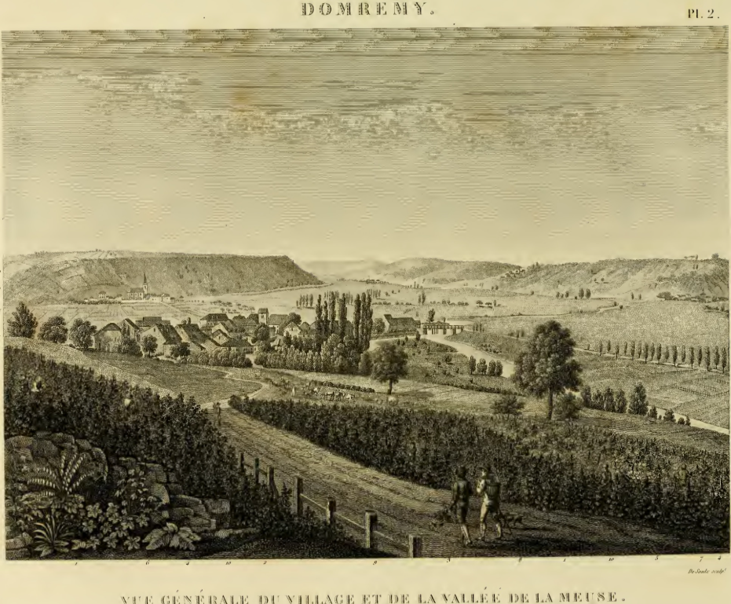

## The jollois map (1821)

## Observations

- The vineyard grew on both sides of the ridge road
- From the ridge road it is possible to see the old road to Neufchateau on the other side of the river

# Personal Thoughts

- Consequenty, it is possible to see the vineyards from the other side of the river