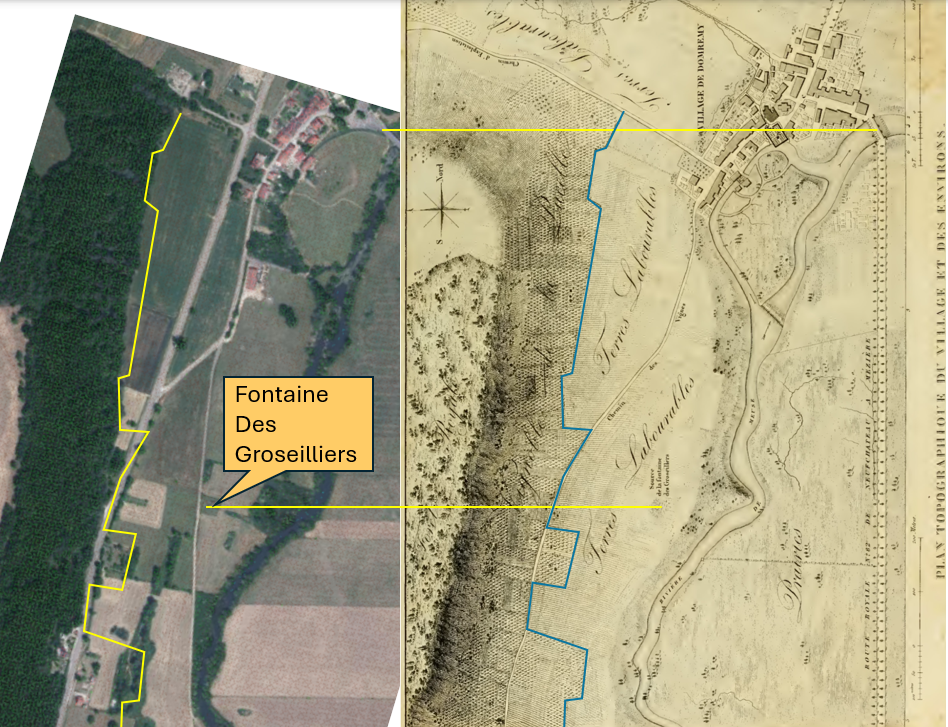
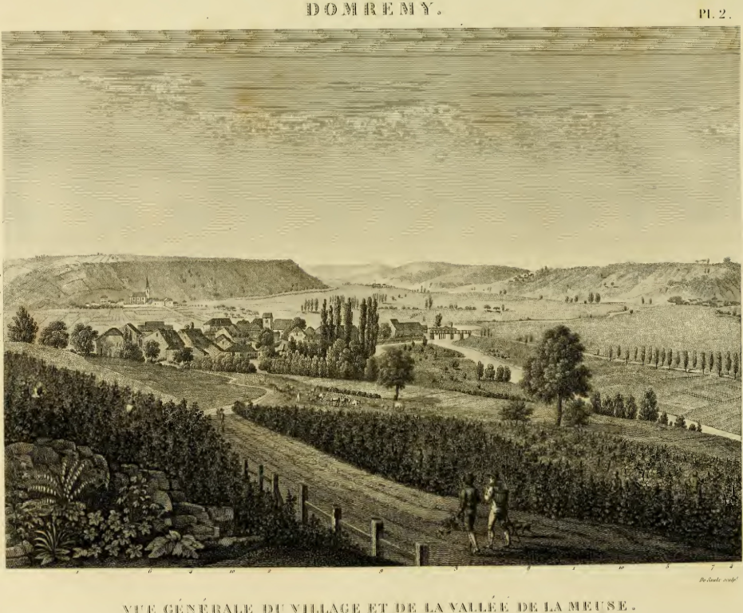

## The jollois map (1821)

## Observations

- The vineyard grew on both sides of the ridge road
- From the ridge road it is possible to see the NEW road to Neufchateau on the other side of the river

# Personal Thoughts

- Consequenty, it is possible to see the vineyards from the other side of the river
- In the 100 years war, it would have been wise to travel over the west bank as that was France as opposed to the East bank because on the East Bank they may be welcomed with stones.
- The stream La Saonelle is not wide, and it must have been passable, it would have been protected by Armagnac soldiers when the villagers of Domremy fled
