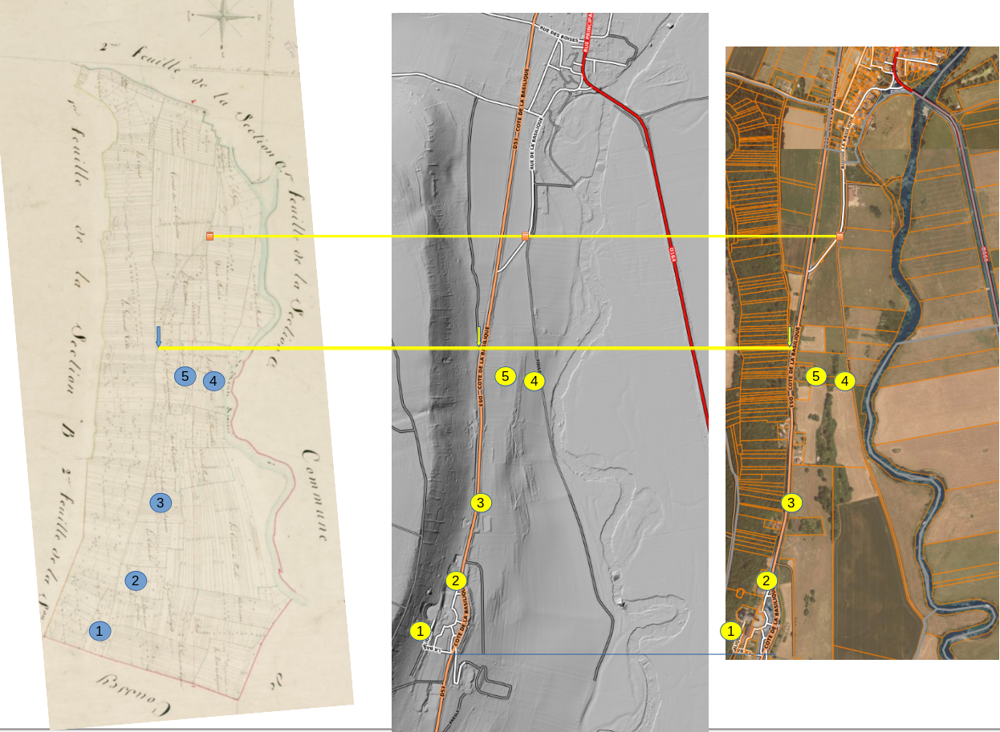
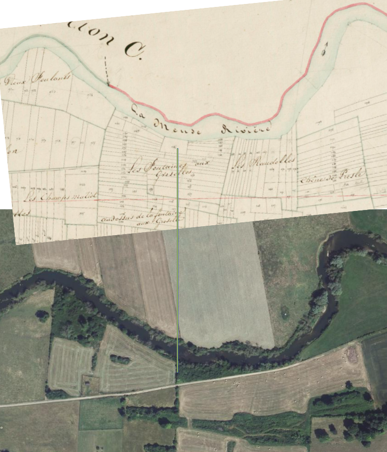

# Napoleonic Cadastre

[napoleonic cadastre](https://recherche-archives.vosges.fr/ark:/50275/1092366/dao/0/1/idsearch:RECH_internet_87e86e4c34dbac48f239a8a9902e2446?id=https%3A%2F%2Frecherche-archives.vosges.fr%2Fark%3A%2F50275%2F1092366%2Fcanvas%2F0%2F1&vx=8215.54&vy=-5686.87&vr=0&vz=0)

# View

## LEGENDA:
1. A la Pucelle
2. Sous la Pucelle
3. Sous la Vigne des Seigneurs
4. Les Fontaines aux Groselles
5. Audessus de la Fontaine aux Groselles

## Observations

- The old ridge road ends stops where the basilique begins
- The map shows that South of the basilique the territory of Coussey starts in the Napoleonic times
- There is a patch of land next to the river Meuse called la Fontaine aux Groselles

## Personal Thoughts

- The ridge road could have been more to the west than the current D53

# What Claude Code thinks of it

- Spots 1 ("A la Pucelle") and 2 ("Sous la Pucelle") are direct toponymic survivals: the Napoleonic cadastre still names this stretch of the hillside "la Pucelle" (Joan of Arc). This matches two **secondary** sources in `general-reputation` — no trial witness uses this name, so it is not first-hand testimony: Montaigne's remark that "There is also a tree beside a vineyard which they call 'l'arbre de la Pucelle,' but there is nothing remarkable about it" (document-reference: michel-montaigne), and Jollois's observation that "il existe plusieurs sources sur le penchant de la côte où se trouve le vignoble connu sous le nom de la Pucelle" (document-reference: jollois). The 19th-century cadastral surveyor recorded the same vineyard name these two secondary sources used for the fairies' tree and its springs.
- Spot 3 ("Sous la Vigne des Seigneurs") sits immediately adjacent to the Pucelle parcels on the same slope, consistent with the tree standing "on the land of Messire Pierre de Bourlémont" (the Seigneurs) and with Jollois's observation that vineyard covered both sides of the ridge road.
- Spots 4 and 5 ("Les Fontaines aux Groselles" / "Audessus de la Fontaine aux Groselles") continue the same slope further along and correspond to the candidate-location "current fontaine des Groseilliers". This matches the historical speculation that the fontaine de l'Ermite beside the fairies' tree "est assez probable que c'est celle même des groseillers" - i.e. that the Ermite spring and the Groseilles spring are one and the same.
- Read together, the cadastre shows one continuous named strip - Pucelle (1-2) / Seigneurs' vineyard (3) / Groseilles fountains (4-5) - rather than separate, unrelated sites. This supports treating the "several springs on the slope of the Pucelle vineyard" as one search area along this strip, rather than as independent candidate points.
- The modern-day "fountain of the Pucelle" referenced near the calvaire in the candidate-locations list plausibly preserves the same "Pucelle" name found in these cadastral parcels, suggesting continuity of the toponym from the 19th century to today.

