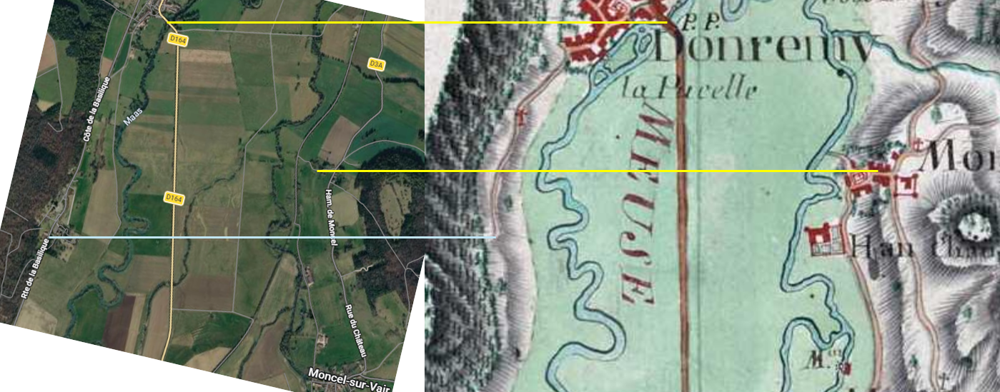

# The naudin map (1728 à 1739)

I have sized the satelite image to the naudin map via the yellow lines.

I have calibrated it on the basis of the road pattern.

## Observations

- The path from Domremy goes up the ridge and stops at the entry of the shoulder of the hill.
- Where the path leads to the plateau, there is also a spot where the ridge becomes narrow.

# Personal Thoughts

