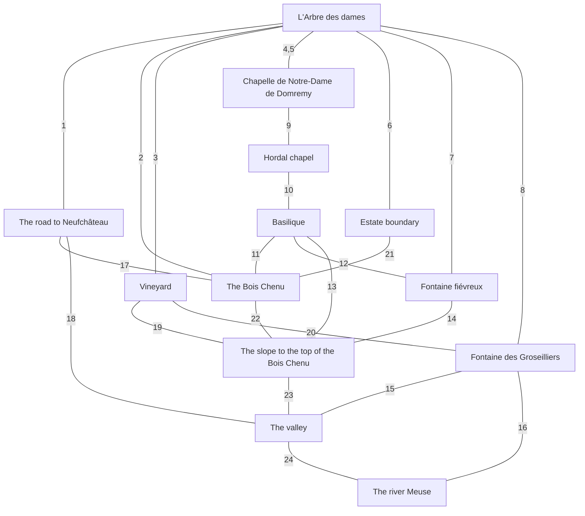

# Object diagram — arbre des Dames and its surroundings

Nodes are the 13 entries of `object-model` in `tree-prompt.yaml`. Each line (edge)
is labeled with the number(s) of the relation(s) it represents — see
`object-relations.md` for what each number means and which source grounds it.
Where more than one relation applies to the same line, the numbers are
comma-separated.

